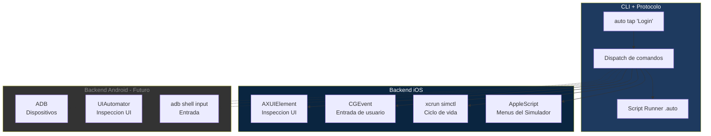
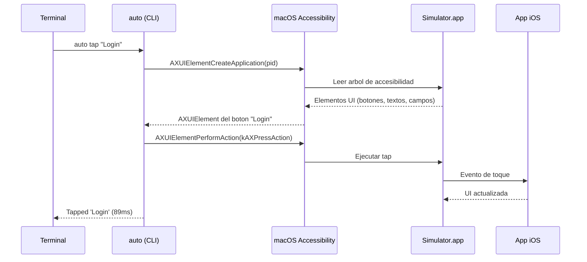
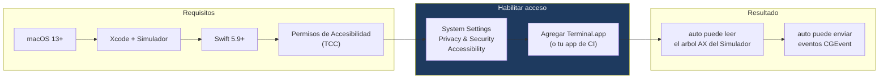
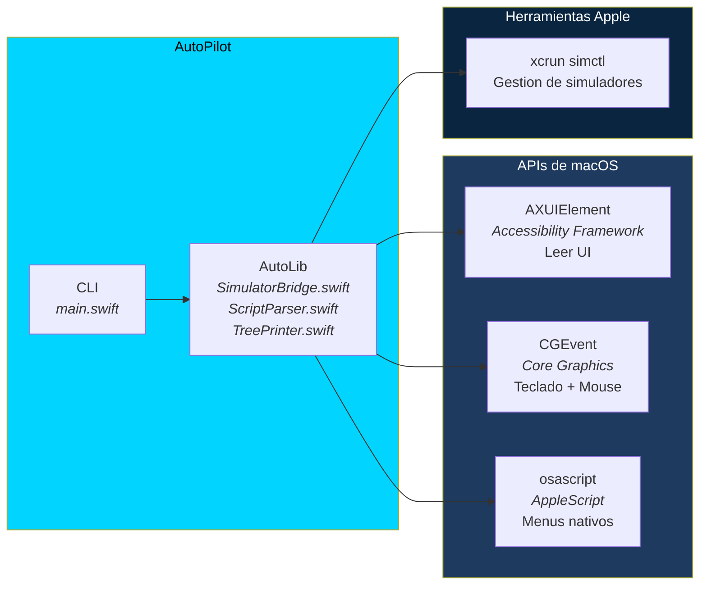
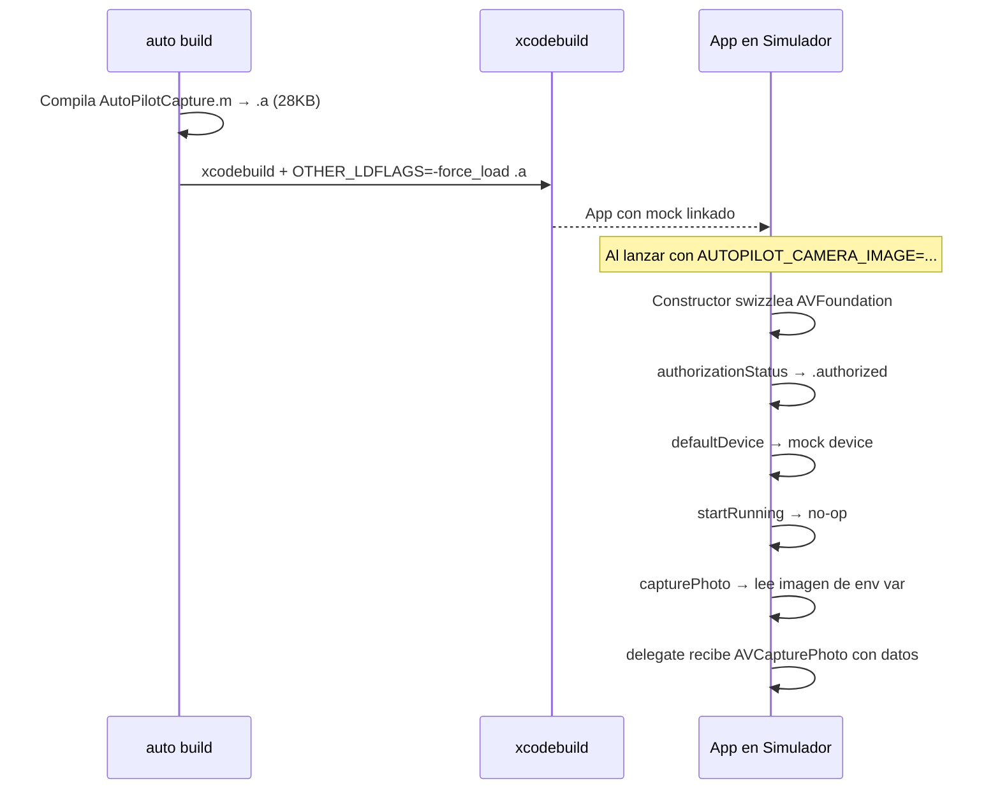

<p align="center">
  
</p>

<p align="center">
  <strong>Controla el Simulador iOS directamente desde la terminal. Sin XCUITest. Sin servidor. Sin dependencias. Un solo binario.</strong>
</p>

<p align="center">
  <a href="#inicio-rapido">Inicio Rapido</a> •
  <a href="#comandos">Comandos</a> •
  <a href="#scripts">Scripts</a> •
  <a href="docs/ios/ARQUITECTURA.md">iOS</a> •
  <a href="docs/android/README.md">Android</a> •
  <a href="ROADMAP.md">Roadmap</a>
</p>

---

## Que es AutoPilot?

AutoPilot es una herramienta CLI que automatiza el Simulador iOS desde macOS. Un solo binario Swift, sin dependencias externas, sin servidor, sin compilacion por ejecucion.

```bash
auto launch com.example.app
auto tap "Iniciar Sesion"
auto type "Usuario" "correo@test.com"
auto screenshot resultado.png
```

### Por que existe?

| | AutoPilot | Appium/WDA | XCUITest | Detox |
|---|---|---|---|---|
| Tiempo de setup | `swift build` | Node + WDA + xcodebuild | Proyecto Xcode | npm + metro + build |
| Servidor | No | Si (WDA HTTP) | No | Si (gRPC) |
| Compilacion por ejecucion | No | WDA una vez | Cada ejecucion | Cada ejecucion |
| Dependencias | Ninguna | Node, Appium, WDA | Xcode | Node, React Native |
| Acceso a UI del sistema | Si (`tapAt`) | Limitado | Limitado | No |
| Tamano del binario | ~311KB | ~200MB+ | N/A | ~150MB+ |
| Camara virtual | **Si** (`auto build`) | No | No | No |

---

## Arquitectura General

AutoPilot esta disenado en capas. El CLI y el protocolo son agnosticos de plataforma. Cada plataforma tiene su propio backend.



### Como funciona? (Vision general)

El Simulador iOS es una app de macOS (`Simulator.app`). macOS expone la interfaz de cualquier aplicacion a traves de las APIs de Accesibilidad. AutoPilot aprovecha esto para leer y controlar la UI del simulador **sin necesidad de un runner de pruebas dentro del simulador**.



---

## Prerequisitos y Setup

### Que se necesita instalar/habilitar



> **Importante:** Sin los permisos de Accesibilidad (TCC), `auto` no puede ver ni interactuar con el Simulador. En CI/CD esto se configura una vez en el runner.

### Compilar

```bash
cd cli
swift build -c release
cp .build/release/auto /usr/local/bin/auto
```

### Primera ejecucion

```bash
# Abrir el Simulador
open -a Simulator

# Verificar conexion
auto ping

# Ver el arbol de accesibilidad
auto tree

# Interactuar
auto tap "General"
```

---

## Stack Tecnologico



### Que hace cada componente

| Componente | Que hace | Usado para |
|---|---|---|
| **AXUIElement** | Lee el arbol de UI del Simulador como elementos de accesibilidad | `tree`, `search`, `exists`, `tap`, `elementAt`, `waitFor` |
| **CGEvent** | Envia eventos de teclado y mouse al proceso del Simulador | `type`, `clear`, `swipe`, `scroll`, `longPress`, `tapAt` |
| **xcrun simctl** | Herramienta CLI de Apple para gestionar simuladores | `launch`, `terminate`, `screenshot`, `install`, `list`, `boot`, `media`, `paste`, `openurl` |
| **AppleScript** | Automatiza menus nativos de Simulator.app | `faceid` (enroll, match, fail) |

---

<h2 id="comandos">Comandos</h2>

### Gestion de Simuladores

```bash
auto ping                              # Verificar conexion
auto list                              # Listar simuladores (encendidos + disponibles)
auto boot "iPhone 16"                  # Encender por nombre
auto boot <UDID>                       # Encender por UDID
auto shutdown "iPhone 16"              # Apagar
```

### Ciclo de vida de apps

```bash
auto launch com.example.app            # Abrir app
auto terminate com.example.app         # Cerrar app
auto install /ruta/a/MiApp.app         # Instalar app
```

### Interaccion UI

```bash
auto tap "Iniciar Sesion"              # Tap por id/titulo/label/valor
auto doubleTap "Imagen"                # Doble tap
auto longPress "Elemento" 2            # Presion larga (2 seg, default: 1s)
auto type "Hola Mundo"                 # Escribir texto (campo enfocado)
auto type "Usuario" "correo@test.com"  # Tap en campo + escribir
auto clear "Usuario"                   # Seleccionar todo + borrar
auto swipe up                          # Deslizar pantalla completa
auto scroll "tableView" down           # Scroll dentro de un elemento
auto tapAt 200 400                     # Tap en coordenadas (UIs del sistema)
```

### Inspeccion UI

```bash
auto tree                              # Arbol de accesibilidad completo
auto tree -s "Login"                   # Buscar elementos por texto
auto exists "Bienvenido"               # SI/NO
auto elementAt 200 400                 # Elemento en coordenada
auto waitFor "Home" 10                 # Esperar hasta 10s a que aparezca
```

### Hardware y Datos

```bash
auto faceid enroll                     # Activar Face ID
auto faceid match                      # Simular escaneo exitoso
auto faceid fail                       # Simular escaneo fallido
auto faceid status                     # Verificar si esta activado
auto media foto.jpg                    # Inyectar foto a la galeria
auto paste "Hola"                      # Poner en portapapeles
auto paste                             # Leer portapapeles
auto openurl "miapp://ruta/profunda"   # Abrir URL / deep link
auto screenshot                        # Guardar como screenshot.png
auto screenshot resultado.png          # Nombre personalizado
```

### Camara Virtual

```bash
auto build -project App.xcodeproj -scheme App \  # Compilar con mock de camara
    -sdk iphonesimulator -destination 'id=XXXX'
auto launch app --env AUTOPILOT_CAMERA_IMAGE=/ruta/foto.jpg  # Inyectar imagen
auto launch app --env AUTOPILOT_QR_CODE="https://url.com"    # Inyectar QR
```

### Scripting

```bash
auto run flujo-login.auto              # Ejecutar script de automatizacion
```

---

<h2 id="scripts">Formato de Scripts (.auto)</h2>

Cada linea es un comando, igual que en la terminal. Comentarios con `#`. Strings entre comillas.

```bash
# flujo-login.auto
# Prueba el flujo completo de login

launch com.example.app
waitFor "Iniciar Sesion" 5

# Ingresar credenciales
tap "Usuario"
type "test@ejemplo.com"
tap "Contrasena"
type "secreto123"

# Enviar y verificar
tap "Entrar"
waitFor "Bienvenido" 10
screenshot login-exitoso.png
```

**Ejecucion:**

```
$ auto run flujo-login.auto
[1] launch com.example.app
Launched com.example.app (245ms)
[2] waitFor "Iniciar Sesion" 5
Found 'Iniciar Sesion' (1203ms)
[3] tap "Usuario"
Tapped 'Usuario' (89ms)
...
9 step(s) completed (5004ms)
```

**Comportamiento:**
- Pasos numerados secuencialmente
- Si falla: muestra numero de linea, error, y sale con codigo 1
- Lineas vacias y comentarios se ignoran

---

## Integracion CI/CD

Construido para CI/CD headless. Sin pantalla, sin webcam, sin interaccion humana.

```bash
# 1. Permisos de accesibilidad (una vez, necesita admin)
# Configurar en el runner de CI

# 2. Encender simulador
xcrun simctl boot "iPhone 16"
open -a Simulator
sleep 5

# 3. Ejecutar automatizacion
auto run pruebas-regresion.auto
echo "Codigo de salida: $?"  # 0 = exito, 1 = fallo
```

### Codigos de salida

| Codigo | Significado |
|---|---|
| 0 | Exito |
| 1 | Fallo (elemento no encontrado, timeout, error de simctl) |

---

## Camara Virtual (CI/CD sin webcam)

En CI/CD headless no hay webcam. El Simulador iOS no mapea camaras de macOS a `AVCaptureSession`. AutoPilot resuelve esto inyectando un mock de camara a nivel de compilacion — **sin modificar el codigo de la app**.

### `auto build` — Inyeccion automatica

```bash
# 1. Compilar la app con mock de camara inyectado
auto build -project MiApp.xcodeproj -scheme MiApp \
    -sdk iphonesimulator -destination 'id=<UDID>'

# 2. Instalar en el simulador
auto install ~/Library/Developer/Xcode/DerivedData/.../MiApp.app

# 3. Lanzar con imagen para la camara
auto launch com.example.app --env AUTOPILOT_CAMERA_IMAGE=/ruta/foto.jpg

# 4. Cualquier tap en "capturar foto" inyecta la imagen al delegate
```

### Como funciona

`auto build` wrapea `xcodebuild` e inyecta una static library ObjC (~28KB) via `-force_load`. La libreria contiene un `__attribute__((constructor))` que swizzlea ~25 metodos de AVFoundation al cargar. Solo se activa si `AUTOPILOT_CAMERA_IMAGE` esta seteada.



### APIs swizzleadas

| Clase | Metodos | Comportamiento mock |
|---|---|---|
| **AVCaptureDevice** | `authorizationStatus`, `requestAccess`, `defaultDevice` (x2) | Siempre autorizado, retorna mock device |
| **AVCaptureDeviceInput** | `initWithDevice:`, `deviceInputWithDevice:` | Acepta cualquier device |
| **AVCaptureSession** | `startRunning`, `stopRunning`, `isRunning`, `canAddInput/Output`, `addInput/Output`, `removeInput/Output`, `beginConfiguration`, `commitConfiguration`, `inputs`, `outputs` | No-ops, estado trackeado via associated objects |
| **AVCapturePhotoOutput** | `capturePhoto:delegate:` | Lee `AUTOPILOT_CAMERA_IMAGE`, crea `AVCapturePhoto`, llama delegate |
| **AVCapturePhoto** | `fileDataRepresentation`, `CGImageRepresentation`, `timestamp`, `photoCount`, `isRawPhoto` | Retorna datos de imagen inyectada |
| **AVCaptureMetadataOutput** | `setMetadataObjectsDelegate:`, `setMetadataObjectTypes:` | No-ops (QR scanner no crashea) |
| **AVCaptureVideoPreviewLayer** | `setSession:` | Muestra imagen como preview estatico |

### Variables de entorno

| Variable | Uso |
|---|---|
| `AUTOPILOT_CAMERA_IMAGE` | Ruta a imagen JPG/PNG en el Mac. Se inyecta como captura de camara. |
| `AUTOPILOT_QR_CODE` | String de codigo QR. Se inyecta directamente al delegate del scanner. |

### Ejemplo completo (CI/CD)

```bash
#!/bin/bash
# test-camara.sh — Prueba de captura de camara en CI

auto build -project App.xcodeproj -scheme App \
    -sdk iphonesimulator -destination 'id=XXXX'

auto install ~/Library/.../App.app
auto launch com.example.app --env AUTOPILOT_CAMERA_IMAGE=test-photo.jpg

auto waitFor "Capturar" 5
auto tap "Capturar"                    # Navegar al tab de camara
auto tap "Camera"                      # Tap boton de captura
auto waitFor "Fotos capturadas" 5      # Verificar que se capturo
auto screenshot resultado-camara.png
```

### Enfoques investigados

| # | Enfoque | Resultado |
|---|---|---|
| 1 | CMIOExtension | Codigo completo, bloqueado por entitlement Apple |
| 2 | Webcam del Mac | Simulador no mapea webcams a AVCaptureSession |
| 3 | Dylib ObjC injection | Swizzle OK, ARM64 PAC bloquea creacion de objetos |
| 4 | Variables de entorno | Funciona, requiere modificar codigo de la app |
| 5 | Swift dylib | Swizzle OK, closures ABI incompatible |
| 6 | Package + callback | Funciona, requiere 1 linea en la app |
| 7 | Pre-build script | Parcial, no alcanza dependencias SPM |
| 8 | VFS overlay + module map | Headers simplificados rompen modulo AVFoundation |
| 9 | **Force-load + #undef AV_INIT_UNAVAILABLE** | **Funciona. Sin modificar codigo de la app.** |

> **Documentacion completa:** [camera/BITACORA.md](camera/BITACORA.md) — 9 intentos documentados
> **Spec de env vars:** [docs/ios/VARIABLES_ENTORNO.md](docs/ios/VARIABLES_ENTORNO.md)

---

## Documentacion Tecnica

| Plataforma | Estado | Documentacion |
|---|---|---|
| **iOS** | Funcional | [docs/ios/ARQUITECTURA.md](docs/ios/ARQUITECTURA.md) — AXUIElement, CGEvent, simctl, AppleScript, algoritmo de matching |
| **iOS Camara** | **Funcional** | [camera/BITACORA.md](camera/BITACORA.md) — 9 intentos, `auto build` con force-load swizzle |
| **iOS Env Vars** | Funcional | [docs/ios/VARIABLES_ENTORNO.md](docs/ios/VARIABLES_ENTORNO.md) — Inyeccion de datos para CI/CD |
| **Android** | Futuro | [docs/android/README.md](docs/android/README.md) — ADB, UIAutomator, adb shell input |

---

## Estructura del Proyecto

```
AutoPilot/
├── cli/                        # Paquete Swift (la herramienta)
│   ├── Package.swift           # Manifiesto SPM (macOS 13+, Swift 5.9)
│   ├── Sources/
│   │   ├── AutoLib/            # Libreria (testeable)
│   │   │   ├── SimulatorBridge.swift   # AX, CGEvent, simctl, AppleScript
│   │   │   ├── BuildInterceptor.swift  # auto build: compila mock, wrapea xcodebuild
│   │   │   ├── MockHeaders.swift       # Codigo ObjC de swizzle (~25 metodos)
│   │   │   ├── ScriptParser.swift      # Tokenizador y parser de .auto
│   │   │   └── TreePrinter.swift       # Pretty-printer del arbol AX
│   │   └── CLI/
│   │       └── main.swift      # Punto de entrada, dispatch, script runner
│   └── Tests/                  # Tests unitarios (27 tests)
├── camera/                     # Camara virtual
│   ├── CameraExtension/        # CMIOExtension (pendiente entitlement)
│   ├── CameraInject/           # Dylib ObjC (swizzle AVFoundation)
│   ├── AutoPilotCamera/        # App contenedora
│   ├── BITACORA.md             # Tropiezos y hallazgos
│   └── DESARROLLO.md           # Plan tecnico
├── protocol/
│   └── commands.json           # Especificacion de comandos (multi-plataforma)
├── scripts/examples/           # Scripts .auto de ejemplo
├── docs/
│   ├── ios/                    # Documentacion tecnica iOS
│   └── android/                # Documentacion tecnica Android
├── assets/                     # Logo e imagenes
├── Demo/                       # App iOS de ejemplo (SwiftUI)
├── legacy/                     # Arquitectura anterior (referencia)
├── .github/workflows/          # CI/CD (build, test, release)
├── README.md
└── ROADMAP.md
```

---

## Licencia

MIT
