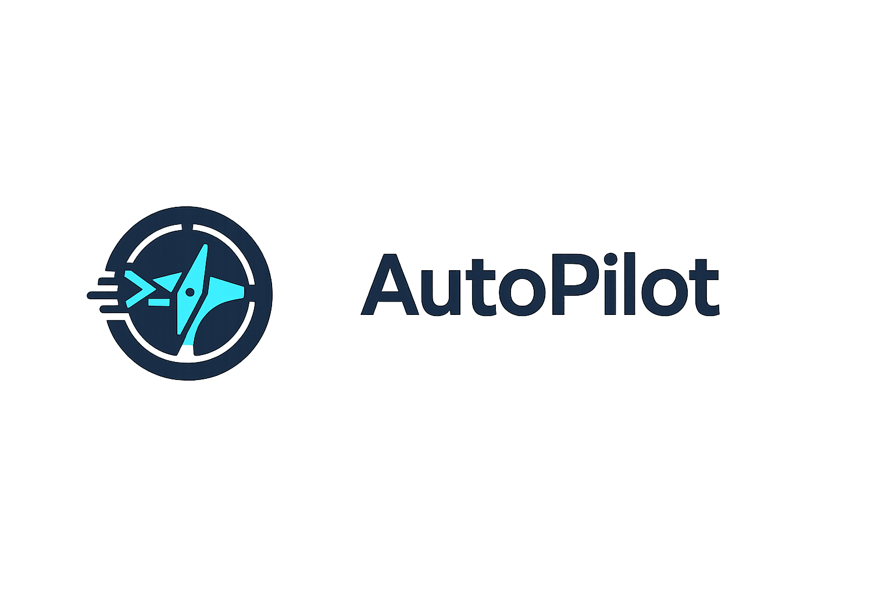

<p align="center">
  
</p>

<p align="center">
  <strong>Automatización iOS desde macOS. Sin XCUITest. Sin servidor. Sin dependencias.</strong>
</p>

<p align="center">
  <a href="docs/libro/README.md">Leer el libro</a> •
  <a href="#inicio-rápido">Inicio rápido</a> •
  <a href="docs/libro/06-alternativas.md">Alternativas</a> •
  <a href="ROADMAP.md">Roadmap</a>
</p>

---

## Por qué existe

Todas las herramientas de automatización iOS — Appium, Maestro, Detox — dependen de XCUITest por debajo. XCUITest requiere compilar un test target dentro de Xcode. Para hacer tap en un botón desde la terminal, necesitas un proyecto, un scheme, un build y un runner.

Descubrimos que el Simulador iOS es una app de macOS que expone la UI de las apps iOS como elementos nativos de accesibilidad. Un `UIButton` con label "Login" aparece como `AXButton` con `kAXTitleAttribute = "Login"` en el árbol AX del Simulador.

No necesitas XCUITest. Solo un binario Swift de 311KB que hable con las APIs de accesibilidad de macOS.

```bash
auto launch com.example.app
auto tap "Iniciar Sesion"
auto type "Usuario" "correo@test.com"
auto screenshot resultado.png
```

## Qué descubrimos

Tres hallazgos que no estan documentados en ningún otro lugar:

**1. La cámara virtual requirió 10 intentos.** CMIOExtension (bloqueado por Apple), webcam mapping (no existe), dylib injection (PAC bloquea objetos), Swift ABI (closures no son function pointers)... hasta que `#undef AV_INIT_UNAVAILABLE` nos dejó crear instancias reales de `AVCapturePhoto`. → [Capítulo 3](docs/libro/03-la-camara-virtual.md)

**2. DYLD_INSERT_LIBRARIES como herramienta de testing.** Ninguna herramienta del mercado usa inyección de dylibs para mockear la cámara en el Simulador iOS. Compilamos el mock como dylib, lo inyectamos al lanzar, y la imagen se puede cambiar en caliente sin relanzar la app. → [Capítulo 4](docs/libro/04-inyeccion-sin-recompilar.md)

**3. Las restricciones de compilador no son restricciones de runtime.** `AV_INIT_UNAVAILABLE` es un macro que desaparece después de compilar. `objc_setAssociatedObject` permite guardar datos en cualquier objeto sin conocer su layout interno. La barrera ObjC/Swift es más profunda de lo que parece. → [Capítulo 3](docs/libro/03-la-camara-virtual.md)

## El libro

Documentamos todo el proceso — los errores, los callejones sin salida, las decisiones y sus razones. No para vender AutoPilot, para que cualquier ingeniero que enfrente problemas similares tenga un punto de partida.

| Capítulo | Qué encontrarás |
|---|---|
| [01 — El problema](docs/libro/01-el-problema.md) | Por qué la automatización iOS está rota |
| [02 — Arquitectura](docs/libro/02-arquitectura.md) | AXUIElement, CGEvent, simctl, AppleScript |
| [03 — La cámara virtual](docs/libro/03-la-camara-virtual.md) | 10 intentos, 9 fracasos, y lo que aprendimos |
| [04 — Inyección sin recompilar](docs/libro/04-inyeccion-sin-recompilar.md) | DYLD_INSERT_LIBRARIES en testing |
| [05 — El editor](docs/libro/05-el-editor.md) | De CLI a IDE visual con Tauri + Monaco |
| [06 — Alternativas](docs/libro/06-alternativas.md) | Maestro, Appium, AXe, XCUITest — análisis honesto |
| [07 — Decisiones](docs/libro/07-decisiones.md) | Por qué Swift, por qué AX públicas, por qué no YAML |

> **[Leer el libro completo →](docs/libro/README.md)**

---

<h2 id="inicio-rápido">Inicio rápido</h2>

```bash
# Compilar
cd cli && swift build -c release
cp .build/release/auto /usr/local/bin/auto

# Abrir Simulador + dar permisos de Accesibilidad
open -a Simulator

# Verificar
auto ping
auto tree
auto tap "General"
```

### Cámara virtual (sin recompilar)

```bash
auto launch com.example.app --inject selfie.jpg
auto tap "Capturar"
auto inject paisaje.jpg    # Cambiar en caliente
auto tap "Capturar"
```

### Scripts .auto

```bash
# login.auto
launch com.example.app
waitFor "Login" 5
tap "Usuario"
type "test@ejemplo.com"
tap "Entrar"
waitFor "Home" 10
screenshot ok.png
```

```
$ auto run login.auto
[1] launch com.example.app    Launched (245ms)
[2] waitFor "Login" 5         Found (1203ms)
[3] tap "Usuario"             Tapped (89ms)
...
7 step(s) completed (5004ms)
```

---

## Alternativas

Si tu caso de uso es diferente, estas herramientas pueden ser mejor opción:

| Caso | Herramienta | Por qué |
|---|---|---|
| Multi-plataforma (iOS + Android) | [Maestro](https://maestro.dev) | YAML, setup rápido, CLI elegante |
| Enterprise / equipo grande | [Appium](https://appium.io) | Estándar de industria, multi-lenguaje |
| React Native | [Detox](https://wix.github.io/Detox/) | Sincronización con JS event loop |
| Solo iOS, sin dependencias | [AXe](https://github.com/cameroncooke/AXe) | Similar a AutoPilot, usa APIs privadas |

Análisis completo: [Capítulo 6 — Alternativas](docs/libro/06-alternativas.md)

---

## Licencia

MIT
