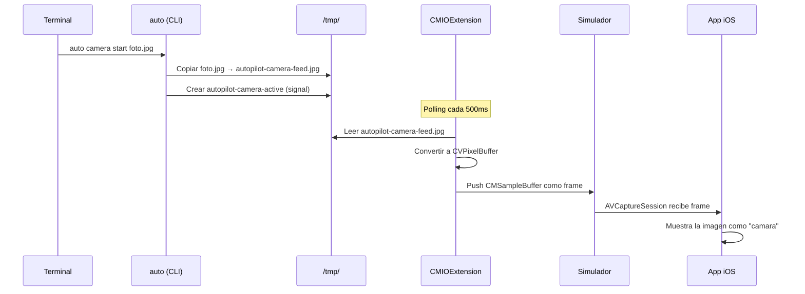
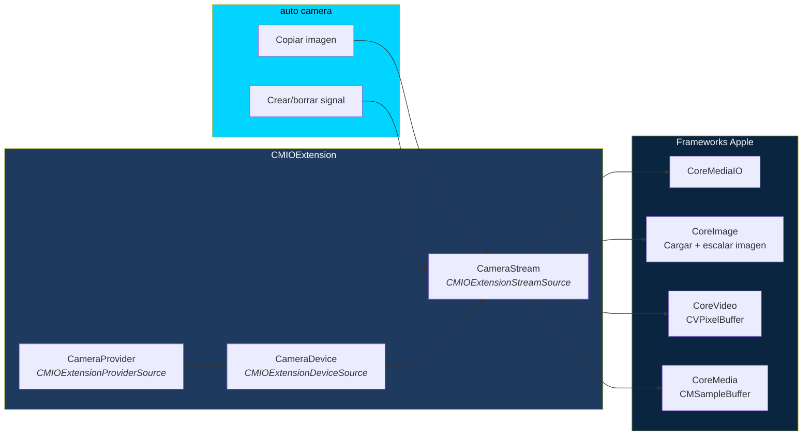

# AutoPilot Camera — Camara Virtual para CI/CD

Camara virtual que permite alimentar imagenes estaticas como feed de camara al Simulador iOS. Diseñada para entornos CI/CD headless donde no hay webcam fisica.

## Arquitectura



## Componentes

### 1. AutoPilotCamera.app (App contenedora)
- App macOS minimal (SwiftUI)
- Su unico trabajo: instalar la CMIOExtension en el sistema
- Se ejecuta una vez, despues ya no se necesita

### 2. CameraExtension (CMIOExtension)
- Se registra como dispositivo de camara virtual en macOS
- Cualquier app que use `AVCaptureSession` la ve como webcam
- Lee de `/tmp/autopilot-camera-feed.jpg` y lo sirve como frames
- 2 FPS para imagen estatica (bajo consumo de CPU)
- Detecta cambios en la imagen automaticamente

### 3. CLI (auto camera)
- `auto camera start <imagen>` — copia imagen + crea signal
- `auto camera feed <imagen>` — actualiza la imagen
- `auto camera stop` — borra signal + imagen
- `auto camera status` — verifica estado

## Comunicacion CLI ↔ Extension

La comunicacion es por archivos en `/tmp/`:

| Archivo | Proposito |
|---|---|
| `/tmp/autopilot-camera-feed.jpg` | Imagen actual a transmitir |
| `/tmp/autopilot-camera-active` | Archivo signal — si existe, camara activa |

La extension hace polling cada 500ms:
1. Verifica si el signal existe
2. Si existe, lee la imagen
3. Compara fecha de modificacion — solo recarga si cambio
4. Convierte a `CVPixelBuffer` (720p, BGRA)
5. Push como `CMSampleBuffer` al stream

Si el signal no existe, transmite frame negro.

## Stack Tecnico



## Prerequisitos

- macOS 13+
- Para compilar: Xcode (proyecto en `camera/`)
- Para instalar la extension: ejecutar `AutoPilotCamera.app` una vez
- El entitlement `com.apple.developer.system-extension.install` requiere cuenta de desarrollador Apple

## Compilar

```bash
# Abrir el proyecto en Xcode
open camera/AutoPilotCamera.xcodeproj

# Compilar y ejecutar AutoPilotCamera.app
# La app instalara la extension automaticamente
```

## Uso

```bash
# Iniciar camara con una imagen
auto camera start foto-qr.jpg

# La app iOS abre la camara → ve foto-qr.jpg

# Cambiar la imagen en caliente
auto camera feed otra-imagen.jpg

# Verificar estado
auto camera status
# ACTIVE — feed: /tmp/autopilot-camera-feed.jpg

# Detener
auto camera stop
```

## Casos de Uso en CI/CD

```bash
# Escaneo de QR
auto camera start qr-code.png
auto launch com.example.app
auto tap "Escanear QR"
auto waitFor "QR Detectado" 10

# Verificacion de selfie
auto camera start selfie-test.jpg
auto tap "Tomar Selfie"
auto waitFor "Foto Capturada" 5

# Captura de documento
auto camera start documento.jpg
auto tap "Escanear Documento"
```

## Limitaciones

- La extension necesita ser instalada una vez via la app contenedora
- Requiere cuenta de desarrollador Apple para el entitlement de system extension
- En desarrollo local se puede usar el modo de developer para system extensions sin firma
- La imagen se escala a 720p manteniendo aspecto (crop al centro)
