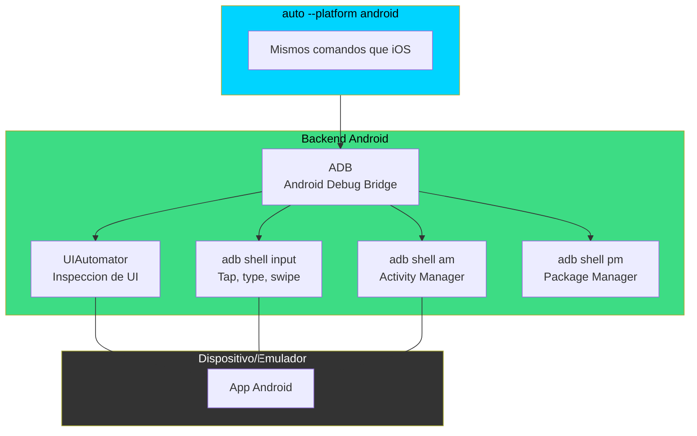

# Android — Backend (Futuro)

> Este backend aun no esta implementado. Este documento describe la arquitectura planeada.

## Arquitectura Propuesta

## Mapeo de Comandos

| Comando AutoPilot | Equivalente Android |
|---|---|
| `auto list` | `adb devices` |
| `auto launch <pkg>` | `adb shell am start -n <pkg>/<activity>` |
| `auto terminate <pkg>` | `adb shell am force-stop <pkg>` |
| `auto install <apk>` | `adb install <apk>` |
| `auto tree` | `uiautomator dump` + parsear XML |
| `auto tap "Login"` | Buscar en XML + `adb shell input tap x y` |
| `auto type "texto"` | `adb shell input text "texto"` |
| `auto swipe up` | `adb shell input swipe x1 y1 x2 y2` |
| `auto screenshot` | `adb exec-out screencap -p > file.png` |

## Diferencias Clave con iOS

| Aspecto | iOS (AXUIElement) | Android (ADB) |
|---|---|---|
| Conexion | Proceso local (mismo Mac) | USB o TCP/IP |
| Inspeccion UI | Tiempo real (AX tree) | Snapshot (uiautomator dump) |
| Entrada | CGEvent (kernel) | adb shell input |
| Latencia | ~50-100ms | ~200-500ms |
| Permisos | TCC (Accesibilidad) | USB debugging habilitado |

## Prerequisitos

- Android SDK (`adb` en PATH)
- Dispositivo con USB debugging habilitado, o emulador corriendo
- No requiere root

## Contribuir

Si quieres ayudar a construir el backend de Android, revisa el [ROADMAP](../../ROADMAP.md) (Fase 5) y abre un issue para coordinar.
