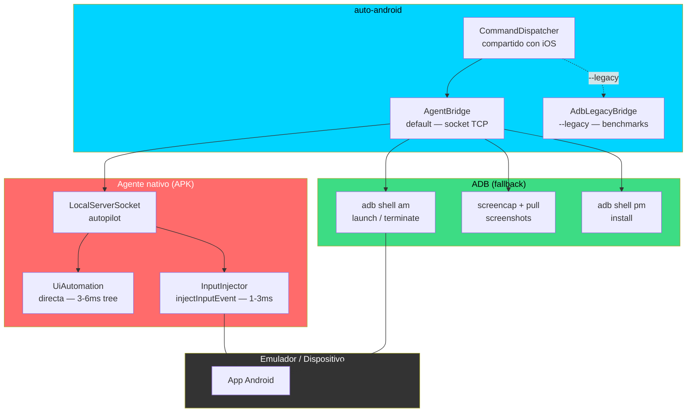

# Android — Backend via ADB + Agente nativo

> Implementado en abril 2026. El binario `auto-android` controla dispositivos Android. La v1 usaba `adb shell` commands (lento, ~2s por tap). La v2 usa un **agente nativo** — un APK de instrumentación con `LocalServerSocket` + `UiAutomation` directa (~75-171ms por tap).
>
> Ver [Capítulo 9 — El agente Android](../libro/09-el-agente-android.md) para la investigación completa.

## Arquitectura



## Comandos Implementados

Todos los comandos del protocolo `DeviceBridge` estan disponibles:

| Comando | Implementacion ADB | Estado |
|---|---|---|
| `auto-android list` | `adb devices -l` → parse model/state | **Funcional** |
| `auto-android launch <pkg>` | `adb shell monkey -p <pkg> -c LAUNCHER 1` | **Funcional** |
| `auto-android terminate <pkg>` | `adb shell am force-stop <pkg>` | **Funcional** |
| `auto-android install <apk>` | `adb install -r <apk>` | **Funcional** |
| `auto-android tree` | `uiautomator dump` → `UIAutomatorParser` | **Funcional** |
| `auto-android tree -s "query"` | Busqueda recursiva en text/content-desc/resource-id | **Funcional** |
| `auto-android tap "Login"` | dump → find element → center → `input tap x y` | **Funcional** |
| `auto-android type "texto"` | `adb shell input text` con escaping | **Funcional** |
| `auto-android swipe up` | `input swipe` 40% de pantalla desde centro | **Funcional** |
| `auto-android longPress <el> 2` | `input swipe cx cy cx cy 2000` (mismo punto) | **Funcional** |
| `auto-android screenshot x.png` | `screencap` → `pull` → `rm` | **Funcional** |
| `auto-android exists "texto"` | dump + search, exit 0/1 | **Funcional** |
| `auto-android waitFor "texto" 10` | Polling cada 500ms, timeout configurable | **Funcional** |
| `auto-android openurl <url>` | `am start -a VIEW -d <url>` | **Funcional** |
| `auto-android media ` | `push` + media scanner broadcast | **Funcional** |

## UIAutomatorParser — El puente entre XML y TreePrinter

`uiautomator dump` devuelve XML con nodos como:
```xml
<node text="Explorea" class="android.widget.TextView"
      content-desc="" resource-id="" bounds="[423,1359][857,1485]"
      clickable="false" enabled="true" />
```

`UIAutomatorParser` transforma cada nodo al formato `[String: Any]` que TreePrinter espera:

| Atributo XML | Campo en tree | Ejemplo |
|---|---|---|
| `class` | `role` | "TextView" (sin package prefix) |
| `text` | `title` | "Explorea" |
| `content-desc` | `label` | "Boton de login" |
| `resource-id` | `identifier` | "com.app:id/btn_login" |
| `bounds` | `frame` | `{x: 423, y: 1359, width: 434, height: 126}` |

Esto permite que `TreePrinter.printAX()` y `CommandDispatcher` funcionen identicos para iOS y Android.

## Diferencias con iOS

| Aspecto | iOS (SimulatorBridge) | Android (AdbBridge) |
|---|---|---|
| Conexion | Proceso local (mismo Mac) | USB o TCP/IP via adb |
| Inspeccion UI | Tiempo real (AX tree) | Snapshot (`uiautomator dump`, ~2s) |
| Entrada | CGEvent (kernel, ~50ms) | `adb shell input` (~100ms) |
| Latencia total de tap | ~90ms | ~2100ms (dump + find + tap) |
| Permisos | TCC Accesibilidad | USB debugging habilitado |
| Camera mock | DYLD_INSERT_LIBRARIES | No implementado aun |
| Clipboard read | `simctl pbpaste` | No soportado via ADB |
| Biometrico | AppleScript menus Face ID | `adb -e emu finger touch` (pendiente) |

## Prerequisitos

- Android SDK con `adb` en PATH (o `ANDROID_HOME` configurado)
- Emulador corriendo o dispositivo con USB debugging habilitado
- No requiere root

## Ejemplo: Script .auto cross-platform

El mismo script funciona en ambas plataformas cambiando solo el binario:

```bash
# iOS
./auto run scripts/examples/login.auto

# Android
./auto-android run scripts/examples/android-login.auto
```

Ejemplo de `android-login.auto`:
```
launch shajaru.Test_Automatitacion
waitFor "Explorea" 10
tap "Desbloquear con PIN"
waitFor "Ingresa tu PIN" 5
tap "1"
tap "2"
tap "3"
tap "4"
waitFor "Inicio" 5
screenshot home.png
```

## Limitaciones actuales

- `uiautomator dump` toma ~2 segundos por llamada — cada `tap(target:)` requiere un dump para encontrar el elemento. En scripts largos esto suma.
- Clipboard read no tiene API directa en ADB. `setPasteboard` usa `input text` como workaround.
- Camera mock no esta implementado en Android. La inyeccion via DYLD es exclusiva de macOS/iOS.
- Algunos elementos de Compose no exponen texto en `uiautomator` — usar `content-desc` (accessibility label) como alternativa.
