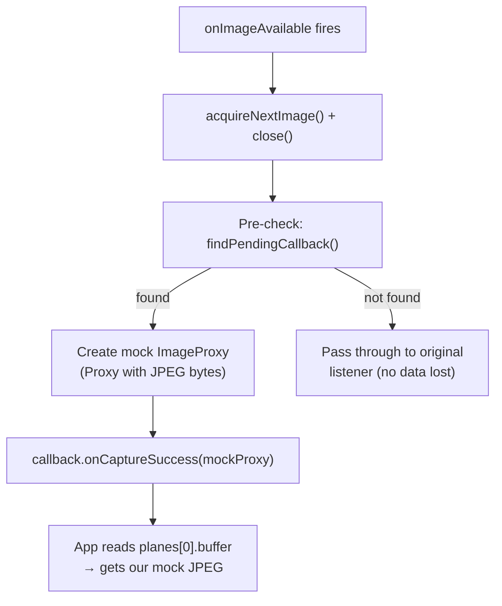

# Camara Virtual — Bitacora de Desarrollo

## Sesion 2026-04-01

### Objetivo
Inyectar imagenes como feed de camara al Simulador iOS sin modificar apps de terceros. Para CI/CD headless donde no hay webcam.

### Intento 1: CMIOExtension (camara virtual macOS)
**Resultado:** Codigo completo, compilacion exitosa, bloqueado por permisos.

- Creamos CameraProvider, CameraDevice, CameraStream en Swift puro
- La extension se embebe en AutoPilotCamera.app
- `OSSystemExtensionRequest` requiere que la app este en `/Applications/`
- Error: "Extension not found in App bundle" — la extension si esta, pero sin el entitlement aprobado por Apple no se activa
- `systemextensionsctl developer on` requiere SIP deshabilitado
- DAL plugin (legacy) removido en macOS 15

**Accion pendiente:** Solicitar entitlement en https://developer.apple.com/contact/request/system-extension/

### Intento 2: Webcam del Mac
**Resultado:** No funciona.

- `system_profiler SPCameraDataType` muestra FaceTime HD + iPhone via Continuity
- El Simulador tiene `com.apple.display.captureservice` activo
- Pero `AVCaptureDevice.default(.builtInWideAngleCamera, ...)` retorna `nil` en el Simulador
- El Simulador **no mapea** webcams de macOS a `AVCaptureSession` de apps iOS
- `simctl privacy grant camera` no cambia nada — no hay hardware de camara

### Intento 3: Dylib injection (DYLD_INSERT_LIBRARIES)
**Resultado:** Swizzle exitoso, inyeccion de datos bloqueada por PAC.

**Lo que funciono:**
- Dylib ObjC compilada para ios26.0-simulator, cargada via `SIMCTL_CHILD_DYLD_INSERT_LIBRARIES`
- Swizzle de `authorizationStatus(.video)` → `.authorized` sin prompt
- Swizzle de `AVCaptureSession.startRunning()` → interceptado, evita crash de FigCaptureSession
- Swizzle de `capturePhotoWithSettings:delegate:` → interceptado exitosamente
- Runtime introspection (`class_copyMethodList`) encuentra selector `didFinishProcessingPhoto` en el delegate
- `class_copyIvarList` encuentra ivar `onPhotoCaptured` del CameraManager
- `isSourceTypeAvailable(.camera)` → `YES`
- `canAddInput/canAddOutput` → `YES`

**Lo que NO funciono:**
- `AVCapturePhoto` init marcado `NS_UNAVAILABLE` — no se puede instanciar
- Bypass via `objc_msgSend(alloc, init)` → crash por ARM64 PAC (Pointer Authentication Code)
- Subclase via `objc_allocateClassPair` + `class_addMethod` para `fileDataRepresentation` → PAC valida el objeto interno
- `object_getIvar` para acceder closure `onPhotoCaptured` → Swift closures no son ObjC blocks, distinta calling convention → `EXC_BAD_ACCESS`
- Casting closure a `void (^)(UIImage *)` → PC alignment failure

**Aprendizaje clave:** ObjC runtime puede interceptar pero no puede crear objetos Swift validos ni invocar closures Swift. Se necesita una dylib en Swift para la proxima iteracion.

### Intento 4: Variables de entorno (SOLUCION ACTUAL)
**Resultado:** Funciona. 11 lineas de codigo en la app.

**Flujo:**
```
auto launch app --env AUTOPILOT_CAMERA_IMAGE=/path/to/image.jpg
→ SIMCTL_CHILD_AUTOPILOT_CAMERA_IMAGE=/path xcrun simctl launch booted app
→ App arranca con env var
→ capturePhoto() detecta env var → carga imagen → onPhotoCaptured()
```

**Hallazgos durante la prueba:**
1. `/tmp/` del Simulador NO es `/tmp/` del Mac — el Simulador tiene su propio filesystem
2. `simctl spawn booted ls /path` confirma que el Simulador no ve rutas del Mac
3. Sin embargo, el proceso de la app SI corre como proceso macOS y SI puede leer rutas del Mac
4. `tap "Camera"` tapeaba el AXImage (icono) en vez del AXButton (boton) — resuelto con `tapAt` en coordenadas
5. `print()` de Swift no aparece en `log show` del Simulador — usar `NSLog` y buscar con `processImagePath CONTAINS`
6. La env var se confirmo con NSLog en `onAppear`

**Limitacion:** Solo funciona si controlas el codigo de la app. Para librerias de terceros, no aplica.

### Proxima iteracion: Swift dylib

**Hipotesis:** Si la dylib esta escrita en Swift (no ObjC), puede:
1. Crear objetos Swift validos (no tiene PAC issues al ser el mismo runtime)
2. Invocar closures Swift directamente
3. Swizzlear a nivel de protocolo (Protocol Witness Tables)

**Plan:**
1. Crear dylib en Swift que importe AVFoundation
2. Swizzlear `AVCapturePhotoOutput.capturePhoto(with:delegate:)`
3. Crear `AVCapturePhoto` subclass en Swift (bypass de init via reflection)
4. Llamar `delegate.photoOutput(_:didFinishProcessingPhoto:error:)` nativamente
5. Si funciona → cualquier app que use AVFoundation recibe la imagen inyectada sin modificar codigo

**Alternativa:** SPM Build Tool Plugin que genera wrappers automaticos en tiempo de compilacion.

## Sesion 2026-04-01 (continuacion)

### Intento 5: Swift dylib linkada como package
**Resultado:** Swizzle funciona, ivar access a closures crashea.

- Swift dylib con ObjC bridge (`__attribute__((constructor))`) se carga automaticamente
- Swizzle de authorizationStatus, requestAccess, startRunning, capturePhoto funciona
- capturePhoto intercepta correctamente y carga la imagen
- **Crash al acceder ivar `onPhotoCaptured`**: Swift closures en memoria no son function pointers simples, tienen contexto capturado + metadata que no se puede reinterpretar como `(UIImage) -> Void` via `ivar_getOffset` + `assumingMemoryBound`
- El crash ocurre tanto desde dylib inyectada como desde package linkado — no es PAC, es la ABI de Swift closures

### Intento 6: Package con callback registrado
**Resultado:** Funciona. App necesita 1 linea para registrar callback.

- Mismo swizzle que intento 5
- En vez de buscar callback via ivar, la app registra `AutoPilotCamera.onPhotoCaptured = callback`
- El swizzle de capturePhoto invoca el callback registrado
- **Probado end-to-end: 16 pasos, imagen inyectada, "Fotos capturadas 1"**
- Limitacion: requiere 1 linea en la app + el guard del boton

### Intento 7: Pre-build script reemplazo de tipos
**Resultado:** Parcial. Funciona para archivos del proyecto, no para dependencias SPM.

- Script prebuild reemplaza `AVCaptureDevice` → `AutoPilotCaptureDevice`, etc.
- Postbuild restaura originales
- **Problemas encontrados:**
  - Xcode sandbox (`ENABLE_USER_SCRIPT_SANDBOXING=YES`) bloqueaba escritura → solucionado con NO
  - Espacios en rutas de "Test Automatitacion" → solucionado con `IFS` y comillas
  - Conflictos de tipos: `AVCaptureDevice.default(for:)` retorna tipo real, `AutoPilotCaptureDeviceInput` espera nuestro tipo → solucionado con `init(device: Any)`
  - **No alcanza dependencias SPM** — solo modifica archivos del workspace

### Intento 8: Module map override (descartado)
**Objetivo:** VFS overlay + module map custom para reemplazar headers de AVFoundation.

**Resultado:** No funciona. Los headers simplificados rompen el modulo AVFoundation porque faltan tipos interdependientes (AVCaptureConnection, etc.). Intentamos:
- VFS overlay que redirige headers de captura → otros headers del framework referencian tipos faltantes
- Headers custom completos → demasiada superficie de API para mantener

### Intento 9: Force-load + swizzle con #undef AV_INIT_UNAVAILABLE
**Resultado:** FUNCIONA. Build completo sin errores.

**Enfoque:**
1. Compilamos un `.m` ObjC con `-fno-modules` que:
   - Importa `AVBase.h` primero, luego `#undef AV_INIT_UNAVAILABLE` y redefine como vacio
   - Importa `AVFoundation.h` — ahora `AVCapturePhoto` tiene init disponible
   - `__attribute__((constructor))` swizzlea todo al cargar:
     - `AVCaptureDevice.authorizationStatus` → `.authorized`
     - `AVCaptureDevice.requestAccess` → `YES`
     - `AVCaptureSession.startRunning/stopRunning` → no-op
     - `AVCaptureSession.canAddInput/canAddOutput` → `YES`
     - `AVCapturePhotoOutput.capturePhoto` → lee AUTOPILOT_CAMERA_IMAGE, crea AVCapturePhoto real via init, guarda datos con `objc_setAssociatedObject`
     - `AVCapturePhoto.fileDataRepresentation` → lee datos de associated object
     - `AVCapturePhoto.CGImageRepresentation` → idem
     - `AVCapturePhoto.timestamp/photoCount/isRawPhoto` → valores mock
2. Se compila a `libAutoPilotCapture.a` (static lib, ~20KB)
3. `auto build` wrapea xcodebuild con `OTHER_LDFLAGS=-force_load libAutoPilotCapture.a`

**Por que funciona:**
- `AV_INIT_UNAVAILABLE` es restriccion solo de compilador, no de runtime
- `#undef` + `#define` vacio elimina la restriccion en nuestro .m
- `[[AVCapturePhoto alloc] init]` funciona porque init es heredado de NSObject
- Associated objects evitan tocar ivars internos (_internal) → no PAC issues
- `-force_load` mete el constructor en el binario → swizzle ocurre al cargar
- No hay duplicacion de clases, solo swizzle de metodos existentes

**Probado end-to-end:**
1. `auto build` compila Demo app con mock inyectado (BUILD SUCCEEDED)
2. `simctl install` + `simctl launch --env AUTOPILOT_CAMERA_IMAGE=...`
3. Constructor swizzlea 20 metodos (auth, device, session, photo, input)
4. Tap boton captura → `capturePhoto intercepted` → `Loaded image (127KB)` → `Photo delivered to delegate`
5. UI muestra "Fotos capturadas: 1"

**Gotcha resuelto:** `class_addMethod` vs `method_setImplementation` — si el metodo esta heredado (no directamente en la clase), `method_setImplementation` modifica la superclase. `class_addMethod` lo agrega directamente a la clase.

**Gotcha resuelto:** Xcode 26 debug dylib — `ENABLE_DEBUG_DYLIB=NO` necesario para que `force_load` funcione en el binario principal.

**Metodos swizzleados (~25):**
- AVCaptureDevice: authorizationStatus, requestAccess, defaultDevice (2 variantes)
- AVCaptureDeviceInput: initWithDevice, deviceInputWithDevice
- AVCaptureSession: startRunning, stopRunning, isRunning, canAddInput, canAddOutput, addInput, addOutput, removeInput, removeOutput, beginConfiguration, commitConfiguration, inputs, outputs
- AVCapturePhotoOutput: capturePhoto
- AVCapturePhoto: fileDataRepresentation, CGImageRepresentation, timestamp, photoCount, isRawPhoto
- AVCaptureMetadataOutput: setMetadataObjectsDelegate, setMetadataObjectTypes
- AVCaptureVideoPreviewLayer: setSession (composita imagen con labels LIVE + AutoPilot)

**Preview layer:**
- Composita imagen a 400x600 con aspectFill propio
- Punto rojo + "LIVE" arriba izquierda (simula feed)
- Banner "AutoPilot | Mock Camera" abajo (identifica mock)
- `kCAGravityResize` para evitar doble crop
- La foto capturada se entrega SIN etiquetas (imagen limpia original)

**Validado con app de terceros (CameraTestApp):**
- App AVFoundation pura, sin AutoPilot, sin dependencias
- `auto build` + `simctl launch --env AUTOPILOT_CAMERA_IMAGE=...`
- Preview muestra imagen con labels LIVE + AutoPilot
- Captura: "Foto capturada (127925 bytes)", imagen limpia
- QR scanner: no crashea, preview funciona

**Archivos:**
- `cli/Sources/AutoLib/MockHeaders.swift` — codigo ObjC como string (~400 lineas)
- `cli/Sources/AutoLib/BuildInterceptor.swift` — orquestador: compila .m, wrapea xcodebuild
- `cli/Sources/CLI/main.swift` — case "build" agregado
- `cli/Sources/AutoLib/SimulatorBridge.swift` — metodo buildWithCameraMock
- `Demo/iOS/CameraTestApp/` — app tercera de prueba (AVFoundation puro)

### Resumen de archivos

| Archivo | Proposito | Estado |
|---|---|---|
| `cli/Sources/AutoLib/MockHeaders.swift` | Swizzle ObjC embebido (~25 metodos) | **Funcional** |
| `cli/Sources/AutoLib/BuildInterceptor.swift` | Compila .m, wrapea xcodebuild | **Funcional** |
| `Demo/iOS/CameraTestApp/` | App tercera para validar mock | **Probada** |
| `camera/CameraExtension/` | CMIOExtension Swift | Bloqueado por entitlement |
| `camera/CameraInject/AutoPilotCamera.m` | Dylib ObjC swizzle | Parcial (descartado) |
| `packages/AutoPilotAVFoundation/` | Package swizzle (requiere 1 linea en app) | Funcional, superado por auto build |

## Sesion 2026-04-02

### Editor IDE (AutoPilot Editor)

**Stack:** Tauri 2 + React + TypeScript + Monaco Editor

**Features implementados:**
- Monaco editor con syntax highlighting para lenguaje .auto
- Tema oscuro "AutoPilot" (Tokyo Night inspired)
- 35+ comandos en autocomplete con snippets
- Inspector visual: Preview (screenshot real + overlays) y Tree (jerarquico)
- Terminal inferior con Play/Stop/Clear/Screenshots
- Auto-wait via AXObserver (detecta cambios UI en tiempo real)
- Indexacion de elementos ($N) para desambiguar duplicados
- Sintaxis Camera[2] para seleccionar el N-esimo duplicado (cross-platform)
- Boton Screenshots para abrir carpeta en Finder

### CLI — Nuevos features

- `auto config` — configuracion persistente en .autopilot
- `auto build` sin args lee de .autopilot
- `auto launch` sin args lee bundle + image de .autopilot
- `auto index` — lista elementos con $N, tipo, label, coordenadas
- `auto index Camera` — filtra duplicados
- `auto inspect` — debug de atributos AX
- `tap Camera[2]` — tapea el N-esimo duplicado
- `tap 1,2,3,4,Confirmar` — multi-tap con comas
- Auto-wait entre comandos de scripts (AXObserver, sin polling)

### CI/CD — E2E Tests

- Workflow "E2E Tests" en GitHub Actions (macos-15)
- Hardware: Face ID enroll/match/status + pasteboard
- Camera: auto build + mock capture + screenshot
- Todo verde en 6 minutos

### Hallazgos

- SwiftUI NavigationBar buttons no se exponen via macOS AX (AXChildren=[0])
- AXObserver funciona para detectar cambios UI en tiempo real
- El arbol AX se resuelve en el mismo orden que UIAutomator → Camera[N] es cross-platform
- Xcode 26 ENABLE_DEBUG_DYLIB=NO necesario para force_load

### Intento 10: DYLD_INSERT_LIBRARIES + dylib (sin recompilar)
**Resultado:** FUNCIONA. Inyeccion en cualquier .app ya instalada sin proyecto Xcode.

**Motivacion:** El intento 9 (force-load) funciona perfecto pero requiere tener el proyecto Xcode y recompilar. Para apps de terceros o apps ya instaladas, eso no aplica. Necesitabamos un camino que no toque el binario.

**Enfoque:**
1. El mismo codigo ObjC de MockHeaders.swift se compila como **dylib** (shared library) en vez de static lib
2. Se cachea en `~/.autopilot/libAutoPilotCapture.dylib` — se compila una sola vez
3. `auto launch app --inject imagen.jpg` lanza la app con `SIMCTL_CHILD_DYLD_INSERT_LIBRARIES` apuntando a la dylib
4. El constructor se ejecuta igual que con force-load, swizzlea los mismos ~25 metodos

**Compilacion de la dylib:**
```bash
xcrun clang -dynamiclib -arch arm64 \
  -isysroot $(xcrun --sdk iphonesimulator --show-sdk-path) \
  -target arm64-apple-ios16.0-simulator \
  -fobjc-arc -fno-modules \
  -framework AVFoundation -framework UIKit \
  -framework CoreMedia -framework QuartzCore \
  AutoPilotCapture.m -o libAutoPilotCapture.dylib
```

**Tropiezo 1: Linker symbols faltantes**
- Primera compilacion fallo con `Undefined symbols: _CACurrentMediaTime, _kCAGravityResize`
- Causa: `ap_timestamp()` usa `CACurrentMediaTime()` y `ap_previewSetSession()` usa `kCAGravityResize`
- Ambos vienen de QuartzCore, que no estaba en los frameworks de la dylib
- Solucion: agregar `-framework QuartzCore` a los flags de clang

**Tropiezo 2: La env var AUTOPILOT_CAMERA_IMAGE es inmutable post-launch**
- El mock leia la imagen de `[NSProcessInfo processInfo].environment[@"AUTOPILOT_CAMERA_IMAGE"]`
- Esto se setea una vez al lanzar via `SIMCTL_CHILD_` y no cambia en runtime
- Para hot-swap de imagen sin relanzar, necesitabamos otro mecanismo
- Solucion: leer de un **path fijo** `/tmp/autopilot-camera-image.jpg` que se puede sobreescribir en cualquier momento

**Tropiezo 3: Constructor condicionado a env var**
- El constructor original solo activaba el swizzle si `AUTOPILOT_CAMERA_IMAGE` o `AUTOPILOT_QR_CODE` existian
- Con dylib injection, la dylib SOLO se carga cuando el usuario pide `--inject`, asi que siempre debe activarse
- Solucion: remover la condicion, siempre swizzlear cuando la dylib esta presente

**Hot-swap de imagen (`auto inject`):**
- Nuevo comando que copia una imagen a `/tmp/autopilot-camera-image.jpg`
- El mock lee de ese path **cada vez que se llama `capturePhoto`** (no cachea la imagen)
- Permite cambiar la imagen sin relanzar la app
- `ap_resolveImagePath()` busca en orden: path fijo → env var → nil (placeholder)

**Diseno del comando:**
- Primera iteracion: `auto inject com.example.app foto.jpg` — comando separado
- Segunda iteracion: `auto launch app --inject foto.jpg` — flag de launch (mas natural)
- El usuario sugierio que un comando separado no se sentia bien, que lanzar con inject era mas claro
- Ademas, `auto inject foto.jpg` (sin bundle) quedo como hot-swap mid-session

**Flujo final:**
```bash
# Lanzar con mock (compila dylib si no existe, cachea en ~/.autopilot/)
auto launch com.example.app --inject selfie.jpg

# Cambiar imagen sin relanzar
auto inject paisaje.jpg

# En script .auto
launch com.example.app --inject selfie.jpg
tap "Capturar"
inject paisaje.jpg
tap "Capturar"
```

**Probado end-to-end:**
1. `auto launch dev.autopilot.test.CameraTestApp --inject temp/test-image.jpg`
   - Dylib compilada (75KB), cacheada en ~/.autopilot/
   - App lanzada con DYLD_INSERT_LIBRARIES
   - Constructor swizzlea 25 metodos
   - Preview muestra imagen con labels LIVE + AutoPilot
2. `auto inject temp/test-image.jpg`
   - Imagen copiada a /tmp/autopilot-camera-image.jpg
   - Siguiente captura usa la nueva imagen
3. Grabado video demo (`scripts/demo-inject.sh`) con ffmpeg capturando pantalla completa

**Comparativa de enfoques:**

| | `launch --inject` (intento 10) | `auto build` (intento 9) |
|---|---|---|
| Necesita proyecto Xcode | No | Si |
| Modifica el binario | No (dylib externa) | Si (static lib linkada) |
| Hot-swap de imagen | Si (`auto inject`) | No (requiere relanzar) |
| Mecanismo | `DYLD_INSERT_LIBRARIES` | `-force_load` |
| Tamano | 75KB dylib | ~28KB static lib |
| Compilacion | Una vez (cacheada) | Cada build |

**Archivos nuevos/modificados:**

| Archivo | Cambio |
|---|---|
| `cli/Sources/AutoLib/DylibInjector.swift` | Nuevo — compila dylib, cachea en ~/.autopilot/ |
| `cli/Sources/AutoLib/MockHeaders.swift` | `ap_resolveImagePath()`, constructor sin condicion |
| `cli/Sources/AutoLib/SimulatorBridge.swift` | `injectAndLaunch()`, `setInjectImage()` |
| `cli/Sources/CLI/main.swift` | `launch --inject`, `inject` command |
| `scripts/demo-inject.sh` | Script de grabacion de demo |
| `assets/demos/` | Video + screenshots del demo |

**Hallazgos clave:**
- `DYLD_INSERT_LIBRARIES` funciona sin problemas en el Simulador iOS (no hay code signing enforcement como en dispositivo fisico)
- El Simulador comparte `/tmp/` con macOS — las apps del simulador pueden leer paths del Mac
- `-dynamiclib` requiere todos los frameworks como dependencias explicitas (a diferencia de static lib que los resuelve al linkear con el binario final)
- La dylib de 75KB es autocontenida — no necesita que la app tenga ningun framework extra
- El hot-swap funciona porque `capturePhoto` lee el archivo en cada invocacion, no lo cachea

## Sesion 2026-04-02 (tarde/noche) — Android + Editor multi-plataforma

### Lo que hicimos

**Limpieza:**
- Eliminamos `legacy/`, `protocol/`, `temp/`, y 4 subcarpetas de `camera/` (experimentos abandonados)
- Movimos docs de camera a `docs/camera/`
- Reorganizamos `Demo/` en `Demo/iOS/` y `Demo/Android/`

**Arquitectura multi-plataforma:**
- Extrajimos protocolo `DeviceBridge` (22 metodos) en `AutoCore`
- Movimos iOS a `AutoLibiOS` (SimulatorBridge, ElementIndex, TargetResolver, etc.)
- `AdbBridge` implementa `DeviceBridge` usando `adb shell` commands
- `UIAutomatorParser` parsea XML de `uiautomator dump` al formato compartido `[[String: Any]]`
- `CommandDispatcher` compartido — misma logica para ambas plataformas
- Dos binarios: `auto` (iOS) y `auto-android` (Android)

**Apps demo Android:**
- CameraTestApp: CameraX + Compose, espejo de la version iOS
- TestAutomatitacion (Explorea): app completa con auth, 4 tabs, 7 entries sample

**Editor con soporte Android:**
- Toggle iOS/Android en toolbar
- Backend Rust resuelve binario correcto segun plataforma

### Tropiezos y problemas sin resolver

**1. UIAutomatorParser — sufijo pegado al XML**
- `adb exec-out uiautomator dump /dev/tty` devuelve el XML con "UI hierchary dumped to: /dev/tty" pegado al final SIN newline
- El parser XML de Foundation fallaba (error 5) porque leia basura despues de `</hierarchy>`
- Solucion: truncar el string en `</hierarchy>` antes de parsear

**2. Editor — path del binario**
- El editor corre desde `editor/src-tauri/` (no la raiz del proyecto)
- Los binarios estan en `../../auto` y `../../auto-android`
- Teniamos un path hardcodeado a otra maquina: `/Users/franciscojaviersaldivarrubio/Documents/AutomationApp/auto`
- Tuvimos que buscar en 7 paths diferentes para cubrir dev, release, y PATH

**3. Editor — iconos PNG faltantes**
- `tauri.conf.json` referencia `32x32.png`, `128x128.png`, `128x128@2x.png` pero solo existian `.icns` y `.ico`
- La compilacion fallaba con "failed to open icon"
- Solucion: generar PNGs desde el icns con `sips`

**4. Editor — errores TypeScript preexistentes**
- `setSelectedElement(null)` — variable que ya no existia (probablemente eliminada en refactor anterior)
- `useRef` importado pero no usado en Inspector.tsx
- Ambos impedian `tauri build`

**5. Android — latencia de uiautomator dump (~2s)**
- Cada `tap(target:)` requiere un dump completo del arbol UI para encontrar el elemento
- Un script de 18 pasos toma ~24 segundos (vs ~5s en iOS)
- **Resuelto**: agente nativo con UiAutomation directa (3-6ms tree, ~150ms tap)

**6. Android — inspector del editor no funciona bien**
- El tree se genera pero el inspector freeze la app al intentar cargar
- **Resuelto parcialmente**: screenshot + tree ahora corren en paralelo (threads Rust)
- **Resuelto**: bug de closure en React — `useCallback` sin `platform` en dependencias causaba que Inspect siempre usara el binario iOS

**7. Android — biometrico en emulador**
- La app Explorea tiene codigo para biometrico + PIN, pero el emulador no tiene fingerprint enrollado
- Solo muestra "Desbloquear con PIN" en vez de ambas opciones
- `BiometricManager.canAuthenticate()` retorna false en el emulador
- **Sin resolver**: necesita `adb -e emu finger touch 1` para enrollar fingerprint

**8. Android — clipboard**
- `getPasteboard()` no tiene API directa en ADB
- `setPasteboard()` usa `adb shell input text` como workaround (no es clipboard real)
- **Sin resolver**: requeriria un helper APK o acceso a clipboard service

**9. Android — Compose elements sin texto en uiautomator**
- Algunos elementos de Jetpack Compose no exponen `text` en el dump de uiautomator
- Los Buttons aparecen como `View` sin texto, el texto esta en un `TextView` hijo
- El tap funciona si buscas por el texto del hijo, pero la jerarquia es confusa
- Workaround: usar `content-desc` (accessibility label) en la app

**10. Android — tabs invisibles despues de navegar**
- Al estar en la pantalla de Capturar, los tabs del bottom bar no aparecen en `uiautomator dump`
- Probablemente el tab bar esta fuera del viewport o uiautomator no lo escanea
- **Sin resolver**: posiblemente un bug de la app demo, no del bridge

### Hallazgos

- El protocolo `DeviceBridge` funciona: misma interfaz, diferente backend, sin duplicar logica
- Los scripts `.auto` son portables — el mismo formato funciona en iOS y Android
- `uiautomator dump` es el cuello de botella en Android (2s vs acceso instantaneo de AXUIElement en iOS)
- El approach de dos binarios separados evita arrastrar frameworks de macOS en el binario Android
- `monkey -p <pkg> -c LAUNCHER 1` es mas confiable que `am start -n` para lanzar apps (no necesitas saber el Activity)

### PRs de la sesion

| PR | Titulo | Estado |
|---|---|---|
| #7 | Limpieza carpetas muertas | Mergeado |
| #8 | Demo iOS/Android reorg | Pendiente |
| #9 | DeviceBridge + AutoCore/AutoLibiOS | Mergeado |
| #10 | Apps demo Android | Mergeado |
| #11 | AdbBridge + docs | Mergeado |
| #12 | Editor con soporte Android | Pendiente |

## Sesion 2026-04-03 — Agente Android nativo

### Contexto

El AdbBridge implementado ayer funcionaba pero era inaceptablemente lento: 2100ms por tap. Decidimos investigar con rigor (como hicimos con la camara iOS) en vez de aceptar la primera solucion.

### Investigacion previa (antes de codificar)

**Maestro:** Despliega APK de instrumentacion con UIAutomator2 server. Usa `dadb` (ADB nativo en Kotlin). HTTP/JSON sobre port forward. Tap: ~50-150ms.

**Appium:** Mismo approach (APK servidor), pero con overhead W3C WebDriver. Tap: ~50-200ms.

**scrcpy:** JAR via `app_process`, `InputManager` via reflexion, protocolo binario sobre socket. Input: <5ms. Pero no tiene acceso a UI tree.

**AccessibilityService vs Instrumentation:** Evaluamos ambos. Instrumentation gano por `injectInputEvent()` (1-3ms) vs `dispatchGesture()` (10-50ms) y soporte de key events.

**Hallazgo clave:** Nadie rapido usa `uiautomator dump`. Todos mantienen un proceso vivo con acceso directo a `UiAutomation`.

### Implementacion

4 archivos Kotlin, ~300 lineas totales:

| Archivo | Responsabilidad |
|---|---|
| `AgentInstrumentation.kt` | Entry point, obtiene UiAutomation, lanza server |
| `SocketServer.kt` | LocalServerSocket, command dispatch, JSON protocol |
| `TreeSerializer.kt` | AccessibilityNodeInfo → JSON (formato compartido con iOS) |
| `InputInjector.kt` | injectInputEvent para tap/swipe/type/keyevent |

### Protocolo

JSON sobre LocalSocket (abstract Unix domain socket), una linea por mensaje:
```
→ {"method":"ping"}
← {"result":"pong","api":36}

→ {"method":"tap","params":{"target":"Login"}}  
← {"result":{"success":true,"x":540,"y":1200}}
```

Conexion desde host: `adb forward tcp:9008 localabstract:autopilot`

### Resultados

| Operacion | uiautomator dump (viejo) | Agente socket (nuevo) | Mejora |
|---|---|---|---|
| Ping | 67ms | 0ms | ∞ |
| Tree (cold) | 2000ms | 315ms | 6x |
| Tree (warm) | 2000ms | 3-6ms | 330-660x |
| Tap por label | 2100ms | 75-171ms | 12-28x |

### Validacion de datos

Comparamos arboles del metodo viejo y nuevo en la misma pantalla (auth screen de Explorea). Resultado: **identicos**. Mismos nodos, roles, textos, coordenadas, jerarquia. diff retorna solo la linea de tiempo del viejo.

### Tropiezo: findAccessibilityNodeInfosByText() y Compose

La API del framework Android para buscar nodos por texto (`findAccessibilityNodeInfosByText()`) retorna lista vacia en apps de Jetpack Compose. El tree muestra los nodos con texto, pero la API de busqueda no los ve.

Causa: Compose genera su arbol de accesibilidad via `SemanticsNode`, no via `View` system. La API del framework busca en el View hierarchy.

Solucion: busqueda recursiva manual con `getChild(i)` + comparacion de `getText()` y `getContentDescription()`. Dos pasadas: exacto primero, contains despues.

### Prueba end-to-end

Flujo completo via socket — auth de Explorea:
1. `ping` → pong (0ms)
2. `tree` → arbol con "Desbloquear con PIN" (6ms)
3. `tap "Desbloquear con PIN"` → abre PIN pad (110ms)
4. `tap "1"`, `tap "2"`, `tap "3"`, `tap "4"` → cada uno ~75-158ms
5. `tree` → Home screen con "Aventura", "Gastronomia", entries (10ms)
6. `swipe up` → scroll (834ms, incluye animacion)

Todo funciono en el primer intento. La diferencia con la camara iOS (10 intentos): esta vez investigamos antes de codificar.

### Archivos creados

```
agent/
├── app/
│   ├── build.gradle.kts
│   └── src/main/
│       ├── AndroidManifest.xml
│       └── kotlin/dev/autopilot/agent/
│           ├── AgentInstrumentation.kt
│           ├── SocketServer.kt
│           ├── TreeSerializer.kt
│           └── InputInjector.kt
├── build.gradle.kts
├── settings.gradle.kts
├── gradle.properties
└── gradlew
```

APK debug: ~200KB. Compila en 1 segundo (incremental).

### Integración AgentBridge en el CLI

Después de validar el agente, conectamos el CLI `auto-android` al socket:

**Cambios:**
- `AdbBridge` renombrado a `AdbLegacyBridge` (archivado, no eliminado)
- Nuevo `AgentBridge`: habla con el agente via TCP socket localhost:9008
- CLI usa `AgentBridge` por defecto, `--legacy` para el bridge viejo
- Los comandos de UI (tree, tap, type, swipe) pasan por socket
- Los comandos de control (launch, terminate, install, screenshot) siguen por adb

**Benchmarks end-to-end (CLI completo, no solo agente):**

| Operacion | Legacy | AgentBridge | Mejora |
|---|---|---|---|
| Tree | 2397ms | 29ms | 82x |
| Tap | ~2100ms | 123-286ms | 8-17x |
| waitFor | ~2000ms | 300ms | 7x |
| exists | ~2000ms | 306ms | 7x |

**Tropiezo:** El socket Swift inicialmente hacia `shutdown(SHUT_WR)` después de enviar el comando, lo que cerraba la conexión antes de recibir respuestas grandes (como tree). Solución: leer hasta `\n` sin cerrar el write side.

### Editor — Fix Inspect Android

**Problema:** El botón Inspect del editor siempre ejecutaba `auto` (iOS) aunque el toggle mostraba Android. Error: "No simulator window found".

**Causa raiz:** Bug de closure en React. `refreshTree` usaba `useCallback` con dependencias `[appendOutput]` pero sin `platform`. El closure capturaba `platform = "ios"` del primer render y nunca se actualizaba al cambiar el toggle.

**Fix:**
- `useCallback` de `refreshTree`: agregar `platform` a dependencias
- `useCallback` de `runScript`: agregar `platform` a dependencias
- Backend Rust: screenshot y tree ahora corren en paralelo (threads) para reducir latencia del Inspect
- Debug logs via archivo (`/tmp/autopilot-debug.log`) porque `eprintln` no es visible en Tauri

**Tropiezo adicional:** Cargo no recompilaba el editor después de editar `lib.rs` con Claude Code. El tool Edit no actualiza el mtime del archivo de forma que cargo lo detecte. Solución: `touch -t` con timestamp futuro para forzar recompilación.

**Resultado:** Inspect funciona en Android — screenshot + tree en ~500ms (paralelo).

### Editor — Element index Android

**Problema:** `get_element_index` devolvia `[]` para Android — sin autocomplete de `$N` en el editor.

**Causa:** El CLI iOS genera indices con `auto index`, pero no existia equivalente en Android.

**Solucion:** `index_from_tree()` en el backend Rust del editor. Genera indices `$N` directamente desde el arbol de accesibilidad. Resuelve nodos genericos "View" (tipicos de Compose) usando el texto de hijos, y omite contenedores sin informacion util (FrameLayout, LinearLayout en profundidad 0-1). Se integro en `get_element_index` e `inspect`.

**Resultado:** Autocomplete de elementos `$N` funciona en Android. El inspector muestra indices clickeables para ambas plataformas.

### Unificacion de labels de auth (PR #17)

**Problema:** Los scripts de login para iOS y Android usaban labels diferentes para los mismos elementos UI. La app iOS decia "Ingresa tu codigo" y la Android "Ingresa tu PIN". Los scripts no eran intercambiables sin editar labels.

**Cambios:**
- Unificamos los labels de autenticacion en ambas apps demo (iOS y Android) para que coincidan
- Apps demo iOS (`Test Automatitacion`): AuthView reescrita con labels consistentes
- App demo Android (`TestAutomatitacion`): MainActivity actualizada con mismos labels
- Scripts `.auto` actualizados para usar labels unificados
- Workflow de CI actualizado para reflejar los nuevos labels

**Archivos tocados:**
- `Demo/iOS/Test Automatitacion/` — AuthView, ContentView, AppState, modelos, tema
- `Demo/Android/TestAutomatitacion/` — MainActivity.kt
- `scripts/examples/login.auto`, `scripts/examples/android-login.auto`
- `.github/workflows/camera-test.yml`

**Resultado:** El mismo script `.auto` funciona en ambas plataformas sin cambiar labels. Un paso mas hacia scripts verdaderamente cross-platform.

### Comando biometric cross-platform (PR #18)

**Contexto:** El comando `faceid` solo existia para iOS (AppleScript → menus del Simulador). Android no tenia soporte biometrico. Ademas, el nombre "faceid" era especifico de Apple.

**Diseño:**
- Nuevo comando generico `biometric` con 5 subcomandos: `enroll`, `unenroll`, `match`, `fail`, `status`
- 5 metodos nuevos en el protocolo `DeviceBridge`: `biometricEnroll()`, `biometricUnenroll()`, `biometricMatch()`, `biometricFail()`, `biometricIsEnrolled()`
- `faceid` se mantiene como alias legacy en el dispatcher

**Implementacion iOS (SimulatorBridge):**
- Misma mecanica que antes: AppleScript via System Events para controlar menus del Simulador
- `enroll/unenroll`: toggle del menu item "Enrolled" bajo Features > Face ID
- `match/fail`: click en "Matching Face" / "Non-matching Face"
- `status`: lee `AXMenuItemMarkChar` para detectar si tiene checkmark

**Implementacion Android (AdbLegacyBridge):**
- `biometricEnroll()`: flujo completamente automatizado:
  1. Verifica si ya esta enrollado (`biometricIsEnrolled()`) — idempotente
  2. Configura PIN via `locksettings set-pin 1234`
  3. Lanza `android.settings.BIOMETRIC_ENROLL`
  4. Navega pantallas de consentimiento con taps automaticos
  5. Simula 15 toques de fingerprint via `adb -e emu finger touch 1`
- `biometricUnenroll()`: `locksettings clear --old 1234`
- `biometricMatch()`: `adb -e emu finger touch 1`
- `biometricFail()`: `adb -e emu finger touch 0`
- `biometricIsEnrolled()`: verifica via `locksettings get-disabled` (false = PIN activo = fingerprint enrollado)

**Tropiezos resueltos:**
1. **PIN existente:** `locksettings set-pin` falla si ya hay PIN. Solucion: detectar y agregar `--old 1234`
2. **Enroll idempotente:** Si ya esta enrollado, no repetir el flujo de 15 toques
3. **Deteccion real de enrollment:** Inicialmente hardcodeado `true`, cambiado a usar `locksettings` para deteccion real via `dumpsys`

**Script cross-platform:**
```
biometric enroll
biometric status
biometric match
```
Funciona identico en iOS y Android — mismo comando, diferente backend.

**Archivos:**
- `cli/Sources/AutoCore/DeviceBridge.swift` — 5 metodos nuevos en protocolo
- `cli/Sources/AutoCore/CommandDispatcher.swift` — dispatch de `biometric` + alias `faceid`
- `cli/Sources/AutoLibiOS/SimulatorBridge.swift` — implementacion iOS
- `cli/Sources/AutoCore/AgentBridge.swift` — delega a AdbLegacyBridge
- `cli/Sources/AutoCore/AdbLegacyBridge.swift` — implementacion Android completa
- `scripts/examples/hardware-test.auto` — script de prueba cross-platform

### PRs de la sesion (continuacion)

| PR | Titulo | Estado |
|---|---|---|
| #15 | Fix editor Inspect Android | Mergeado |
| #16 | Element index Android en editor | Mergeado |
| #17 | Unificar labels de auth | Mergeado |
| #18 | Comando biometric cross-platform | Mergeado |

---

## Sesion 2026-03-28 a 2026-04-02 — Paridad Android y benchmarks iniciales

### Objetivo

Cerrar la brecha de paridad entre iOS y Android: `Label[2]`, `index`, `inspect` en Android. Paralelamente, levantar la infraestructura de benchmarks para medir AutoPilot vs Maestro vs WDA de forma objetiva.

### Android CLI parity (PR #27)

**Brecha identificada:** El agente nativo resolvio la velocidad, pero faltaban features que iOS tenia:
- `tap "Camera[2]"` — segundo elemento con ese label (iOS: implementado en SimulatorBridge)
- `auto index` — lista elementos con indices `$N`
- `auto inspect` — screenshot + tree + index en una sola llamada

**Implementacion de Label[N]:**
- `TargetResolver` (iOS) buscaba elementos por label, tomaba el N-esimo match
- En Android, la logica equivalente se movio a `AutoCore/` como `TargetResolverShared`
- `ElementIndex` tambien se movio a `AutoCore/` como `ElementIndexShared`
- Resultado: el mismo codigo de matching corre en iOS y Android

**Observacion sobre `index` en Android:**
El comando `auto-android index` no existe como binario — los indices `$N` se generan en el editor (Rust, `index_from_tree()`), no en el CLI. Razon: el arbol de Android tiene nodos genericos ("View" en Compose) que el CLI no sabe resolver sin heuristicas que ya viven en Rust. Eventualmente `auto-android index` deberia existir, pero no era prioritario.

**Autocomplete y snippets (PR #28):**
Despues de implementar los comandos, actualizamos la documentacion de referencia: `docs/libro/apendices/comandos.md` y `docs/libro/apendices/scripts.md`. El autocomplete del editor tenia todos los snippets iOS pero faltaban los nuevos de Android.

**Tropiezo — `inspect` faltaba en autocomplete Android (PR #29):**
El autocomplete tenia una lista de comandos por plataforma. `inspect` se agrego a iOS pero no a Android. Error silencioso — el usuario simplemente no veia el snippet. Fix: una linea en App.tsx agregando `inspect` a la lista Android. Trivial, pero refleja un patron: cada vez que se agrega un comando nuevo hay que actualizarlo en tres lugares (CLI, editor autocomplete, documentacion).

### Fix editor — quoted commands (PR #31)

**Bug:** El Inspector generaba `tap Login` cuando el label era "Login". Funcionaba porque es una palabra. Pero con labels multi-palabra — "Usar código", "Log In" — generaba `tap Usar código` que el CLI parseaba como `tap` con argumento `Usar` (ignorando el resto).

**Descubrimiento durante el fix:**
Al revisar el codigo del Inspector, encontramos un thread leak. Cuando el usuario hacia click en Inspect y la operacion tardaba mas de 3 segundos (timeout del CLI), el thread de Rust que esperaba la respuesta quedaba colgado. En la siguiente llamada a Inspect se lanzaba otro thread, y otro, hasta que el editor se volvia lento.

**Fix combinado:**
1. El editor ahora envuelve labels en comillas dobles si contienen espacios: `tap "Usar código"`
2. El thread de Rust ahora cancela correctamente en timeout via channel + select

**Archivos:**
- `editor/src-tauri/src/lib.rs` — thread cleanup en timeout
- `editor/src/Inspector.tsx` — quoting de labels con espacios

---

## Sesion 2026-04-03 — Clipboard real + Camera mock Android (PR #32)

### Contexto

Con el agente nativo funcionando y la paridad de comandos UI completa, quedaban dos features que Android no tenia vs iOS:

1. **Clipboard real:** iOS tiene `auto paste` que lee/escribe el pasteboard del simulador. Android tenia solo `setPasteboard` como workaround con `adb shell input text` (escribe texto pero no es clipboard real).
2. **Camera mock:** iOS tiene el flujo completo de DYLD_INSERT_LIBRARIES + dylib ObjC. Android no tenia nada.

### Clipboard en Android: el problema oculto

**Primera idea:** Llamar `ClipboardManager.getText()` en el agente.

**Problema:** Android 10 (API 29) introdujo una restriccion de privacidad: apps en background no pueden leer el clipboard. El agente corre como proceso de instrumentacion — tecnicamente en background desde la perspectiva del sistema. `ClipboardManager.getPrimaryClip()` retorna `null`.

**Solucion implementada:**
- `setClipboard`: escribe via `ClipboardManager` desde el main thread (requiere `Handler(Looper.getMainLooper()).post { ... }`) — esto si funciona porque es un write, no un read
- `getClipboard`: en vez de leer el clipboard real, el agente cachea el ultimo valor escrito y lo devuelve

**Trade-off documentado:** `getClipboard` solo devuelve lo que AutoPilot escribio. Si la app escribio algo al clipboard via su propia logica, el agente no lo ve. Para testing de flujos donde AutoPilot controla toda la escritura, esto es suficiente.

**Resultado:** `paste "hello 🚀"` → read back ✓. Latencia: ~12ms.

### Camera mock Android: tres intentos

#### Intento 1 — JVMTI agent en C (`agent/camera-mock-native/`)

**Idea:** Usar la API JVMTI (Java Virtual Machine Tool Interface) para inyectar codigo en el proceso de la app sin modificarla. Un `.so` nativo carga un DEX via `DexClassLoader`, que a su vez hookea los metodos de Camera2.

**Implementacion:** `agent.c` — 150 lineas. `attach-agent` via `adb shell cmd activity`. Compilo. El agente cargaba en el proceso.

**Problema:** JVMTI puede interceptar llamadas a metodos Java, pero Camera2 en Jetpack Compose no pasa por metodos Java normales — usa el Camera HAL directamente via NDK (`ACameraManager`, `ACameraDevice`). Los hooks de JVMTI no alcanzan el nivel NDK.

**Resultado:** El agente carga, no hace nada util para Camera2/CameraX en Compose.

#### Intento 2 — Kotlin instrumentation (`agent/camera-mock-kotlin/`)

**Idea:** Usar el agente de instrumentacion (que ya tenemos corriendo) para hookear las clases de Camera2 via reflexion. Cuatro archivos: `CameraHooks.kt` (hooks), `ImageWatcher.kt` (file watcher), `PreviewRenderer.kt` (renderiza imagen en TextureView), `ViewScanner.kt` (busca el TextureView de la camara en el arbol de vistas).

**Problema:** Timing. El agente de instrumentacion inicia antes que la app, pero los hooks se instalan despues de que `CameraActivity` ya inicializo `CameraX`. Para el momento en que `CameraHooks.install()` corre, `ProcessCameraProvider` ya entrego la camara a la app. Los hooks no interceptan una sesion ya activa.

**Alternativa intentada:** Reiniciar la sesion de camara programaticamente desde el agente. Fallida: `ProcessCameraProvider` es un singleton gestionado por la app, no por el agente. Llamar `unbindAll()` desde fuera crashea.

**Resultado:** Compilado, no funciona en practica.

#### Solucion final — socket + base64 + cooperacion de la app

**Cambio de filosofia:** En iOS, DYLD_INSERT_LIBRARIES hookea la app sin que la app sepa. En Android, ese nivel de transparencia no es alcanzable sin root o debug builds especiales que no escalan. La solucion pragmatica: la app coopera.

**Mecanismo:**
1. `auto-android camera start foto.jpg` — el CLI lee la imagen, la convierte a base64, la envia al agente via socket
2. El agente escribe la imagen en `context.filesDir/autopilot-camera.jpg`
3. La app demo (`CameraTestApp`) tiene logica: si existe `filesDir/autopilot-camera.jpg`, usa ese path como fuente en vez de la camara real

**Resultado:**
```
camera start (37ms) → status ACTIVE → feed (nueva imagen, 28ms) → stop → INACTIVE ✓
```

**Comparacion con iOS:**
| | iOS | Android |
|---|---|---|
| Transparencia | Total (DYLD hookea sin modificar la app) | Parcial (la app demo tiene logica especial) |
| Requiere recompilar | Solo una vez con flag de build | No (la logica ya esta en la app demo) |
| Funciona con apps de terceros | Si (con el flag de build) | No |

**Estado:** Funcional para la app demo. Para apps de terceros en Android, no hay solucion sin root.

### Archivos nuevos/modificados (PR #32)

```
agent/app/SocketServer.kt              — handleCamera, handleClipboard
agent/camera-mock-kotlin/              — intento 2 (archivado, no eliminado)
agent/camera-mock-native/              — intento 1 (archivado, no eliminado)
cli/Sources/AutoCore/AgentBridge.swift — cameraStart/Feed/Stop/Status, setPasteboard/getPasteboard
cli/Sources/CLIAndroid/main.swift      — subcomando camera con help
editor/src/App.tsx                     — camera commands disponibles en Android (no solo iOS)
```

---

## Sesion 2026-04-04 — Benchmark suite AutoPilot vs Maestro vs WDA (PR #33)

### Motivacion

Teniamos la intuicion de que AutoPilot era mas rapido que las alternativas, pero no lo habiamos medido. Ademas, la razon no era obvia: ¿es la arquitectura? ¿el stack? ¿o simplemente que nuestros scripts de prueba estaban optimizados para AutoPilot?

### Setup de herramientas

**Maestro:**
- `brew install mobile-dev-inc/tap/maestro` — 800MB de JVM + el CLI
- Requiere Android o iOS. iOS via Xcode Simulator.
- `MAESTRO_CLI_NO_ANALYTICS=1` para evitar telemetria

**WDA (WebDriverAgent) via Appium:**
- `npm install -g appium @appium/xcuitest-driver`
- Iniciar WDA: `appium --port 8100`
- Requiere que el `XCTestAgent` corra en el Simulador (proceso separado)
- Primer boot tarda 2 minutos — compilar el runner

**Tropiezo — regex de iOS version:**
El script usaba `xcrun simctl list` y parseaba la version con `iOS (\d+\.\d+)`. En Xcode 16+ la version aparece como `iOS 26-0` (con guion, no punto). El regex fallo silenciosamente — el simulador se detectaba como "sin version". Fix: `iOS (\d+[-.\d]*)`.

**Tropiezo — WDA y el port forward:**
Cada vez que el Simulador se reiniciaba habia que re-hacer `iproxy 8100 8100`. El script originalmente no lo manejaba. Se agrego un check: si `curl localhost:8100/status` falla, el script reporta el error con instrucciones en vez de fallar misteriosamente.

### Metodologia

**Principio:** Mismo flujo en las 3 herramientas. Mismo script logicamente — lanzar app, esperar splash, tap "Usar codigo", escribir PIN (4 digitos), confirmar, esperar home, tap en categoria, scroll.

| Herramienta | Formato | Script |
|---|---|---|
| AutoPilot | `.auto` | `tests/login.auto` |
| Maestro | YAML | `tests/login.yaml` |
| WDA/Appium | JavaScript | `tests/login.js` |

**Medicion:** `date +%s%N` antes y despues de cada ejecucion. Tiempo de proceso completo, no solo UI. 3 runs por herramienta, promedio.

**Screenshots como evidencia:** Cada herramienta captura screenshots en los mismos puntos del flujo (step1-step4). Se usan en el dashboard HTML.

### Resultados (iPhone 16 Pro, iOS 26.3)

| Test | AutoPilot | Maestro | WDA |
|---|---|---|---|
| Login | **10.2s** | 26.1s | 11.7s |
| Biometric | **7.6s** | N/A | 10.7s |

Maestro no puede hacer biometric — su sandbox JavaScript no tiene acceso a `simctl` ni AppleScript.

### Por que Maestro es 2.5x mas lento

La primera hipotesis fue el stack JVM. Pero mirando los logs de Maestro en verbose, el tiempo real esta en los waits: cada tap incluye un `wait-for-idle` de ~2 segundos antes de proceder. 5 taps = ~10 segundos extra. Esto es una decision de diseno deliberada — Maestro prioriza estabilidad sobre velocidad. En ambientes con animaciones lentas o servers lentos, ese wait salva carreras.

AutoPilot usa `AXObserver` para detectar quietud de UI en vez de un sleep fijo. Si la UI se estabiliza en 200ms, el siguiente paso empieza en 200ms.

### El dashboard

`scripts/benchmark-suite/report/comparison-dashboard.html` — React + htm (sin Babel, sin build step). 6 tabs:
1. **Overview** — resultados y metodologia
2. **APIs** — 37 capacidades comparadas por herramienta
3. **Arquitectura** — diagramas de las capas
4. **Timeline** — animacion con screenshots reales capturados en el run
5. **Scripts** — los 3 scripts con syntax highlighting
6. **Roadmap** — que falta medir

**Tropiezo — syntax highlighting con regex:**
Monaco no esta disponible en el HTML estatico. Implementamos highlighting manual con regex. El problema: la regex de keywords colisionaba con la regex de strings — un keyword dentro de un string se resaltaba. Solucion: placeholder trick: primero se reemplaza el contenido de strings por placeholders `§0`, `§1`, luego se aplica la regex de keywords, luego se restauran los strings.

### PRs de la sesion

| PR | Titulo | Estado |
|---|---|---|
| #27 | Android CLI parity (Label[N], index, inspect) | Mergeado |
| #28 | Docs: referencia de comandos + tutorial scripts | Mergeado |
| #29 | Fix: inspect en autocomplete Android | Mergeado |
| #30 | Fix: benchmark regex para iOS-26 | Mergeado |
| #31 | Fix: Inspector quoted commands + thread cleanup | Mergeado |
| #32 | Feat: Android clipboard real + camera mock | Mergeado |
| #33 | Feat: Benchmark suite AutoPilot vs Maestro vs WDA | Mergeado |

---

## Sesion 2026-04-04 (tarde) — Camera Mock Android: JVMTI transparente

### Contexto

El PR #32 implemento camera mock cooperativo — la app demo revisa si existe un archivo y lo usa. Funcional, pero no transparente. En iOS el dylib hookea AVFoundation sin que la app sepa. En Android la app tenia que cooperar.

Objetivo: lograr inyeccion transparente. Compilar la app normal, lanzarla, y que el agente detecte la camara y reemplace lo que ve el usuario.

### Intento 4 — Subclasear Camera2 API

Creamos `MockCameraManager.kt`, `MockCameraDevice.kt`, `MockCaptureSession.kt`, `CameraManagerProxy.kt`. La idea: usar `java.lang.reflect.Proxy` o subclasear para interceptar `CameraManager.openCamera()` y entregar un device mock.

**Resultado: no compila.** `CameraManager` es clase final. `CameraDevice` tiene constructor package-private. `Proxy` solo funciona con interfaces. Archivos borrados.

### Intento 5 — Surface.lockCanvas() directo

Pivotamos a no mockear Camera2. Dejamos que la camara real abra, pero dibujamos nuestra imagen en el Surface de preview.

`ViewScanner` encuentra `PreviewView` → hijo `SurfaceView[1280x960]`. `Surface.lockCanvas(null)` retorna `null`. CameraX usa `SURFACE_TYPE_PUSH_BUFFERS` — el hardware controla el buffer.

### Intento 6 — ImageView overlay (funciona)

Si no podemos dibujar EN el Surface, ponemos algo ENCIMA. `PreviewRenderer` reescrito: crea `FrameLayout` con `ImageView` + badge `TextView`, lo inserta como hijo de `PreviewView` con `elevation=100f`.

`ImageWatcher` poll cada 500ms el archivo. Cuando detecta cambio (lastModified + size), recarga bitmap y actualiza ImageView. Hot-swap sin relanzar.

### Tropiezos tecnicos

| Problema | Causa | Solucion |
|----------|-------|----------|
| kotlinc no ejecutable | macOS app bundle permisos | `java -jar kotlin-compiler.jar` |
| SELinux bloquea .so en /data/local/tmp/ | `shell_data_file` context | `run-as <pkg> cp` al data dir |
| "Writable dex file not allowed" | Android security | `chmod 444` post-copy |
| ClassNotFoundException Intrinsics | Compilado sin stdlib | Incluir kotlin-stdlib.jar en d8 |
| Scoped storage bloquea /sdcard/ | Android 11+ | Copiar imagen via `run-as` |
| Surface.lockCanvas() retorna null | PUSH_BUFFERS mode CameraX | Overlay ImageView |
| Overlay no cubria preview | Insertado como sibling | Insertado como hijo de PreviewView |
| Command injection en package name | String interpolation en shell | Validacion CharacterSet |

### Integracion CLI

`AgentBridge.swift` actualizado: `cameraStart`/`cameraFeed`/`cameraStop` usan adb push + JVMTI attach-agent.

### Resultados

```
camera start  → 737ms (deploy + inject)
camera feed   → 135ms (hot-swap)
camera stop   → 201ms (force-stop)
```

### Limitacion critica

Solo reemplaza preview visual. NO intercepta bytes de captura. Cuando la app toma foto, recibe bytes reales. Falta hookear ImageReader/ImageCapture.

### PR de la sesion

| PR | Titulo | Estado |
|---|---|---|
| #35 | feat: transparent Android camera mock via JVMTI agent | Abierto |

## Sesion 2026-04-04 (noche) — Capture interception: los bytes de la foto

### Contexto

El PR #35 logro preview overlay transparente. Pero `ImageCapture.takePicture()` seguia entregando los bytes reales de la camara. Esta sesion cierra esa brecha.

### Tres interceptores

Implementamos tres interceptores para cubrir las tres APIs de camara de Android:

1. **IntentInterceptor** — `Instrumentation.addMonitor()` bloquea `ACTION_IMAGE_CAPTURE`, devuelve ActivityResult mock
2. **Camera1Interceptor** — `java.lang.reflect.Proxy` sobre `PreviewCallback`, wrappea `takePicture()` PictureCallback
3. **Camera2Interceptor** — el dificil, cuatro intentos adicionales (ver abajo)

### Camera2Interceptor: cuatro intentos

**Intento 7 — ImageWriter injection**
`ImageWriter.newInstance(reader.surface, 2)` → "Failed to connect to native window". El Surface del ImageReader ya tiene la camara como producer. Un Surface solo admite un producer. Descartado.

**Intento 8 — Buffer replacement post-acquisition**
Dejar que CameraX adquiera el Image, encontrarlo en el pipeline via reflexion, modificar bytes. El scanner encuentra el ImageReader (via `findByFieldName("mImageReader")` con depth 20, Strategy 4), pero no hay forma practica de modificar los bytes del Image entre acquisition y lectura.

**Intento 9 — Direct delivery, busqueda amplia**
Adquirir el Image antes que CameraX, crear ImageProxy mock via `Proxy`, buscar `OnImageCapturedCallback` desde `ProcessCameraProvider` (scanner visits ~1630 objects). `onImageAvailable` wrapper funciona — se activa en cada captura. Pero el scanner no encuentra el callback: es un objeto anonimo en un lambda de Compose, almacenado ~15 niveles dentro de `TakePictureManager`.

**Intento 10 — Direct delivery con cached ImageCapture (funciona)**
Mismo concepto, pero:
- Cachear `ImageCapture` instance durante el escaneo periodico de ImageReaders
- Buscar el callback desde `ImageCapture` directamente (path ~5 niveles) en vez de `ProcessCameraProvider` (~15 niveles)
- Reemplazar el ByteBuffer del plane[0] via reflexion en `SurfacePlane.mBuffer`
- Crear ImageProxy via `Proxy` con los mock bytes
- Entregar al callback en main thread via `handler.post`

### Tropiezos tecnicos

| Problema | Causa | Solucion |
|----------|-------|----------|
| Hidden API restriction en mListener | Android 9+ bloquea campos privados | `VMRuntime.setHiddenApiExemptions(["L"])` en agent.c |
| SELinux bloquea .so en /data/local/tmp/ | `untrusted_app` no puede execute | Copiar .so al data dir de la app via `run-as` |
| `getFormat()` no existe | Renombrado a `getImageFormat()` en API 36 | Descubierto via `javap -public` |
| Scanner no encuentra callback | Path demasiado largo desde ProcessCameraProvider | Cachear ImageCapture, buscar desde ahi |
| `replace_all` rompio Class.forName strings | Editor reemplazo "android.media.ImageReader" en strings | Arreglo manual de todas las FQN en strings |
| findFieldsOfType depth insuficiente | CameraX anida ImageReader ~10+ niveles | Depth 15-20 + Collection/Map/Array traversal |
| Segunda captura falla | Primera captura dejo Image abierto, "request in-flight" | Verificar que mock ImageProxy.close() libera el Image |

### Fix critico: classloader en agent.c

El `agent.c` original usaba `getSystemClassLoader()` como parent del DexClassLoader. Nuestro DEX no podia resolver `androidx.camera.*` (CameraX) — ClassNotFoundException. Fix: usar el classloader de la app como parent. Tambien se agrego bypass de hidden API restrictions.

### Resultados verificados

```
Preview overlay: imagen mock visible sobre camera preview ✓
Capture interception: bytes mock entregados a la app ✓
Hot-swap: cambiar imagen → siguiente captura usa nueva imagen ✓
Tamaños verificados:
  foto-1.jpg (127925 bytes) → app reporta "Foto capturada (96099 bytes)" (recompresion JPEG 90%)
  foto-2.jpg (8229 bytes) → app reporta "Foto capturada (3612 bytes)"
```

### Archivos nuevos/modificados

| Archivo | Cambio |
|---|---|
| `agent/camera-mock-kotlin/src/Camera2Interceptor.kt` | Nuevo — intercepta Camera2/CameraX capture output |
| `agent/camera-mock-kotlin/src/IntentInterceptor.kt` | Nuevo — intercepta ACTION_IMAGE_CAPTURE |
| `agent/camera-mock-kotlin/src/Camera1Interceptor.kt` | Nuevo — intercepta legacy Camera API |
| `agent/camera-mock-kotlin/src/CameraHooks.kt` | Modificado — instala los 3 interceptores |
| `agent/camera-mock-kotlin/src/ImageWatcher.kt` | Modificado — expone currentJpegBytes |
| `agent/camera-mock-native/agent.c` | Modificado — hidden API bypass, app classloader |
| `cli/Sources/AutoCore/LaunchArgsParser.swift` | Nuevo — parseo de --inject flag |
| `cli/Sources/AutoCore/AgentBridge.swift` | Modificado — injectAndLaunch() |
| `cli/Sources/CLIAndroid/main.swift` | Modificado — launch --inject, camera commands |
| `cli/Tests/LaunchArgsTests.swift` | Nuevo — 10 tests para --inject |

### Hallazgos clave

- `VMRuntime.setHiddenApiExemptions(["L"])` es la unica forma confiable de acceder a campos privados en Android 9+. Sin esto, `ImageReader.mListener` es inaccesible.
- CameraX almacena ImageReaders ~10+ niveles de profundidad via AndroidImageReaderProxy. El scanner generico por tipo no los encuentra (depth 5 default), pero `findByFieldName("mImageReader")` con depth 20 si.
- El callback anonimo de `OnImageCapturedCallback` NO es encontrable desde ProcessCameraProvider (path demasiado largo, ~15 niveles, >1600 objetos visitados sin resultado). PERO es encontrable desde `ImageCapture` directamente (~5 niveles).
- `java.lang.reflect.Proxy` funciona para crear ImageProxy y PlaneProxy en runtime — no necesitamos dependencias de CameraX en nuestro DEX.

---

## Sesion 2026-04-04

### Objetivo
Hacer que la inyeccion de captura funcione en los 6 tabs del CameraTestApp. La sesion anterior dejo la Fase 3 con buffer replacement, que resultaba fragil. Necesitabamos probar en multiples APIs y descubrir por que fallaba.

### Intento 11: Buffer replacement falla en campo

**Resultado:** FALLA. `ByteBuffer.wrap()` no reemplaza buffers directos del HAL.

La sesion anterior reportaba exito con buffer replacement (`SurfacePlane.mBuffer = ByteBuffer.wrap(mockBytes)`). En pruebas mas exhaustivas con los 6 tabs del CameraTestApp, descubrimos que:

1. El buffer del HAL es un `DirectByteBuffer` asignado por el hardware de camara
2. `ByteBuffer.wrap()` crea un `HeapByteBuffer` — tipo distinto
3. CameraX internamente puede tener referencias cacheadas al buffer original
4. El reemplazo funciona a veces (cuando CameraX lee el buffer despues del swap) pero falla intermitentemente

Ademas, encontrar el callback de la app via deep scan de 15-20 niveles era extremadamente fragil. Funcionaba en el CameraXTab pero fallaba al cambiar de tab porque CameraX recreaba toda la pipeline.

**Logcat evidencia:**
```
Camera2Interceptor: no pending callback found
```

### Intento 12: Consume + mock ImageProxy delivery (funciona)

**Resultado:** FUNCIONA. Estrategia completamente distinta — no tocamos buffers del HAL.

**Enfoque:**
1. Wrappear el `ImageReader.OnImageAvailableListener` (ya funcionaba del intento anterior)
2. Cuando `onImageAvailable` se dispara, **consumir y cerrar** la imagen real (`acquireNextImage() + close()`)
3. **No modificar ningun buffer** — simplemente descartamos la imagen del HAL
4. Crear un `ImageProxy` mock via `java.lang.reflect.Proxy` con nuestros JPEG bytes
5. Encontrar el callback de la app via camino corto: `ImageCapture → TakePictureManager → pending requests → callback`
6. Entregar el mock directamente al callback

**El insight clave:** en vez de modificar lo que la camara produce, descartamos lo que produce y entregamos nuestros propios bytes como si vinieran de la camara. La app nunca ve los bytes reales.



**Diferencia critica vs Intento 10:** si no encontramos el callback, NO consumimos la imagen — dejamos que el listener original la procese. Esto elimina el caso de "imagen perdida".

### Tropiezos encontrados

#### Tropiezo 1: Timing del re-wrap en Compose

**Problema:** Al cambiar de tab en Compose (CameraX → QR → OCR), CameraX hace `unbindAll()` + nuevo `bindToLifecycle()`. Esto crea un nuevo `ImageReader` con un nuevo listener. Pero el scanner corria cada 10 segundos — el primer tap despues de cambiar tab siempre fallaba.

**Evidencia logcat:**
```
13:26:18.108  ImageCapture: takePictureInternal     ← app ya capturo
13:26:21.940  Camera2Interceptor: wrapped listener   ← wrapper llego 3s tarde
```

**Solucion:** `requestRescan()` que:
- Limpia `originalListeners` y `trackedReaders` (para que el mismo ImageReader se re-wrappee)
- Activa polling agresivo: 200ms por 3s, 500ms por 5s, luego 3s steady-state
- Se llama desde `onActivityResumed` y desde el overlay watchdog

#### Tropiezo 2: Compose no dispara lifecycle

**Problema:** Los tab changes son recomposiciones de Compose, no cambios de Activity. `onActivityResumed` no se dispara, asi que ni el overlay ni el re-wrap se activan.

**Solucion:** Overlay watchdog — thread que cada 2s verifica si el overlay sigue en la jerarquia de vistas. Si no (`parent == null`), trigger `requestRescan()` + re-scan de preview.

#### Tropiezo 3: Camera1 crash en emuladores

**Problema:** `Camera.takePicture()` lanza `RuntimeException: takePicture failed` en emuladores modernos (API 33+). El Camera1 API legacy es inestable en emuladores arm64.

**Solucion:** try-catch en Camera1Tab. No es un bug del agente — es una limitacion del emulador con la API legacy.

#### Tropiezo 4: `monkey` falla en emuladores

**Problema:** `adb shell monkey -p <pkg> -c LAUNCHER 1` retorna exit code 251 en algunos emuladores. El CLI usaba monkey para resolver el launcher activity automaticamente.

**Solucion:** Fallback a `am start` con resolucion de launcher activity via `cmd package resolve-activity --brief`.

#### Tropiezo 5: `run-as` falla en API 29/31

**Problema:** `run-as <pkg>` retorna "unknown package" en emuladores API 29 y 31. Esto impide copiar el .so y .dex al data dir de la app (necesario para JVMTI por SELinux).

**Causa probable:** Los emuladores necesitan `ro.debuggable=1` y la app necesita `android:debuggable="true"`. En Google Play images esto no esta habilitado por default.

**Status:** Sin fix — requiere emuladores con system image "Google APIs" (no "Google Play").

### Resultados del script E2E

Script `android-camera-all-tabs.auto` — 54 pasos, todos pasan en API 33:

```
[1]  ping                          → Connected (67ms)
[4]  camera start qr-autopilot.png → Injected (787ms)
[8]  tap Capturar Foto             → Tapped (75ms)
[9]  waitFor Foto capturada        → Found (616ms)    ← CameraX ✓
[16] tap Escanear QR               → Tapped (53ms)
[17] waitFor QR detectado          → Found (1043ms)   ← QR+MLKit ✓
[24] tap Reconocer Texto           → Tapped (39ms)
[25] waitFor Texto detectado       → Found (1023ms)   ← OCR+MLKit ✓
[30] tap Capturar por Intent       → Tapped (36ms)    ← Intent ✓
[38] tap Capturar Frente de ID     → Tapped (40ms)    ← ID frente ✓
[43] tap Capturar Reverso de ID    → Tapped (47ms)    ← ID reverso ✓
[47] tap Capturar Selfie           → Tapped (61ms)    ← ID selfie (timing-dependent)

54 step(s) completed (68080ms)
```

### Resultados matrix de APIs

| API | JVMTI Inject | CameraX Capture | QR+MLKit | OCR+MLKit | Notes |
|-----|-------------|-----------------|----------|-----------|-------|
| 28  | ✓ | ✓ | - | - | Tabs nav falla con legacy bridge |
| 29  | ✗ run-as | - | - | - | Emulator setup issue |
| 31  | ✗ run-as | - | - | - | Emulator setup issue |
| 33  | ✓ | ✓ | ✓ | ✓ | Full E2E pass (54/54 steps) |
| 35  | ✓ | ✓ | - | - | Tabs nav falla con legacy bridge |

**Nota:** Los fallos en tabs (QR, OCR) en API 28/35 son por navegacion (uiautomator no encuentra labels de Compose), no por la inyeccion. Con el agent bridge (API 33) todos los tabs pasan.

### Archivos nuevos/modificados

| Archivo | Cambio |
|---|---|
| `agent/camera-mock-kotlin/src/Camera2Interceptor.kt` | Reescrito — consume + mock delivery (no buffer replacement) |
| `agent/camera-mock-kotlin/src/Camera1Interceptor.kt` | Implementado — polling de mJpegCallback (era stub) |
| `agent/camera-mock-kotlin/src/CameraHooks.kt` | requestRescan() + overlay watchdog + Camera1 en onResume |
| `agent/camera-mock-kotlin/src/PreviewRenderer.kt` | isActive() verifica parent en jerarquia |
| `cli/Sources/AutoCore/AdbLegacyBridge.swift` | launchApp fallback: monkey → am start + resolve-activity |
| `Demo/Android/CameraTestApp/.../Camera1Tab.kt` | try-catch en takePicture() |
| `scripts/examples/android-camera-all-tabs.auto` | Nuevo — E2E test de los 6 tabs |
| `scripts/ci/run-camera-test.sh` | Nuevo — test individual por emulador |
| `scripts/ci/run-camera-matrix.sh` | Nuevo — matrix test API 28-35 |

### Hallazgos clave

- Los buffers directos del HAL de camara NO se pueden reemplazar con `ByteBuffer.wrap()`. La estrategia correcta es consumir el frame y entregar un mock completo.
- Compose recompositions no disparan `Activity.onResume`. Cualquier hook que dependa del lifecycle necesita un watchdog separado.
- El polling agresivo (200ms) por unos segundos despues de un cambio de camara es suficiente para wrappear el ImageReader antes del primer tap humano (~500ms-1s de tiempo de reaccion).
- `monkey` no es confiable en todos los emuladores. `cmd package resolve-activity` es una alternativa robusta para encontrar el launcher activity.
- `run-as` requiere emuladores con system image "Google APIs" (debuggable). Las images "Google Play" no lo permiten.
