# iOS — Arquitectura Tecnica

Este documento explica en detalle como AutoPilot controla el Simulador iOS. Todo esta documentado para que la comunidad entienda, contribuya y construya sobre esta base.

> **Nota**: desde la versión con `HybridBridge`, AutoPilot usa **dos motores en escalera**: el `SimulatorBridge` documentado aquí (fast-path, AX de macOS) y un `XCUIBridge` opcional (deep-path, XCTest runner dentro del sim) que resuelve elementos que el AX externo no ve, como botones de NavigationBar SwiftUI. El detalle de ese motor está en **[XCUI-BRIDGE.md](./XCUI-BRIDGE.md)**.

---

## Diagrama de Componentes

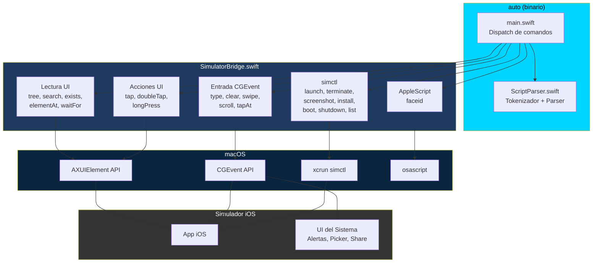

---

## Capa 1: AXUIElement — Lectura de la UI

macOS expone la interfaz de cualquier aplicacion a traves del framework de Accesibilidad. El Simulador iOS es una app de macOS (`com.apple.iphonesimulator`) que **renderiza las vistas de iOS como elementos nativos de accesibilidad de macOS**. Esta es la idea clave que hace que todo el enfoque funcione.

### Flujo de conexion

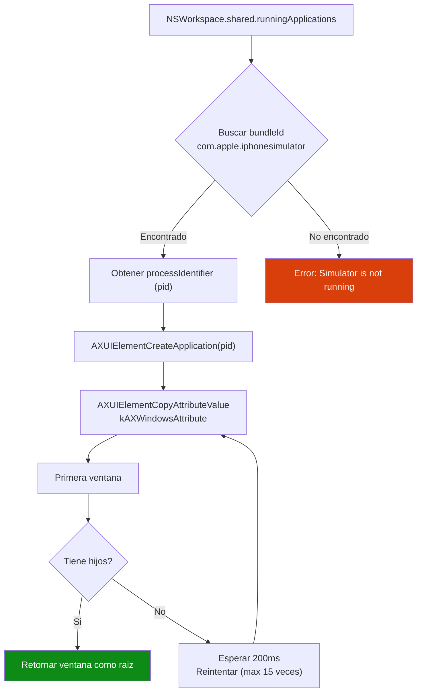

### Atributos de cada elemento

| Atributo AX | Que contiene | Ejemplo |
|---|---|---|
| `kAXRoleAttribute` | Tipo de elemento | `AXButton`, `AXStaticText`, `AXTextField` |
| `kAXTitleAttribute` | Texto visible | `"Login"`, `"Configuracion"` |
| `kAXDescriptionAttribute` | Label de accesibilidad | `"Boton de inicio de sesion"` |
| `AXIdentifier` | accessibilityIdentifier del codigo | `"login_btn"` |
| `kAXValueAttribute` | Valor actual / placeholder | `"Ingresa tu correo"` (placeholder SwiftUI) |
| `kAXPositionAttribute` | Posicion en pantalla | `CGPoint(x: 100, y: 200)` |
| `kAXSizeAttribute` | Tamano del elemento | `CGSize(width: 300, height: 44)` |
| `kAXEnabledAttribute` | Estado interactivo | `true` / `false` |

### Activacion y reintentos

El arbol AX no esta disponible inmediatamente despues de activar el Simulador. `findSimulatorContent()` reintenta hasta 15 veces con intervalos de 200ms (3 segundos en total). Cada reintento verifica que la ventana exista Y que tenga hijos (completamente cargada).

```swift
for _ in 0..<15 {
    if let window = getFirstWindow(of: app) {
        if let children = getChildren(of: window), !children.isEmpty {
            return window  // listo
        }
    }
    usleep(200_000)  // 200ms
}
```

**Profundidad del arbol:** Limitada a 20 niveles para prevenir recursion infinita.

---

## Capa 2: CGEvent — Simulacion de Entrada

Toda la entrada de usuario (teclado, mouse, gestos) se simula a traves de `CGEvent`. Eventos a nivel kernel, no acciones de accesibilidad.

### Flujo de un tap

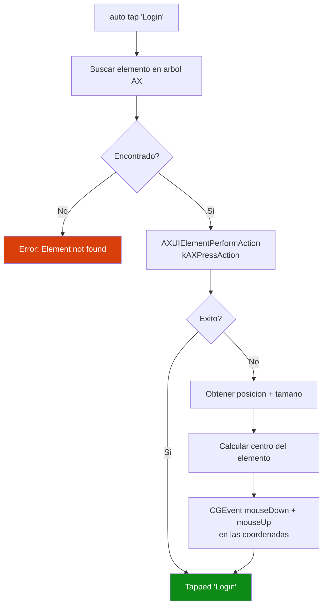

### Escritura de texto

Cada caracter se mapea a un virtual key code de macOS y se envia como eventos key down + key up:

```swift
let keyDown = CGEvent(keyboardEventSource: src, virtualKey: keyCode, keyDown: true)
let keyUp = CGEvent(keyboardEventSource: src, virtualKey: keyCode, keyDown: false)
if necesitaShift {
    keyDown?.flags = .maskShift
}
keyDown?.postToPid(pid)
keyUp?.postToPid(pid)
usleep(30_000)  // 30ms entre teclas para estabilidad
```

Los key codes estan mapeados manualmente (layout US QWERTY). Shift se aplica para mayusculas y caracteres especiales (`~!@#$%^&*()_+{}|:"<>?`).

### Swipe/Scroll

El Simulador traduce arrastres de mouse de macOS en gestos de swipe de iOS. AutoPilot simula esto con 20 pasos incrementales de drag:

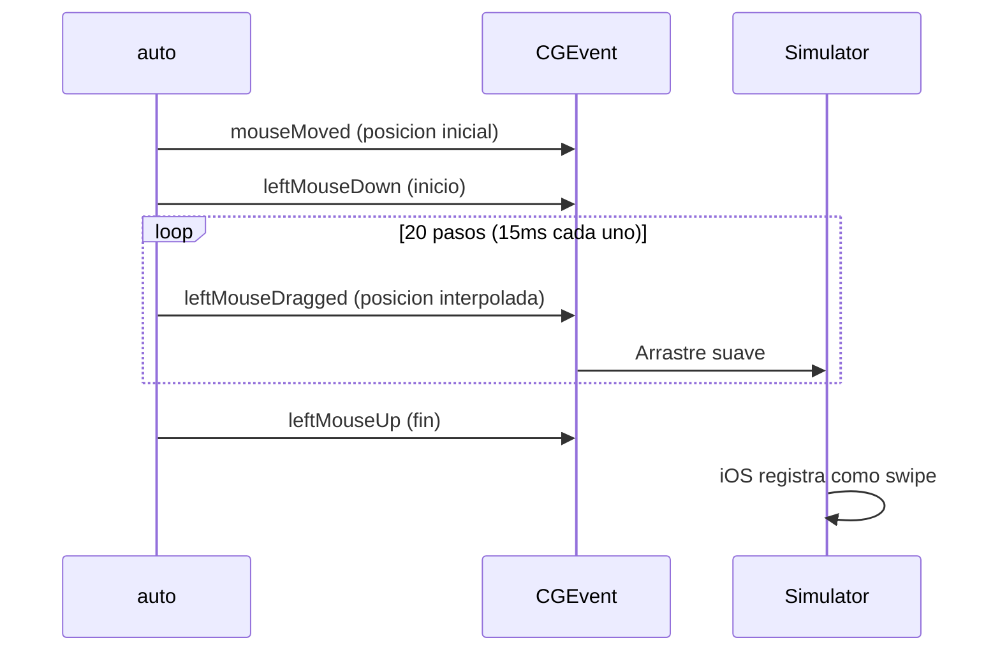

El movimiento suave es necesario — un salto directo de inicio a fin no se reconoce como swipe.

### `postToPid` vs `.cghidEventTap`

| Metodo | Alcance | Usado para |
|---|---|---|
| `postToPid(pid)` | Solo el proceso del Simulador | `type`, `clear`, tap dentro de la app |
| `.post(tap: .cghidEventTap)` | Evento global HID | `tapAt`, `swipe`, `scroll`, `longPress` — alcanza UIs del sistema (photo picker, alertas de permisos, share sheets) |

### Limpiar campo de texto

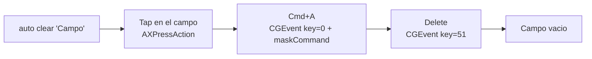

### Presion larga

Mouse down → esperar N segundos → mouse up. Usa posting global para funcionar con UIs del sistema.

---

## Capa 3: xcrun simctl — Ciclo de Vida

Comandos que ejecutan la herramienta `simctl` de Apple como subproceso:

| Operacion | Comando simctl | Notas |
|---|---|---|
| Listar dispositivos | `simctl list devices -j` | Parsea JSON, agrupa por estado |
| Encender | `simctl boot <udid>` | Resuelve nombre a UDID primero |
| Apagar | `simctl shutdown <udid>` | Misma resolucion de nombre |
| Abrir app | `simctl launch <deviceId> <bundleId>` | |
| Cerrar app | `simctl terminate <deviceId> <bundleId>` | |
| Instalar | `simctl install <deviceId> <ruta>` | Acepta bundles .app |
| Screenshot | `simctl io <deviceId> screenshot <ruta>` | |
| Inyectar media | `simctl addmedia <deviceId> <ruta>` | Fotos, videos, contactos |
| Portapapeles | `simctl pbcopy/pbpaste <deviceId>` | Leer/escribir clipboard |
| Abrir URL | `simctl openurl <deviceId> <url>` | Deep links, universal links |

### Resolucion de nombre a UDID

Cuando pasas un nombre como `"iPhone 16"`, AutoPilot lista todos los dispositivos via `simctl list devices -j`, busca el nombre coincidente (case-insensitive) y extrae el UDID. Si la entrada ya es un UDID (longitud > 30, contiene guiones), se usa directamente.

---

## Capa 4: AppleScript — Menus del Simulador

Face ID no tiene equivalente en simctl ni en ninguna API. Vive en la barra de menus del Simulador bajo Features > Face ID.

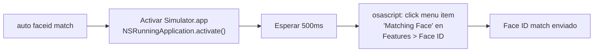

**Ruta del menu:**
```applescript
tell application "System Events" to tell process "Simulator"
    click menu item "Matching Face" of menu "Face ID" 
        of menu item "Face ID" of menu "Features" of menu bar 1
end tell
```

**Verificacion de enrollment:** Lee el atributo `AXMenuItemMarkChar` del menu item "Enrolled". Si hay checkmark, Face ID esta activado.

---

## Algoritmo de Busqueda de Elementos

Encontrar el elemento correcto es critico. AutoPilot usa una estrategia de tres pasadas depth-first:

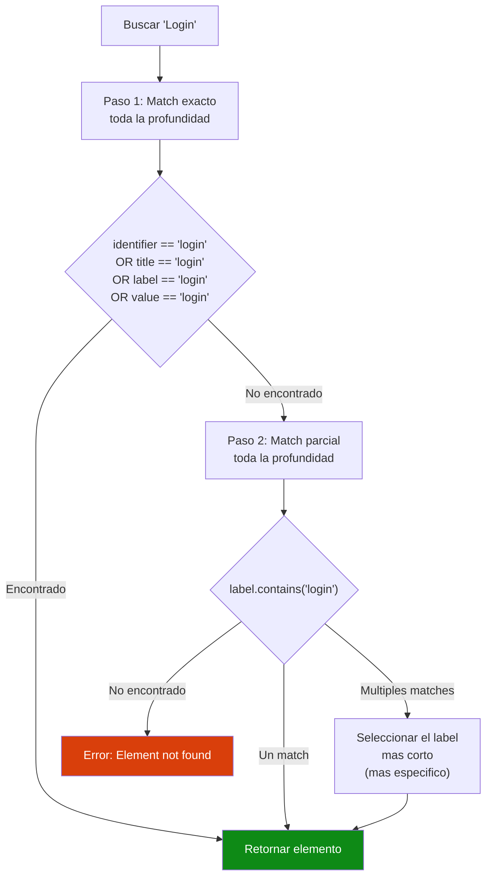

**Detalle importante:** El Paso 1 recorre toda la profundidad del arbol antes de pasar al Paso 2. Un match exacto a cualquier profundidad tiene prioridad sobre un match parcial a cualquier profundidad.

**Por que el match por value importa:** Los elementos SwiftUI frecuentemente exponen su texto visible en `kAXValueAttribute` en vez de `kAXTitleAttribute` o `kAXDescriptionAttribute`. Sin match por value, el texto placeholder y el contenido de campos de texto serian invisibles para la herramienta.

Todas las comparaciones son case-insensitive.

---

## Motor de Scripts

### Flujo de ejecucion

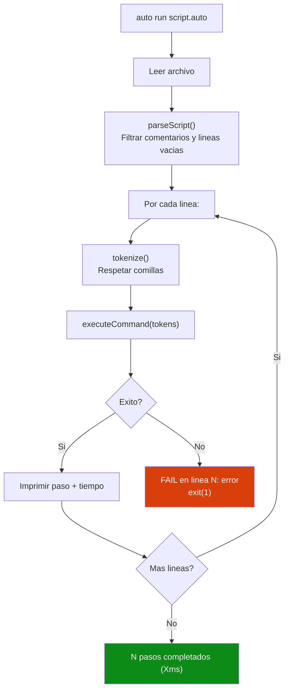

### Tokenizador

El tokenizador respeta comillas dobles y simples:

```
tap "Login Button"     → ["tap", "Login Button"]
type 'Hello World'     → ["type", "Hello World"]
scroll "tabla" down    → ["scroll", "tabla", "down"]
```

---

## Capa 5: Inyeccion de Camara (Camera Mock)

El Simulador iOS no tiene webcam. AutoPilot inyecta un mock de camara que swizzlea ~25 metodos de AVFoundation, permitiendo probar flujos de camara en CI/CD headless.

### Dos modos de inyeccion

| | `launch --inject` (dylib) | `auto build` (static lib) |
|---|---|---|
| Necesita proyecto Xcode | No | Si |
| Modifica el binario | No | Si |
| Hot-swap de imagen | Si (`auto inject`) | No |
| Mecanismo | `DYLD_INSERT_LIBRARIES` | `-force_load` |
| Cuando usar | Apps ya compiladas/instaladas | Cuando tienes el proyecto |

### `launch --inject` — Inyeccion sin recompilar

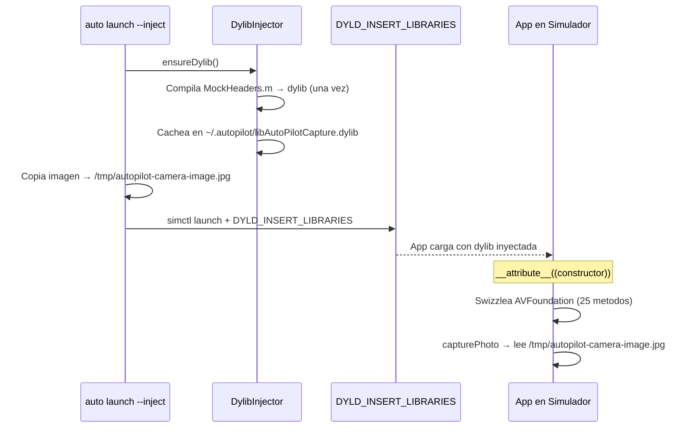

### `auto inject` — Hot-swap de imagen

Cambia la imagen de camara sin relanzar la app. Solo copia el archivo al path fijo que el mock lee en cada captura.

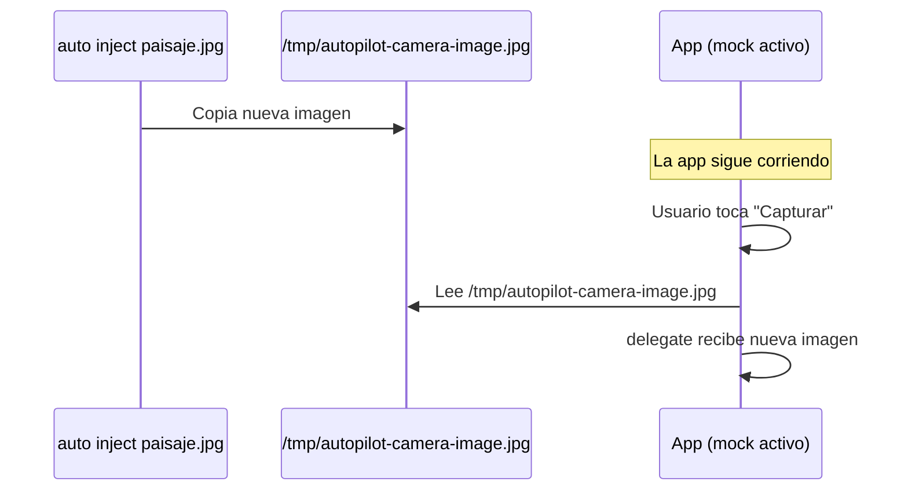

### Flujo de resolucion de imagen

El mock busca la imagen en este orden:

1. `/tmp/autopilot-camera-image.jpg` — path fijo, actualizado por `auto inject`
2. `AUTOPILOT_CAMERA_IMAGE` env var — seteada al lanzar
3. Placeholder rojo (100x100) — si no hay imagen

### Metodos swizzleados

| Clase | Metodos | Mock |
|---|---|---|
| **AVCaptureDevice** | `authorizationStatus`, `requestAccess`, `defaultDevice` (x2) | Siempre autorizado, retorna mock device |
| **AVCaptureDeviceInput** | `initWithDevice:`, `deviceInputWithDevice:` | Acepta cualquier device |
| **AVCaptureSession** | `startRunning`, `stopRunning`, `isRunning`, `canAdd*`, `add*`, `remove*`, `begin/commitConfiguration`, `inputs`, `outputs` | No-ops, estado via associated objects |
| **AVCapturePhotoOutput** | `capturePhoto:delegate:` | Lee imagen, crea AVCapturePhoto, llama delegate |
| **AVCapturePhoto** | `fileDataRepresentation`, `CGImageRepresentation`, `timestamp`, `photoCount`, `isRawPhoto` | Retorna datos de imagen inyectada |
| **AVCaptureMetadataOutput** | `setMetadataObjectsDelegate:`, `setMetadataObjectTypes:` | No-ops (QR scanner no crashea) |
| **AVCaptureVideoPreviewLayer** | `setSession:` | Preview con labels "LIVE" + "AutoPilot" |

### Demo

Video demostrando el flujo completo: launch sin mock → `launch --inject` → hot-swap con `inject`:

https://github.com/fsaldivar-dev/AutoPilot/blob/main/assets/demos/demo-inject.mp4

| Sin mock | Con `--inject` | Hot-swap |
|---|---|---|
| 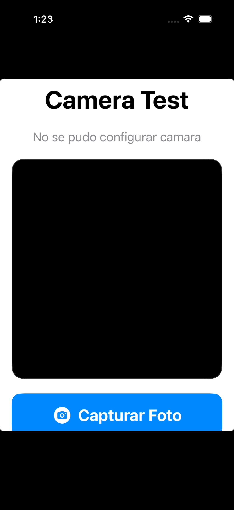 | 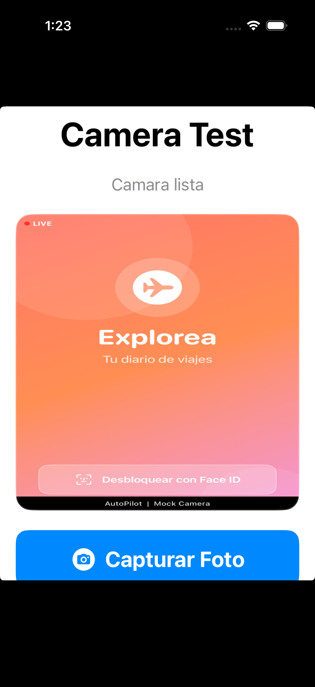 | 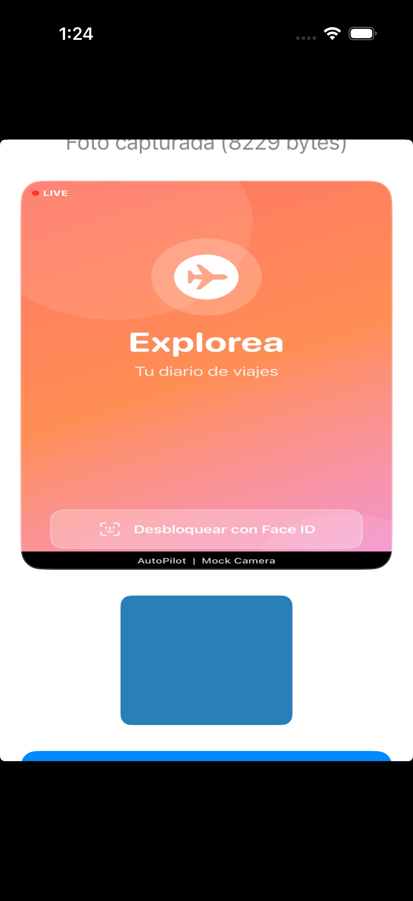 |

### Ejemplo en script .auto

```bash
# test-camara.auto
launch com.example.app --inject selfie.jpg
waitFor "Camara lista" 10
tap "Capturar Foto"
screenshot resultado-1.png

inject paisaje.jpg
tap "Capturar Foto"
screenshot resultado-2.png

inject documento.jpg
tap "Capturar Foto"
screenshot resultado-3.png
```
