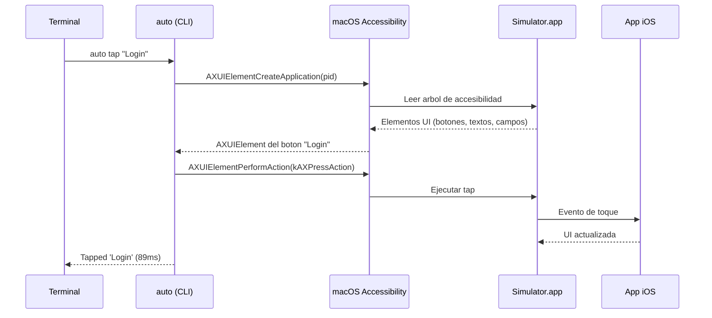

# Capitulo 1 — El problema

## La automatizacion iOS esta rota

Hay una pregunta que parece simple: ¿como hago tap en un boton del Simulador iOS desde la terminal?

La respuesta oficial de Apple es XCUITest. Escribes un test target en Swift, lo compilas junto con tu app, Xcode lanza el runner, el runner se conecta al Simulador, y ahi si — puedes hacer tap. Para una accion de 89 milisegundos, necesitas un proyecto de Xcode, un scheme de test, un build completo y un runner que compile cada vez que quieras ejecutar.

La respuesta de la comunidad es Appium. Instalas Node.js, el CLI de Appium, un driver de iOS que internamente usa WebDriverAgent (que a su vez es un wrapper de XCUITest), Java para Android, Python o Ruby para los clients, y un servidor HTTP que traduce el protocolo WebDriver W3C a acciones nativas. Para hacer tap en un boton, levantas un servidor.

La respuesta de Maestro, la herramienta mas moderna del espacio, es un poco mas elegante. Escribes flujos en YAML, corres un CLI escrito en Kotlin, y por debajo — sin que lo sepas — Maestro lanza un XCUITest "zombie" que nunca termina y levanta un servidor HTTP interno. El matching de elementos lo hace Maestro en Kotlin despues de jalar el arbol de accesibilidad por HTTP.

Todas estas herramientas comparten una dependencia fundamental: **XCUITest**. Es el unico punto de acceso que Apple ofrece oficialmente para interactuar con la UI de una app iOS de forma programatica. Y XCUITest fue disenado para correr *dentro* del ecosistema de Xcode, no como una herramienta de linea de comandos.

## Lo que nadie te dice

Hay cosas que descubres solo cuando intentas automatizar iOS en produccion, en CI/CD headless, a las 2 de la manana cuando el pipeline falla.

**No hay camara.** El Simulador iOS no tiene webcam. `AVCaptureDevice.default(.builtInWideAngleCamera, ...)` retorna `nil`. Si tu app usa la camara — escanear QR, tomar foto, verificar identidad — no la puedes probar en CI. Apple no ofrece solucion. Appium tampoco. Maestro tampoco. La unica opcion "oficial" es usar servicios cloud como BrowserStack que inyectan un modulo propietario en tu app por $400/mes.

**El arbol de accesibilidad es un ciudadano de segunda.** XCUITest tiene su propia forma de exponer elementos. Los botones de SwiftUI NavigationBar? `AXChildren = [0]`. Estan ahi visualmente pero el framework no los ve. Los placeholders de TextField en SwiftUI? Aparecen en `kAXValueAttribute`, no en `kAXTitleAttribute` ni `kAXDescriptionAttribute`. Cada version de iOS mueve cosas.

**El tiempo de setup es el enemigo silencioso.** Un ingeniero nuevo necesita entre 30 minutos y 2 horas para configurar Appium. Necesita entre 5 y 15 minutos para configurar un test target de XCUITest en un proyecto existente. Y si estas en CI, necesitas mantener esa configuracion viva — actualizar drivers cuando cambia Xcode, manejar timeouts de WebDriverAgent, lidiar con sesiones zombies.

## La observacion que lo cambio todo

El Simulador iOS es una app de macOS. Se llama `Simulator.app`, tiene un PID, tiene una ventana. Y macOS tiene algo que pocas personas aprovechan para este caso de uso: las **APIs de Accesibilidad**.

Cualquier aplicacion de macOS expone su interfaz a traves de `AXUIElement`. Es la misma API que usan los lectores de pantalla, los window managers, las herramientas de automatizacion de escritorio. No es nueva, no es experimental, no es privada. Esta documentada, es estable, y funciona en todas las versiones de macOS.

Lo que descubrimos es que el Simulador iOS **renderiza las vistas de la app iOS como elementos nativos de accesibilidad de macOS**. Un `UIButton` con label "Login" en la app iOS aparece como un `AXButton` con `kAXTitleAttribute = "Login"` en el arbol de accesibilidad del Simulador.

Esto significa que no necesitas XCUITest. No necesitas compilar un test target. No necesitas un servidor. No necesitas Node ni Java ni Python. Solo necesitas un binario que hable con las APIs de accesibilidad de macOS.

Un binario Swift de 311KB.

## Lo que decidimos construir

No una herramienta de testing. No un framework. No un producto.

Un experimento: ¿hasta donde puedes llegar controlando el Simulador iOS *exclusivamente* desde macOS, sin tocar nada dentro del Simulador?

La respuesta nos sorprendio. Pudimos:
- Leer el arbol completo de UI de cualquier app
- Hacer tap, scroll, swipe, long press, double tap
- Escribir texto caracter por caracter
- Simular Face ID (via menus nativos del Simulador)
- Inyectar fotos al photo library
- Manipular el portapapeles
- Y lo mas inesperado: **inyectar un mock de camara en cualquier app sin recompilar**, algo que ninguna otra herramienta del mercado ofrece

Cada una de estas capacidades trajo descubrimientos, tropiezos y decisiones de diseno que documentamos en detalle. La camara virtual en particular requirio **10 intentos** antes de encontrar un enfoque que funcionara — desde CMIOExtension (bloqueado por Apple) hasta dylib injection via `DYLD_INSERT_LIBRARIES` (que nadie usa en herramientas de testing).

Este libro documenta todo el proceso: los errores, los callejones sin salida, las decisiones y sus razones. No para vender AutoPilot — para que cualquier ingeniero que se enfrente a problemas similares tenga un punto de partida.

## Estructura de este libro

| Capitulo | Que encontraras |
|---|---|
| [02 — Arquitectura](02-arquitectura.md) | Las 4 capas tecnicas: AXUIElement, CGEvent, simctl, AppleScript |
| [03 — La camara virtual](03-la-camara-virtual.md) | 10 intentos, 9 fracasos, y lo que aprendimos de cada uno |
| [04 — Inyeccion sin recompilar](04-inyeccion-sin-recompilar.md) | DYLD_INSERT_LIBRARIES en testing — un enfoque que nadie mas usa |
| [05 — El editor](05-el-editor.md) | De CLI a IDE visual con Tauri + Monaco |
| [06 — Alternativas](06-alternativas.md) | Maestro, Appium, AXe, XCUITest, idb — que hacen bien y por que elegimos otro camino |
| [07 — Decisiones](07-decisiones.md) | Por que Swift puro, por que AX publicas, por que no YAML |
| [Apendices](apendices/) | Referencia de comandos, variables de entorno, CI/CD, troubleshooting |

---

*Siguiente: [Capitulo 2 — Arquitectura](02-arquitectura.md)*
