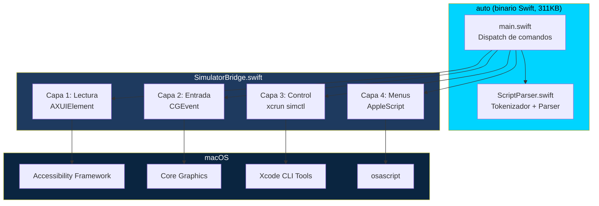
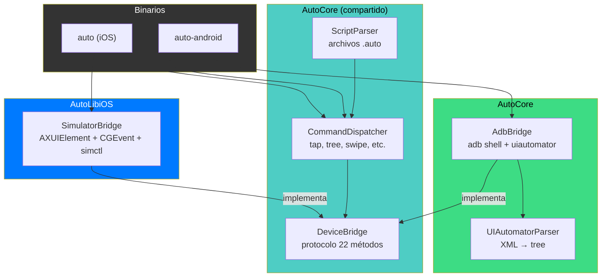

# Capítulo 2 — Arquitectura

## Arquitectura agnóstica, backends específicos

AutoPilot controla dispositivos iOS y Android con la misma interfaz (`DeviceBridge`, 22 métodos). Cada plataforma tiene su propio backend — iOS usa APIs de macOS, Android usa un agente nativo con UiAutomation directa (ver [Capítulo 9](09-el-agente-android.md)). Lo que sigue es el detalle del backend iOS.

## iOS: Cuatro capas, cero dependencias

Una vez que entiendes que el Simulador iOS es una app de macOS con accesibilidad expuesta, la arquitectura se vuelve obvia. No necesitas inventar nada — solo necesitas hablar con macOS en su propio idioma.

El backend iOS se construye sobre 4 APIs de macOS. Cada una resuelve un problema distinto:

| Capa | API | Qué resuelve | Ejemplo |
|---|---|---|---|
| **Lectura** | AXUIElement | Ver la UI de la app | `auto tree`, `auto exists "Login"` |
| **Entrada** | CGEvent | Simular interacción humana | `auto type "Hola"`, `auto swipe up` |
| **Control** | xcrun simctl | Gestionar el Simulador | `auto launch`, `auto screenshot` |
| **Menus** | AppleScript | Acceder a menus nativos | `auto faceid match` |

Ninguna de estas APIs es nueva o experimental. AXUIElement existe desde macOS 10.2 (2002). CGEvent desde 10.4 (2005). `simctl` desde Xcode 6 (2014). AppleScript desde System 7 (1993). Lo que es nuevo es usarlas *juntas* para controlar un Simulador iOS sin XCUITest.



Lo que sigue es el detalle técnico de cada capa. Si prefieres la vision general, salta a la [tabla resumen](#resumen) al final.

---

> **Nota:** La documentación técnica completa de cada capa esta en [docs/ios/ARQUITECTURA.md](../ios/ARQUITECTURA.md). Este capítulo es un resumen narrativo con los hallazgos más importantes.

---

## Capa 1: AXUIElement — Leer la UI sin tocar la app

El descubrimiento fundamental: el Simulador renderiza las vistas de iOS como elementos nativos de accesibilidad de macOS.

Cuando una app iOS muestra un botón con label "Login", el Simulador crea un `AXButton` con `kAXTitleAttribute = "Login"` en su árbol de accesibilidad. Esto no es una feature del Simulador — es un efecto secundario de como macOS renderiza ventanas.

Para conectarse:

```
NSWorkspace → buscar com.apple.iphonesimulator → obtener PID
    → AXUIElementCreateApplication(pid) → obtener ventana
    → recorrer AXChildren recursivamente → árbol completo
```

### Hallazgos que no estan documentados en otro lugar

- **El árbol no esta disponible inmediatamente.** Después de activar el Simulador, los elementos tardan hasta 3 segundos en aparecer. AutoPilot reintenta 15 veces con intervalos de 200ms.

- **SwiftUI NavigationBar es invisible.** Los botones de la barra de navegación de SwiftUI tienen `AXChildren = [0]`. Estan renderizados visualmente pero el framework de accesibilidad no los expone. Solución: `tapAt` con coordenadas.

- **Los placeholders viven en Value, no en Title.** En SwiftUI, el texto placeholder de un `TextField` aparece en `kAXValueAttribute`, no en `kAXTitleAttribute` ni `kAXDescriptionAttribute`. Sin buscar en Value, campos de texto con placeholder son invisibles.

- **La profundidad máxima importa.** Sin limite, la recursión puede colgarse en árboles muy profundos. AutoPilot limita a 20 niveles.

### Algoritmo de busqueda

Encontrar el elemento correcto es crítico. AutoPilot usa dos pasadas:

1. **Match exacto** (toda la profundidad): identifier == query OR title == query OR label == query OR value == query
2. **Match parcial** (toda la profundidad): label.contains(query), selecciona el más corto (mas específico)

Todas las comparaciones son case-insensitive.

---

## Capa 2: CGEvent — Simular un humano

AXUIElement puede hacer tap (`kAXPressAction`), pero no puede escribir texto, ni hacer swipe, ni long press. Para eso necesitas eventos de entrada a nivel kernel.

`CGEvent` envia eventos de teclado y mouse directamente al proceso del Simulador. El Simulador los traduce en gestos de iOS.

### Hallazgos

- **postToPid vs cghidEventTap.** `postToPid` envia el evento solo al Simulador — perfecto para escribir texto. `.post(tap: .cghidEventTap)` es global y alcanza UIs del sistema (photo picker, alertas de permisos). Cada acción usa el método correcto.

- **Swipe necesita movimiento suave.** Un salto directo de punto A a punto B no se reconoce como swipe. AutoPilot simula 20 pasos incrementales de drag con 15ms entre cada uno.

- **30ms entre teclas.** Menos causa caracteres perdidos. Mas es innecesariamente lento.

---

## Capa 3: xcrun simctl — Controlar el ciclo de vida

`simctl` es la herramienta CLI de Apple para gestionar simuladores. AutoPilot la ejecuta como subproceso.

Lo que agrega AutoPilot sobre simctl puro:
- **Resolución de nombre a UDID** — pasas "iPhone 16", AutoPilot busca el UDID
- **Inyección de variables de entorno** — via prefijo `SIMCTL_CHILD_`
- **Inyección de dylib** — via `SIMCTL_CHILD_DYLD_INSERT_LIBRARIES` (Capítulo 4)

---

## Capa 4: AppleScript — El ultimo recurso

Face ID no tiene API, ni en simctl ni en accesibilidad. Vive en el menu `Features > Face ID` del Simulador. La única forma de acceder es automatizar el menu con AppleScript.

```applescript
tell application "System Events" to tell process "Simulator"
    click menu item "Matching Face" of menu "Face ID" 
        of menu item "Face ID" of menu "Features" of menu bar 1
end tell
```

Es frágil (depende del idioma del sistema y la estructura exacta del menu), pero es la única opción.

---

## Resumen

```
Terminal
    |
    auto tap "Login"
    |
    ├─ Capa 1 (AXUIElement): Buscar "Login" en el árbol → encontrar AXButton
    ├─ Capa 1 (AXUIElement): AXUIElementPerformAction(kAXPressAction)
    │   └─ Si falla: Capa 2 (CGEvent) → calcular centro → mouseDown + mouseUp
    |
    auto type "correo@test.com"
    |
    ├─ Capa 2 (CGEvent): keyDown + keyUp por cada caracter, 30ms entre teclas
    |
    auto screenshot resultado.png
    |
    ├─ Capa 3 (simctl): xcrun simctl io <device> screenshot resultado.png
    |
    auto faceid match
    |
    └─ Capa 4 (AppleScript): click menu item "Matching Face" of menu "Face ID"...
```

La documentación técnica completa con diagramas Mermaid de cada flujo está en [docs/ios/ARQUITECTURA.md](../ios/ARQUITECTURA.md).

---

## Más allá de iOS: DeviceBridge

Todo lo descrito hasta aquí es específico de iOS — AXUIElement, CGEvent, simctl, AppleScript. Pero la *interfaz* de automatización es genérica: necesitas leer la UI, hacer tap, escribir texto, tomar screenshots, lanzar apps. Cualquier plataforma tiene esas operaciones, solo que con APIs diferentes.

En abril 2026 extrajimos esa interfaz en un protocolo Swift llamado `DeviceBridge`:

```swift
public protocol DeviceBridge {
    func tree() throws -> [[String: Any]]
    func tap(target: String) throws
    func typeText(_ text: String) throws
    func swipe(direction: String) throws
    func screenshot(path: String) throws
    func launchApp(bundleId: String, envVars: [String: String]) throws
    // ... 22 métodos en total
}
```

`SimulatorBridge` implementa este protocolo usando las 4 capas de macOS. `AdbBridge` lo implementa usando `adb shell` commands. El `CommandDispatcher` compartido no sabe — ni le importa — qué plataforma hay debajo.



La decisión de dos binarios separados (en lugar de un flag `--platform`) se documenta en [ADR 8](07-decisiones.md#adr-8-dos-binarios--protocolo-devicebridge). La arquitectura Android se detalla en [docs/android/README.md](../android/README.md).

---

*Anterior: [Capítulo 1 — El problema](01-el-problema.md) | Siguiente: [Capítulo 3 — La cámara virtual](03-la-camara-virtual.md)*
