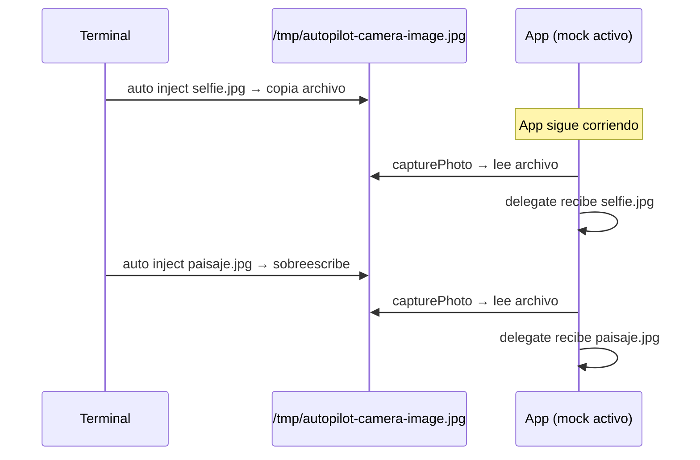

# Capitulo 4 — Inyeccion sin recompilar

## Un enfoque que nadie mas usa

Despues de 9 intentos para resolver la camara virtual (Capitulo 3), teniamos una solucion funcional: `auto build` compila una static library ObjC y la inyecta via `-force_load`. Funciona con cualquier app, swizzlea 25 metodos de AVFoundation, y la app recibe fotos inyectadas como si vinieran de una camara real.

Pero tenia un problema: **necesitas el proyecto Xcode**.

Si alguien te pasa un `.app` ya compilado, o si quieres probar una app de terceros, o si estas en CI y no quieres recompilar cada vez que cambias la imagen de la camara — `auto build` no te sirve.

La pregunta era: ¿se puede inyectar el mock en una app que ya esta instalada en el Simulador, sin tocarla?

## DYLD_INSERT_LIBRARIES

macOS tiene un mecanismo de inyeccion de codigo a nivel de dynamic linker: `DYLD_INSERT_LIBRARIES`. Al setear esta variable de entorno antes de lanzar un proceso, `dyld` carga la dylib especificada *junto con* el binario principal. El codigo de la dylib se ejecuta antes que `main()`.

En seguridad, esto se usa para interceptar funciones (hooking). En desarrollo, Apple lo usa para herramientas como AddressSanitizer. En testing de iOS, **nadie lo usa**. Revisamos la documentacion de Maestro, Appium, Detox, AXe, idb, EarlGrey — ninguno menciona `DYLD_INSERT_LIBRARIES` como mecanismo de inyeccion.

### Por que funciona en el Simulador

Las apps del Simulador iOS corren como procesos de macOS. No tienen code signing enforcement como en un dispositivo fisico. `dyld` acepta la variable de entorno sin restricciones.

`simctl` tiene un prefijo especial: cualquier variable de entorno con prefijo `SIMCTL_CHILD_` se pasa al proceso de la app sin el prefijo. Es decir:

```
SIMCTL_CHILD_DYLD_INSERT_LIBRARIES=/path/to/lib.dylib xcrun simctl launch booted com.example.app
```

La app arranca con `DYLD_INSERT_LIBRARIES=/path/to/lib.dylib`, `dyld` carga la dylib, y el `__attribute__((constructor))` se ejecuta antes que `main()`.

### Por que NO funciona en dispositivo fisico

En un iPhone real, iOS verifica code signing de todas las librerias cargadas. ARM64 PAC (Pointer Authentication Codes) valida la integridad de punteros de funcion. Una dylib no firmada por Apple o por el desarrollador es rechazada. Esto es una limitacion fundamental — la inyeccion solo funciona en Simulador.

## Compilar el mock como dylib

El mismo codigo ObjC de MockHeaders.swift (534 lineas, 25 metodos swizzleados) que usabamos como static library se puede compilar como dylib:

```bash
xcrun clang -dynamiclib -arch arm64 \
  -isysroot $(xcrun --sdk iphonesimulator --show-sdk-path) \
  -target arm64-apple-ios16.0-simulator \
  -fobjc-arc -fno-modules \
  -framework AVFoundation -framework UIKit \
  -framework CoreMedia -framework QuartzCore \
  AutoPilotCapture.m -o libAutoPilotCapture.dylib
```

El resultado es una dylib de ~75KB que se cachea en `~/.autopilot/` y se reutiliza en todas las ejecuciones siguientes.

### Tropiezo: QuartzCore faltante

La primera compilacion fallo:

```
Undefined symbols for architecture arm64:
  "_CACurrentMediaTime", referenced from: _ap_timestamp
  "_kCAGravityResize", referenced from: _ap_previewSetSession
```

`CACurrentMediaTime()` y `kCAGravityResize` vienen de QuartzCore. Con `-force_load` no era problema porque el binario final de la app ya linkea QuartzCore. Con `-dynamiclib`, la dylib necesita declarar todas sus dependencias explicitamente. Solucion: agregar `-framework QuartzCore`.

## Hot-swap: cambiar la imagen sin relanzar

Con `auto build` (force-load), la imagen se lee del environment variable `AUTOPILOT_CAMERA_IMAGE`. Esta variable se setea una vez al lanzar la app y no cambia. Si quieres otra imagen, relanzas.

Con dylib injection, descubrimos que podiamos hacer algo mejor.

### El problema

Las variables de entorno son inmutables post-launch. `[NSProcessInfo processInfo].environment` retorna un snapshot del momento en que el proceso arranco. No hay forma de cambiar `AUTOPILOT_CAMERA_IMAGE` desde fuera una vez que la app esta corriendo.

### La solucion: un path fijo

En vez de leer de una variable de entorno, el mock lee de un **archivo en una ubicacion fija**: `/tmp/autopilot-camera-image.jpg`. Cada vez que la app llama `capturePhoto`, el mock lee el archivo en ese momento — no lo cachea.

El nuevo comando `auto inject foto.jpg` simplemente copia el archivo a esa ubicacion. La proxima captura usara la nueva imagen, sin relanzar la app.



### Hallazgo: /tmp/ es compartido

Un descubrimiento temprano (Intento 4 en la bitacora) fue que `/tmp/` del Simulador NO es `/tmp/` del Mac — el Simulador tiene su propio filesystem. Pero las apps del Simulador corren como procesos macOS y SI pueden leer rutas del Mac. `/tmp/autopilot-camera-image.jpg` es accesible tanto desde el CLI como desde la app en el Simulador.

### Tropiezo: constructor condicionado

El constructor original de MockHeaders solo activaba el swizzle si existia la variable `AUTOPILOT_CAMERA_IMAGE`:

```objc
if (!imagePath && !qrCode) {
    NSLog(@"[AutoPilot] Camera mock inactive");
    return;  // No swizzlea nada
}
```

Con dylib injection, la dylib SOLO se carga cuando el usuario pide `--inject`. Si la dylib esta presente, siempre debe activar el swizzle — la imagen puede llegar despues via `auto inject`. Solucion: remover la condicion.

## El flujo final

```bash
# Lanzar app con mock inyectado
auto launch com.example.app --inject selfie.jpg

# La app muestra selfie.jpg en el preview de camara
# El usuario toca "Capturar" → recibe selfie.jpg

# Cambiar imagen sin relanzar
auto inject paisaje.jpg

# El usuario toca "Capturar" → recibe paisaje.jpg
```

En un script `.auto`:

```bash
launch com.example.app --inject selfie.jpg
waitFor "Camara lista" 10
tap "Capturar Foto"
screenshot resultado-1.png

inject paisaje.jpg
tap "Capturar Foto"
screenshot resultado-2.png

inject documento.jpg
tap "Capturar Foto"
screenshot resultado-3.png
```

Tres fotos, tres imagenes diferentes, una sola sesion de la app, sin relanzar.

## Comparativa de los dos enfoques

| | `launch --inject` (dylib) | `auto build` (static lib) |
|---|---|---|
| Necesita proyecto Xcode | No | Si |
| Modifica el binario | No (dylib externa) | Si (linkada al binario) |
| Hot-swap de imagen | Si (`auto inject`) | No (relanzar) |
| Mecanismo | `DYLD_INSERT_LIBRARIES` | `-force_load` |
| Tamano | ~75KB dylib cacheada | ~28KB static lib (por build) |
| Funciona en device fisico | No (code signing) | No (solo Simulador) |
| Compilacion | Una vez | Cada build |

No es que uno sea mejor que el otro. Son complementarios. Si tienes el proyecto Xcode y quieres el mock integrado en el binario, usa `auto build`. Si quieres probar una app ya instalada o cambiar imagenes en caliente, usa `launch --inject`.

## Que aprendimos

1. **`DYLD_INSERT_LIBRARIES` es una herramienta de testing viable** — nadie la usa para esto, pero funciona perfectamente en el Simulador.

2. **Las apps del Simulador son procesos de macOS** — comparten `/tmp/`, aceptan dylibs, no tienen code signing enforcement. Esto abre posibilidades que no existen en dispositivos fisicos.

3. **Las variables de entorno son inmutables post-launch** — si necesitas cambiar estado desde fuera, usa archivos en disco, no env vars.

4. **`-dynamiclib` requiere dependencias explicitas** — a diferencia de static libs que resuelven dependencias al linkear con el binario final.

5. **El hot-swap cambia la ergonomia de testing** — poder cambiar la imagen de camara sin relanzar la app permite scripts de prueba mas ricos y realistas.

---

*Anterior: [Capitulo 3 — La camara virtual](03-la-camara-virtual.md) | Siguiente: [Capitulo 5 — El editor](05-el-editor.md)*
