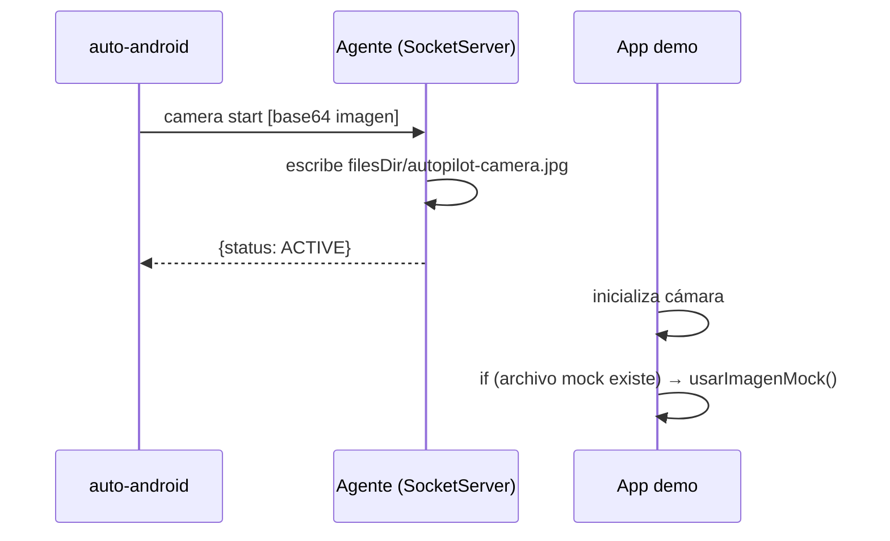
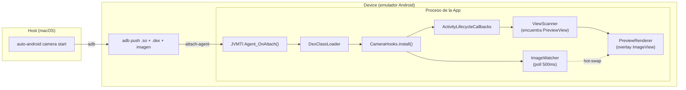
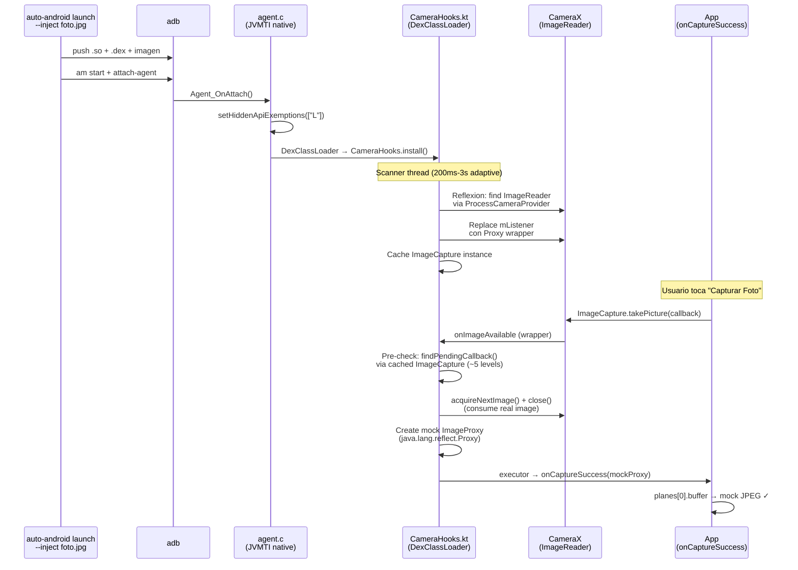
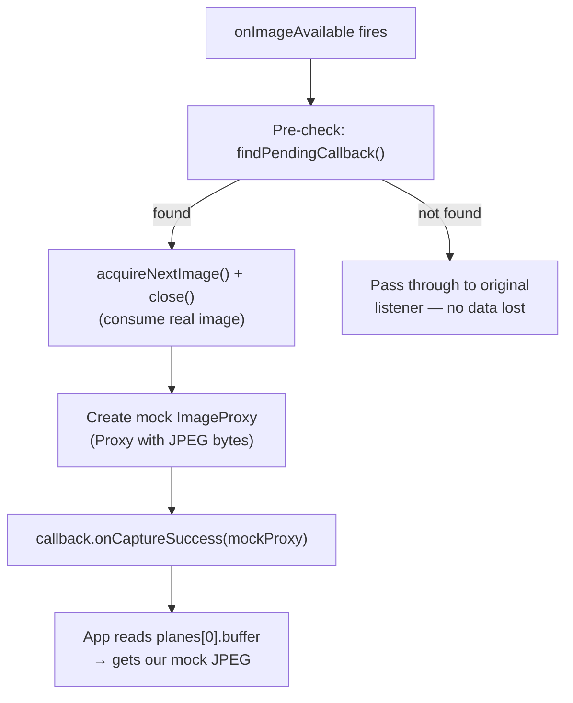

# Capítulo 10 — Paridad Android

## La brecha que quedó abierta

El Capítulo 9 termina con el agente nativo funcionando: de 2100ms a 75ms por tap, árbol de UI en 6ms, protocolo JSON sobre socket. Un salto de orden de magnitud.

Pero velocidad no es lo mismo que paridad. Al terminar el agente, Android podía hacer las operaciones básicas — `tap`, `type`, `swipe`, `tree`, `screenshot` — pero le faltaban features que iOS tenía desde el principio:

| Feature | iOS | Android (post-agente) |
|---|---|---|
| `tap "Camera[2]"` | ✓ | ✗ |
| `auto index` | ✓ | ✗ |
| `auto inspect` | ✓ | ✗ |
| Clipboard real | ✓ | workaround con `adb input text` |
| Camera mock | ✓ (DYLD_INSERT_LIBRARIES) | ✗ |

Este capítulo documenta cómo cerramos esa brecha — y dónde decidimos que la brecha es estructural y no vale la pena cerrar.

---

## Label[N] e `index`: el árbol como fuente de verdad

### El problema con elementos duplicados

Una pantalla puede tener dos botones "Camera" — el original y uno de "Cámara frontal", por ejemplo. `auto tap "Camera"` tapeaba el primero sin avisar. No había forma de tapear el segundo sin usar coordenadas hardcodeadas.

iOS resolvía esto con `Label[N]` — `tap "Camera[2]"` tapea la segunda ocurrencia. La lógica vivía en `TargetResolver` de `AutoLibiOS/`.

### Mover la lógica a AutoCore

La solución era compartir la lógica entre plataformas. `TargetResolver` y `ElementIndex` se movieron a `AutoCore/` como `TargetResolverShared` y `ElementIndexShared`:

```
AutoCore/
├── TargetResolverShared.swift  ← antes solo en AutoLibiOS
├── ElementIndexShared.swift    ← antes solo en AutoLibiOS
└── ...
```

Ambas implementaciones de `DeviceBridge` — `SimulatorBridge` (iOS) y `AgentBridge` (Android) — ahora usan el mismo código de matching. El árbol de accesibilidad de iOS y Android tiene el mismo formato JSON (diseño intencional desde el Capítulo 9), así que el resolver funciona sin cambios.

### `index` en Android: una decisión de arquitectura

`auto index` (iOS) imprime la lista de elementos con sus índices `$N`. Devuelve algo como:

```
$0  AXWindow     Simulator
$1  AXGroup      App
$2  AXButton     Login
$3  AXTextField  Usuario
```

Para Android, `auto-android index` no existe como comando del CLI. Los índices `$N` se generan en el **editor** (backend Rust), no en el CLI.

La razón: el árbol de Android tiene nodos genéricos sin etiqueta útil — `View`, `FrameLayout`, `LinearLayout` — que son artefactos de Jetpack Compose. Para que `$N` sea útil, hay que filtrarlos y resolver su texto desde los hijos. Esa heurística ya existía en `index_from_tree()` en Rust. Duplicarla en Swift en el CLI habría sido deuda técnica, no paridad real.

**Consecuencia práctica:** Para usar `$N` en scripts Android, hay que abrirlos en el editor una vez y dejar que el inspector genere los índices. No es ideal para uso puramente CLI, pero es el trade-off correcto por ahora.

---

## Clipboard en Android: la restricción silenciosa

### Lo que esperábamos

iOS tiene `auto paste "texto"` — escribe al pasteboard del simulador, la app puede leerlo con `UIPasteboard.general.string`. El equivalente Android obvio era llamar `ClipboardManager.getText()` desde el agente y `ClipboardManager.setText()` para escribir.

### Android 10 cerró esa puerta

Android 10 (API 29) introdujo una restricción de privacidad: las apps en background no pueden leer el clipboard. El agente de instrumentación, aunque tiene permisos elevados, corre en background desde la perspectiva del sistema. `ClipboardManager.getPrimaryClip()` retorna `null`.

Esto no lanza excepción ni error — retorna `null` silenciosamente. El primer intento de implementación "funcionó" en prueba porque ejecutábamos el agente en foreground manualmente. En uso real, dentro de un script automatizado, siempre retornaba vacío.

### La solución: cachear lo que nosotros escribimos

```
setClipboard(text):
  Handler(Looper.getMainLooper()).post {
    ClipboardManager.setText(text)   // funciona desde main thread
    cachedClipboard = text            // guardar localmente
  }

getClipboard():
  return cachedClipboard               // no leer el sistema, devolver el cache
```

**Escribir** sí funciona desde el agente — hay que hacerlo desde el main thread (de otro modo `ClipboardManager` se queja de no tener Looper). El `Handler(Looper.getMainLooper()).post { ... }` resuelve eso.

**Leer** no funciona. El workaround es guardar el último valor escrito por AutoPilot y devolverlo.

**Limitación real:** Si la app escribe algo al clipboard por su propia lógica — un "Copiar al portapapeles" del usuario — el agente no lo ve. Para flujos de testing donde AutoPilot controla toda la entrada, esto es suficiente. Para probar "el usuario copia X, la app lo lee", no sirve.

---

## Camera mock en Android: diez intentos, tres fases

iOS tuvo 10 intentos para mockear la cámara (ver [Capítulo 3](03-la-camara-virtual.md)). Android tuvo diez, en tres fases. La primera fase terminó con una solución cooperativa (la app tenía que saber del mock). La segunda fase logró inyección transparente del preview. La tercera fase interceptó los bytes de captura — cerrando la brecha con iOS.

### Fase 1: Tres intentos, solución cooperativa (PR #32)

#### Intento 1 — JVMTI agent en C (hookear Camera2 API)

**Idea:** JVMTI (Java Virtual Machine Tool Interface) permite inyectar un `.so` en el proceso de cualquier app via `adb shell cmd activity attach-agent`. Desde ahí, cargar un DEX con `DexClassLoader` que hookee Camera2.

**Compiló. No hookeó nada útil.** CameraX y Camera2 usan el Camera HAL vía NDK. Las llamadas no pasan por métodos Java que JVMTI pueda interceptar.

#### Intento 2 — Kotlin instrumentation (timing)

**Compiló. Falló por timing.** Los hooks se instalan después de que `CameraActivity` ya inicializó CameraX. `ProcessCameraProvider` ya entregó la cámara — interceptar una sesión ya activa no es posible.

#### Intento 3 — Socket + base64 + cooperación de la app

La alternativa pragmática: la app coopera explícitamente. El CLI envía la imagen al agente via socket, el agente la escribe a disco, y la app demo revisa si existe el archivo para usarlo en vez de la cámara real.



Funcional (37ms start, 28ms feed), pero no transparente — la app tenía código especial para cooperar.

### Fase 2: Inyección transparente via JVMTI (PR #35)

Los intentos 1 y 2 de la fase anterior no fueron en vano. El agente nativo JVMTI (`agent.c`) y la infraestructura de DEX loading funcionaban — lo que falló fue la estrategia de hookeo. La idea correcta era: dejar que la cámara real funcione, pero interceptar lo que el usuario ve.

#### Intento 4 — Subclasear Camera2 API

Intentamos crear `MockCameraManager`, `MockCameraDevice`, `MockCaptureSession` en Kotlin. Proxy dinámico o subclases que interceptaran `openCamera()`.

**No compila.** `CameraManager` es `final`. `CameraDevice` tiene constructor package-private. `java.lang.reflect.Proxy` solo funciona con interfaces. Sin `cglib`/`dexmaker` (dependencias externas), no hay forma de subclasear clases concretas del framework.

#### Intento 5 — Surface.lockCanvas() directo

Dejar que la cámara real abra, encontrar el `SurfaceView` del preview, y dibujar nuestra imagen directamente en su Surface.

`ViewScanner` encuentra el `PreviewView` → hijo `SurfaceView[1280x960]`. Hasta ahí bien. Pero `Surface.lockCanvas(null)` retorna `null`. CameraX usa `SURFACE_TYPE_PUSH_BUFFERS` — el hardware controla el buffer, la app no puede dibujar en él.

#### Intento 6 — ImageView overlay (funciona)

Si no podemos dibujar EN el Surface, ponemos algo ENCIMA. Un `ImageView` como hijo del `PreviewView` con `elevation=100f` se renderiza por encima de cualquier Surface.



El flujo: el agente nativo carga el DEX → `CameraHooks` registra `ActivityLifecycleCallbacks` → cuando una actividad hace `onResume`, `ViewScanner` busca el `PreviewView` en la jerarquía → `PreviewRenderer` coloca un `ImageView` con la imagen mock encima → `ImageWatcher` poll cada 500ms para hot-swap.

**Resultado:**
```
camera start  → 737ms (deploy completo + inject)
camera feed   → 135ms (solo push imagen, hot-swap)
camera stop   → 201ms (force-stop app)
```

**Tropiezos técnicos en el camino:**

| Problema | Causa | Solución |
|----------|-------|----------|
| kotlinc no ejecutable | macOS app bundle permisos | `java -jar kotlin-compiler.jar` |
| SELinux bloquea .so | `shell_data_file` context | `run-as <pkg> cp` al data dir |
| "Writable dex file" | Android security | `chmod 444` post-copy |
| ClassNotFoundException Intrinsics | Compilado sin stdlib | Incluir kotlin-stdlib.jar en d8 |
| Scoped storage bloquea /sdcard/ | Android 11+ | Copiar imagen via `run-as` |

### Fase 3: Capture interception — los bytes de la foto

La fase 2 reemplazó lo que **se ve** en pantalla. Pero cuando la app hacía `ImageCapture.takePicture()`, recibía los bytes reales de la cámara (el tablero de ajedrez del emulador), no nuestra imagen. Para que el flujo completo funcione — la app toma la foto, la guarda, la sube a un servidor — necesita recibir **nuestros bytes**.



Tres interceptores cubren los tres caminos que Android ofrece para capturar fotos:

#### IntentInterceptor — `ACTION_IMAGE_CAPTURE`

El camino más simple: la app delega al sistema con `startActivityForResult(ACTION_IMAGE_CAPTURE)`. El interceptor usa `Instrumentation.addMonitor()` para bloquear el launch de la cámara del sistema y devolver un `ActivityResult` con nuestros bytes JPEG. Funciona sin tocar la app de cámara.

#### Camera1Interceptor — API legacy `android.hardware.Camera`

Apps antiguas usan `Camera.takePicture(shutterCallback, rawCallback, jpegCallback)`. El interceptor wrappea `Camera.open()` via `java.lang.reflect.Proxy` sobre `PreviewCallback` y reemplaza los bytes JPEG en el `PictureCallback`.

#### Camera2Interceptor — Camera2 + CameraX (el difícil)

CameraX (que internamente usa Camera2) es el camino de las apps modernas. Aquí hubo cuatro intentos adicionales:

**Intento 7 — ImageWriter injection.** La idea: crear un `ImageWriter` conectado al Surface del `ImageReader` de captura y escribir frames mock. Falla con "Failed to connect to native window" — el Surface ya tiene la cámara como producer. Un Surface solo admite un productor.

**Intento 8 — Buffer replacement post-acquisition.** Dejar que CameraX adquiera el Image, encontrarlo en el pipeline interno de CameraX (~10+ niveles de profundidad via reflexión), y modificar sus bytes. Funciona para ENCONTRAR el ImageReader (Strategy 4: `findByFieldName("mImageReader")` con depth 20), pero el Image vive en memoria nativa que no se puede modificar trivialmente antes de que la app lo lea.

**Intento 9 — Direct delivery, búsqueda amplia.** Adquirir el Image antes que CameraX, crear un `ImageProxy` mock via `java.lang.reflect.Proxy`, y entregarlo directamente al callback de la app. El `onImageAvailable` wrapper se activa correctamente. Pero `findInstancesOfClass(OnImageCapturedCallback)` escaneando desde `ProcessCameraProvider` (10000+ objetos visitados) no encuentra el callback — es un objeto anónimo creado inline en un lambda de Compose, almacenado profundo en `TakePictureManager`.

**Intento 10 — Direct delivery con cached ImageCapture.** La misma idea del intento 9, pero cambiando el punto de partida del scanner: cacheamos `ImageCapture` durante el escaneo periódico y buscamos el callback desde ahí (~5 niveles) en vez de desde `ProcessCameraProvider` (~15 niveles). El callback SÍ está en `TakePictureManager` dentro de `ImageCapture`.

Funcionó parcialmente — pero la entrega de bytes usaba buffer replacement (`SurfacePlane.mBuffer = ByteBuffer.wrap(mockBytes)`), que resultó ser frágil.

**Intento 11 — Buffer replacement falla en campo.** Al probar con los 6 tabs del CameraTestApp, descubrimos que el buffer del HAL es un `DirectByteBuffer` asignado por hardware. `ByteBuffer.wrap()` crea un `HeapByteBuffer` — tipo distinto. CameraX puede tener referencias cacheadas al buffer original. El reemplazo funciona intermitentemente, no de forma confiable.

**Intento 12 — Consume + mock ImageProxy delivery (funciona).** Estrategia completamente distinta:



La diferencia clave: **no tocamos los buffers del HAL**. Consumimos la imagen real y entregamos una completamente nueva. Si no encontramos el callback, dejamos pasar al listener original — ninguna imagen se pierde.

El callback se encuentra via path corto: `ImageCapture → mTakePictureManager → mPendingRequests → last.mCallback`. El `ImageCapture` se cachea durante el escaneo periódico de ImageReaders.

**Tropiezo: Hidden API restrictions.** `ImageReader.mListener` es un campo privado bloqueado por Android 9+. Solución: `VMRuntime.setHiddenApiExemptions(["L"])` desde `agent.c`. Misma técnica que VCAM (módulo Xposed).

**Tropiezo: Timing del re-wrap en Compose.** Al cambiar de tab, CameraX crea un nuevo `ImageReader`. El scanner tardaba 2-10s en wrapearlo — el primer tap siempre fallaba. Fix: `requestRescan()` activa polling agresivo (200ms → 500ms → 3s) y limpia el estado trackeado para que el mismo ImageReader se re-wrappee.

**Tropiezo: Compose no dispara lifecycle.** Los tab changes son recomposiciones, no cambios de Activity. Un "overlay watchdog" (thread que verifica cada 2s si el overlay sigue en la jerarquía) detecta cuando Compose destruyó el `PreviewView` y trigger re-scan.

**Tropiezo: `monkey` falla en emuladores modernos.** `adb shell monkey` retorna exit code 251. Fix: fallback a `am start` con resolución del launcher activity via `cmd package resolve-activity --brief`.

### Testing E2E: el script `.auto` como verificación

Para probar que la inyección funciona end-to-end, escribimos `android-camera-all-tabs.auto` — 54 pasos que recorren los 6 tabs:

```
auto-android run scripts/examples/android-camera-all-tabs.auto

[4]  camera start qr-autopilot.png → Injected (787ms)
[9]  waitFor "Foto capturada"      → Found (616ms)    ← CameraX ✓
[17] waitFor "QR detectado"        → Found (1043ms)   ← QR+MLKit ✓
[25] waitFor "Texto detectado"     → Found (1023ms)   ← OCR+MLKit ✓
[30] tap "Capturar por Intent"     → Tapped (36ms)    ← Intent ✓
[38] tap "Capturar Frente de ID"   → Tapped (40ms)    ← ID frente ✓
[43] tap "Capturar Reverso de ID"  → Tapped (47ms)    ← ID reverso ✓

54 step(s) completed (68080ms)
```

ML Kit decodificó `AUTOPILOT-QR-TEST-2026` desde nuestra imagen QR mock, y reconoció 5 bloques de texto desde la imagen OCR. Los bytes que la app recibe son nuestros — no los del emulador.

### Matrix de APIs

| API | JVMTI Inject | CameraX Capture | QR+MLKit | Notes |
|-----|-------------|-----------------|----------|-------|
| 28  | ✓ | ✓ | — | Legacy bridge no navega tabs de Compose |
| 29  | ✗ | — | — | `run-as` falla (emulador no debuggable) |
| 31  | ✗ | — | — | `run-as` falla (mismo) |
| 33  | ✓ | ✓ | ✓ | **54/54 pasos pasan** |
| 35  | ✓ | ✓ | — | Legacy bridge no navega tabs |

Los fallos en API 29/31 son de setup del emulador (`run-as` necesita `ro.debuggable=1`), no del agente. Los fallos de navegación en API 28/35 son de `uiautomator` con Compose, no de la inyección.

### La comparación honesta (final)

| | iOS | Android (cooperativo) | Android (JVMTI) |
|---|---|---|---|
| Transparencia | Total — DYLD hookea sin tocar la app | Parcial — app tiene código especial | **Total — inyecta en cualquier app** |
| Funciona con apps de terceros | Sí | No | **Sí** (en emulador) |
| Modifica la app | No | Sí (código cooperativo) | **No** |
| Preview mock | ✓ | ✓ | **✓** |
| Output mock (bytes captura) | ✓ | ✓ (la app controla) | **✓** |
| Hot-swap imagen | ✓ | ✓ | **✓** |
| Requiere | Simulador + Xcode | Agente + app cooperativa | **Emulador + NDK (build una vez)** |

---

## Estado actual de paridad

```
Comandos implementados en ambas plataformas:
  ping, tree, tap, longPress, doubleTap, tapAt, clear, type,
  scroll, swipe, exists, waitFor, screenshot, launch, terminate,
  index (editor), inspect, media, clipboard, camera, biometric

Solo iOS:
  - build, config (camera mock via recompilación)
  - faceid (alias legacy de biometric)

Solo Android:
  - (ninguno — todos los Android-specifics tienen equivalente iOS)

Diferencias de comportamiento:
  - clipboard read: iOS = sistema real. Android = cache del último set
  - camera mock: iOS = DYLD_INSERT_LIBRARIES. Android = JVMTI agent injection
  - camera mock preview: ambos ✓ (transparente)
  - camera mock output: ambos ✓ (transparente)
  - index CLI: iOS = auto index. Android = solo disponible en editor
  - biometric: iOS = AppleScript. Android = emu finger + locksettings

Mismo script cross-platform:
  launch com.app --inject foto.jpg
  waitFor "Cámara lista" 15
  tap "Capturar Foto"
  waitFor "Foto capturada" 10
  screenshot resultado.png
```

La brecha de camera mock se cerró completamente — preview Y output interceptados en ambas plataformas, sin modificar la app.

---

## Qué aprendimos

1. **Paridad de API ≠ paridad de comportamiento.** Los mismos 22 métodos de `DeviceBridge` existen en iOS y Android, pero la implementación debajo tiene trade-offs distintos. El protocolo compartido esconde esa diferencia del script, no de la realidad.

2. **Android 10+ cerró puertas de forma silenciosa.** `ClipboardManager.getPrimaryClip()` retornando `null` en background es el tipo de bug que aparece en producción, no en desarrollo. Los tests que pasaban en dev (agente en foreground) fallaban en CI (agente en background).

3. **JVMTI sí funciona — lo que importa es dónde hookeas.** Los primeros intentos fallaron porque intentamos hookear Camera2 API (clases finales, constructores privados) y escribir directo en el Surface (PUSH_BUFFERS). JVMTI como mecanismo de inyección es sólido — el error fue la estrategia de interceptación. La vista (overlay ImageView) resultó ser el punto correcto para el preview.

4. **Los intentos "fallidos" construyen hacia la solución.** Los 5 intentos que no funcionaron no fueron desperdicio: el `agent.c` del intento 1 se reusó en la solución final, el `ViewScanner` del intento 2 encontró el `PreviewView`, y la infraestructura de DEX loading fue la misma. Cada fracaso dejó una pieza reutilizable.

5. **Transparencia tiene niveles — y logramos ambos.** El overlay era transparente para la app (nivel 1: la app no sabe del mock visual). La capture interception es transparente para los bytes (nivel 2: la app recibe nuestro JPEG, no el de la cámara). iOS lo logró con `DYLD_INSERT_LIBRARIES` + swizzle. Android lo logró con JVMTI + reflexión profunda. Mecanismos diferentes, mismo resultado.

6. **Compartir código entre plataformas requiere diseño previo.** `TargetResolverShared` y `ElementIndexShared` solo fueron posibles porque el árbol de accesibilidad de iOS y Android tiene el mismo formato JSON. Esa decisión de diseño del Capítulo 9 pagó dividendos aquí.

7. **No modifiques buffers del HAL — reemplaza el objeto completo.** Los `DirectByteBuffer` asignados por el hardware de cámara no se pueden swap con `ByteBuffer.wrap()`. La estrategia correcta (tanto en iOS con swizzle como en Android con Proxy) es interceptar a nivel de API y entregar un objeto mock completo, no modificar internals del framework.

8. **Compose rompe asunciones de lifecycle.** Los hooks que dependen de `onActivityResumed` fallan cuando la UI cambia via recomposición (tab changes, navigation) sin cambio de Activity. Un watchdog que verifica el estado real de la view hierarchy es más robusto que confiar en callbacks de lifecycle.

---

*Anterior: [Capítulo 9 — El agente Android](09-el-agente-android.md) | Siguiente: [Capítulo 11 — El benchmark](11-el-benchmark.md)*

*[Índice del libro](README.md)*
