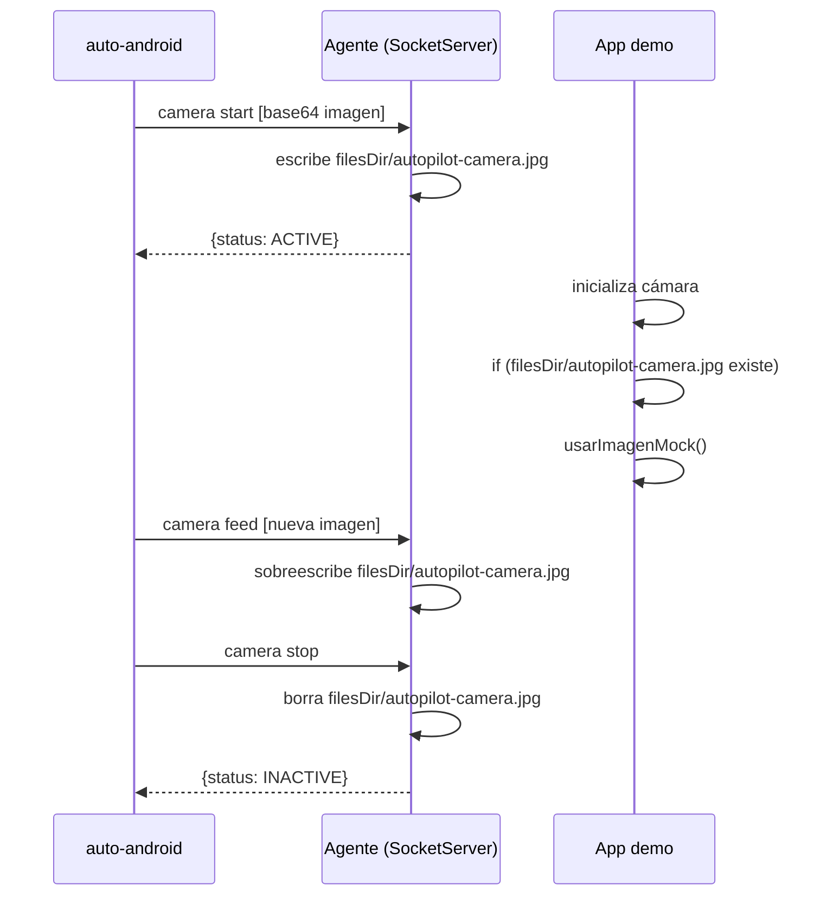

# Capítulo 10 — Paridad Android

## La brecha que quedó abierta

El Capítulo 9 termina con el agente nativo funcionando: de 2100ms a 75ms por tap, árbol de UI en 6ms, protocolo JSON sobre socket. Un salto de orden de magnitud.

Pero velocidad no es lo mismo que paridad. Al terminar el agente, Android podía hacer las operaciones básicas — `tap`, `type`, `swipe`, `tree`, `screenshot` — pero le faltaban features que iOS tenía desde el principio:

| Feature | iOS | Android (post-agente) |
|---|---|---|
| `tap "Camera[2]"` | ✓ | ✗ |
| `auto index` | ✓ | ✗ |
| `auto inspect` | ✓ | ✗ |
| Clipboard real | ✓ | workaround con `adb input text` |
| Camera mock | ✓ (DYLD_INSERT_LIBRARIES) | ✗ |

Este capítulo documenta cómo cerramos esa brecha — y dónde decidimos que la brecha es estructural y no vale la pena cerrar.

---

## Label[N] e `index`: el árbol como fuente de verdad

### El problema con elementos duplicados

Una pantalla puede tener dos botones "Camera" — el original y uno de "Cámara frontal", por ejemplo. `auto tap "Camera"` tapeaba el primero sin avisar. No había forma de tapear el segundo sin usar coordenadas hardcodeadas.

iOS resolvía esto con `Label[N]` — `tap "Camera[2]"` tapea la segunda ocurrencia. La lógica vivía en `TargetResolver` de `AutoLibiOS/`.

### Mover la lógica a AutoCore

La solución era compartir la lógica entre plataformas. `TargetResolver` y `ElementIndex` se movieron a `AutoCore/` como `TargetResolverShared` y `ElementIndexShared`:

```
AutoCore/
├── TargetResolverShared.swift  ← antes solo en AutoLibiOS
├── ElementIndexShared.swift    ← antes solo en AutoLibiOS
└── ...
```

Ambas implementaciones de `DeviceBridge` — `SimulatorBridge` (iOS) y `AgentBridge` (Android) — ahora usan el mismo código de matching. El árbol de accesibilidad de iOS y Android tiene el mismo formato JSON (diseño intencional desde el Capítulo 9), así que el resolver funciona sin cambios.

### `index` en Android: una decisión de arquitectura

`auto index` (iOS) imprime la lista de elementos con sus índices `$N`. Devuelve algo como:

```
$0  AXWindow     Simulator
$1  AXGroup      App
$2  AXButton     Login
$3  AXTextField  Usuario
```

Para Android, `auto-android index` no existe como comando del CLI. Los índices `$N` se generan en el **editor** (backend Rust), no en el CLI.

La razón: el árbol de Android tiene nodos genéricos sin etiqueta útil — `View`, `FrameLayout`, `LinearLayout` — que son artefactos de Jetpack Compose. Para que `$N` sea útil, hay que filtrarlos y resolver su texto desde los hijos. Esa heurística ya existía en `index_from_tree()` en Rust. Duplicarla en Swift en el CLI habría sido deuda técnica, no paridad real.

**Consecuencia práctica:** Para usar `$N` en scripts Android, hay que abrirlos en el editor una vez y dejar que el inspector genere los índices. No es ideal para uso puramente CLI, pero es el trade-off correcto por ahora.

---

## Clipboard en Android: la restricción silenciosa

### Lo que esperábamos

iOS tiene `auto paste "texto"` — escribe al pasteboard del simulador, la app puede leerlo con `UIPasteboard.general.string`. El equivalente Android obvio era llamar `ClipboardManager.getText()` desde el agente y `ClipboardManager.setText()` para escribir.

### Android 10 cerró esa puerta

Android 10 (API 29) introdujo una restricción de privacidad: las apps en background no pueden leer el clipboard. El agente de instrumentación, aunque tiene permisos elevados, corre en background desde la perspectiva del sistema. `ClipboardManager.getPrimaryClip()` retorna `null`.

Esto no lanza excepción ni error — retorna `null` silenciosamente. El primer intento de implementación "funcionó" en prueba porque ejecutábamos el agente en foreground manualmente. En uso real, dentro de un script automatizado, siempre retornaba vacío.

### La solución: cachear lo que nosotros escribimos

```
setClipboard(text):
  Handler(Looper.getMainLooper()).post {
    ClipboardManager.setText(text)   // funciona desde main thread
    cachedClipboard = text            // guardar localmente
  }

getClipboard():
  return cachedClipboard               // no leer el sistema, devolver el cache
```

**Escribir** sí funciona desde el agente — hay que hacerlo desde el main thread (de otro modo `ClipboardManager` se queja de no tener Looper). El `Handler(Looper.getMainLooper()).post { ... }` resuelve eso.

**Leer** no funciona. El workaround es guardar el último valor escrito por AutoPilot y devolverlo.

**Limitación real:** Si la app escribe algo al clipboard por su propia lógica — un "Copiar al portapapeles" del usuario — el agente no lo ve. Para flujos de testing donde AutoPilot controla toda la entrada, esto es suficiente. Para probar "el usuario copia X, la app lo lee", no sirve.

---

## Camera mock en Android: tres intentos

iOS tuvo 10 intentos para mockear la cámara (ver [Capítulo 3](03-la-camara-virtual.md)). Android tuvo tres. El resultado final es diferente en naturaleza: en iOS mockear es transparente para la app; en Android requiere cooperación.

### Intento 1 — JVMTI agent en C

**Idea:** JVMTI (Java Virtual Machine Tool Interface) es la API que usan los debuggers de Java para interceptar llamadas a métodos. Un agente nativo `.so` se inyecta en el proceso de la app via `adb shell cmd activity attach-agent`. Desde ahí, cargamos un DEX con `DexClassLoader` que hookea los métodos de Camera2.

```
agent/camera-mock-native/
├── agent.c           ← agente JVMTI en C
├── build.sh
└── jvmti-headers/
```

El `agent.c` carga `autopilot-camera-mock.dex` en el proceso de la app y llama `CameraHooks.install(imagePath)`.

**Compiló. No funcionó.**

El problema: CameraX y Camera2 en Jetpack Compose usan el Camera HAL directamente vía NDK (`ACameraManager`, `ACameraDevice`). Las llamadas no pasan por métodos Java que JVMTI pueda interceptar. JVMTI solo ve el bytecode de la JVM, no las llamadas nativas.

Si la app usara `android.hardware.Camera` (la API deprecada, pre-Android 5), JVMTI habría funcionado. Pero ninguna app moderna la usa.

### Intento 2 — Kotlin instrumentation

**Idea:** Si JVMTI no llega a CameraX, tal vez podemos interceptar en un nivel más alto — las vistas. `TextureView` o `SurfaceView` muestran el preview de la cámara. Si encontramos esa vista en el árbol y dibujamos encima, el usuario ve la imagen mock.

```
agent/camera-mock-kotlin/src/
├── CameraHooks.kt      ← hooks de Camera2
├── ImageWatcher.kt     ← detecta cambios en archivo de imagen
├── PreviewRenderer.kt  ← dibuja imagen en TextureView
└── ViewScanner.kt      ← busca TextureView en árbol de vistas
```

**Compiló. Falló por timing.**

El agente de instrumentación inicia antes que la app, pero los hooks se instalan después de que `CameraActivity` ya inicializó `CameraX`. Para cuando `CameraHooks.install()` corre, `ProcessCameraProvider` ya entregó la cámara a la app. Los hooks no interceptan una sesión ya activa.

Intentamos reiniciar la sesión desde el agente: llamar `unbindAll()` en `ProcessCameraProvider`. Falló — `ProcessCameraProvider` es un singleton de la app, no del agente. Acceder desde fuera crashea el proceso.

### Solución final — socket + base64 + cooperación de la app

**Cambio de filosofía.** En iOS, DYLD_INSERT_LIBRARIES es transparente porque el sistema operativo lo diseñó para eso — carga librerías antes que el binario principal. Android no tiene un mecanismo equivalente en apps no-root.

La alternativa pragmática: la app coopera explícitamente.

**Mecanismo:**

```
[CLI] auto-android camera start foto.jpg
  → lee foto.jpg → codifica a base64 → envía al agente via socket

[Agente] recibe base64 → decodifica → escribe a context.filesDir/autopilot-camera.jpg
  → responde: {"result": {"status": "ACTIVE"}}

[App demo] al inicializar cámara:
  if (File(filesDir, "autopilot-camera.jpg").exists()) {
      usarImagenMock()  // lee el archivo y lo muestra en el preview
  } else {
      usarCamaraReal()
  }
```



**Resultado real:**
```
camera start   → 37ms
camera status  → ACTIVE, path: /data/.../autopilot-camera.jpg
camera feed    → 28ms (nueva imagen)
camera stop    → INACTIVE ✓
```

### La comparación honesta

| | iOS | Android |
|---|---|---|
| Transparencia | Total — DYLD hookea sin tocar la app | Parcial — la app demo tiene código especial |
| Funciona con apps de terceros | Sí (una vez con el flag de build) | No (sin root) |
| Requiere recompilar la app | Una vez, con `ENABLE_DEBUG_DYLIB=YES` | No (la lógica está en la app demo) |
| Latencia de start | ~45ms | ~37ms |

En iOS encontramos la manera de no modificar la app. En Android no encontramos esa manera — o no existe con las restricciones actuales, o existe pero requeriría root o una modificación al sistema.

Guardamos los dos intentos fallidos en el repo (`agent/camera-mock-kotlin/`, `agent/camera-mock-native/`) en vez de borrarlos. Si alguien en el futuro tiene otra idea, tiene el contexto completo de qué se intentó.

---

## Estado actual de paridad

```
Comandos implementados en ambas plataformas:
  ping, tree, tap, longPress, doubleTap, tapAt, clear, type,
  scroll, swipe, exists, waitFor, screenshot, launch, terminate,
  index (editor), inspect, media, clipboard, camera, biometric

Solo iOS:
  - build, config (camera mock transparente)
  - faceid (alias legacy de biometric)

Solo Android:
  - (ninguno — todos los Android-specifics tienen equivalente iOS)

Diferencias de comportamiento:
  - clipboard read: iOS = sistema real. Android = cache del último set
  - camera mock: iOS = transparente. Android = requiere app cooperativa
  - index CLI: iOS = auto index. Android = solo disponible en editor
  - biometric: iOS = AppleScript. Android = emu finger + locksettings
```

La brecha que queda no es de comandos faltantes — es de profundidad de implementación. iOS puede mockear cámara en cualquier app con una compilación; Android solo en la app demo. iOS lee el clipboard real; Android lee lo que él mismo escribió.

---

## Qué aprendimos

1. **Paridad de API ≠ paridad de comportamiento.** Los mismos 22 métodos de `DeviceBridge` existen en iOS y Android, pero la implementación debajo tiene trade-offs distintos. El protocolo compartido esconde esa diferencia del script, no de la realidad.

2. **Android 10+ cerró puertas de forma silenciosa.** `ClipboardManager.getPrimaryClip()` retornando `null` en background es el tipo de bug que aparece en producción, no en desarrollo. Los tests que pasaban en dev (agente en foreground) fallaban en CI (agente en background).

3. **JVMTI tiene límites en apps modernas.** El approach nativo en C fue el más técnicamente ambicioso y el menos efectivo. CameraX/Camera2 en NDK no es interceptable por JVMTI. Documentamos el intento porque la idea es legítima para apps que usan APIs Java directamente.

4. **A veces la cooperación explícita es mejor que la transparencia forzada.** El mock de cámara iOS es elegante porque es invisible. El de Android es pragmático porque es lo que es posible. Ambos sirven para CI/CD.

5. **Compartir código entre plataformas requiere diseño previo.** `TargetResolverShared` y `ElementIndexShared` solo fueron posibles porque el árbol de accesibilidad de iOS y Android tiene el mismo formato JSON. Esa decisión de diseño del Capítulo 9 pagó dividendos aquí.

---

*Anterior: [Capítulo 9 — El agente Android](09-el-agente-android.md)*

*Siguiente: [Capítulo 11 — El benchmark](11-el-benchmark.md)*

*[Índice del libro](README.md)*
