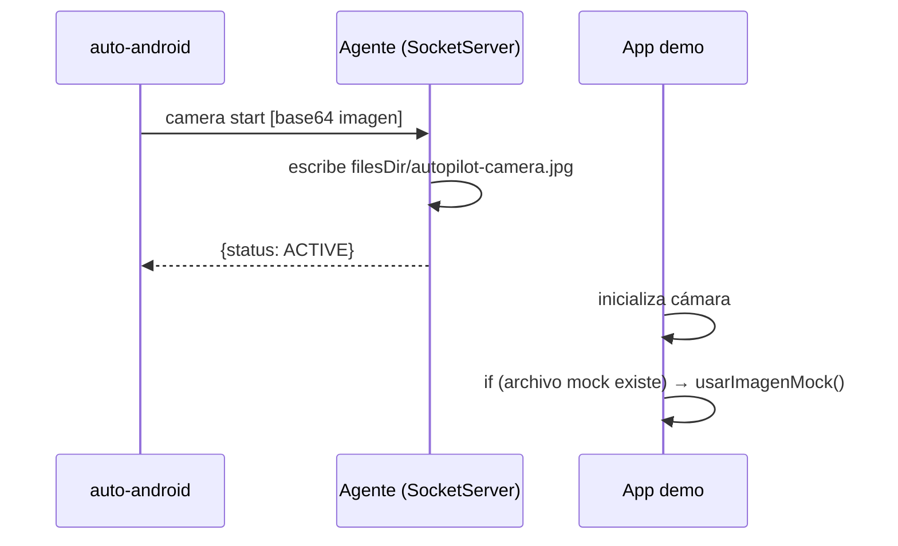
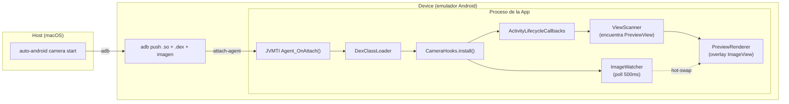

# Capítulo 10 — Paridad Android

## La brecha que quedó abierta

El Capítulo 9 termina con el agente nativo funcionando: de 2100ms a 75ms por tap, árbol de UI en 6ms, protocolo JSON sobre socket. Un salto de orden de magnitud.

Pero velocidad no es lo mismo que paridad. Al terminar el agente, Android podía hacer las operaciones básicas — `tap`, `type`, `swipe`, `tree`, `screenshot` — pero le faltaban features que iOS tenía desde el principio:

| Feature | iOS | Android (post-agente) |
|---|---|---|
| `tap "Camera[2]"` | ✓ | ✗ |
| `auto index` | ✓ | ✗ |
| `auto inspect` | ✓ | ✗ |
| Clipboard real | ✓ | workaround con `adb input text` |
| Camera mock | ✓ (DYLD_INSERT_LIBRARIES) | ✗ |

Este capítulo documenta cómo cerramos esa brecha — y dónde decidimos que la brecha es estructural y no vale la pena cerrar.

---

## Label[N] e `index`: el árbol como fuente de verdad

### El problema con elementos duplicados

Una pantalla puede tener dos botones "Camera" — el original y uno de "Cámara frontal", por ejemplo. `auto tap "Camera"` tapeaba el primero sin avisar. No había forma de tapear el segundo sin usar coordenadas hardcodeadas.

iOS resolvía esto con `Label[N]` — `tap "Camera[2]"` tapea la segunda ocurrencia. La lógica vivía en `TargetResolver` de `AutoLibiOS/`.

### Mover la lógica a AutoCore

La solución era compartir la lógica entre plataformas. `TargetResolver` y `ElementIndex` se movieron a `AutoCore/` como `TargetResolverShared` y `ElementIndexShared`:

```
AutoCore/
├── TargetResolverShared.swift  ← antes solo en AutoLibiOS
├── ElementIndexShared.swift    ← antes solo en AutoLibiOS
└── ...
```

Ambas implementaciones de `DeviceBridge` — `SimulatorBridge` (iOS) y `AgentBridge` (Android) — ahora usan el mismo código de matching. El árbol de accesibilidad de iOS y Android tiene el mismo formato JSON (diseño intencional desde el Capítulo 9), así que el resolver funciona sin cambios.

### `index` en Android: una decisión de arquitectura

`auto index` (iOS) imprime la lista de elementos con sus índices `$N`. Devuelve algo como:

```
$0  AXWindow     Simulator
$1  AXGroup      App
$2  AXButton     Login
$3  AXTextField  Usuario
```

Para Android, `auto-android index` no existe como comando del CLI. Los índices `$N` se generan en el **editor** (backend Rust), no en el CLI.

La razón: el árbol de Android tiene nodos genéricos sin etiqueta útil — `View`, `FrameLayout`, `LinearLayout` — que son artefactos de Jetpack Compose. Para que `$N` sea útil, hay que filtrarlos y resolver su texto desde los hijos. Esa heurística ya existía en `index_from_tree()` en Rust. Duplicarla en Swift en el CLI habría sido deuda técnica, no paridad real.

**Consecuencia práctica:** Para usar `$N` en scripts Android, hay que abrirlos en el editor una vez y dejar que el inspector genere los índices. No es ideal para uso puramente CLI, pero es el trade-off correcto por ahora.

---

## Clipboard en Android: la restricción silenciosa

### Lo que esperábamos

iOS tiene `auto paste "texto"` — escribe al pasteboard del simulador, la app puede leerlo con `UIPasteboard.general.string`. El equivalente Android obvio era llamar `ClipboardManager.getText()` desde el agente y `ClipboardManager.setText()` para escribir.

### Android 10 cerró esa puerta

Android 10 (API 29) introdujo una restricción de privacidad: las apps en background no pueden leer el clipboard. El agente de instrumentación, aunque tiene permisos elevados, corre en background desde la perspectiva del sistema. `ClipboardManager.getPrimaryClip()` retorna `null`.

Esto no lanza excepción ni error — retorna `null` silenciosamente. El primer intento de implementación "funcionó" en prueba porque ejecutábamos el agente en foreground manualmente. En uso real, dentro de un script automatizado, siempre retornaba vacío.

### La solución: cachear lo que nosotros escribimos

```
setClipboard(text):
  Handler(Looper.getMainLooper()).post {
    ClipboardManager.setText(text)   // funciona desde main thread
    cachedClipboard = text            // guardar localmente
  }

getClipboard():
  return cachedClipboard               // no leer el sistema, devolver el cache
```

**Escribir** sí funciona desde el agente — hay que hacerlo desde el main thread (de otro modo `ClipboardManager` se queja de no tener Looper). El `Handler(Looper.getMainLooper()).post { ... }` resuelve eso.

**Leer** no funciona. El workaround es guardar el último valor escrito por AutoPilot y devolverlo.

**Limitación real:** Si la app escribe algo al clipboard por su propia lógica — un "Copiar al portapapeles" del usuario — el agente no lo ve. Para flujos de testing donde AutoPilot controla toda la entrada, esto es suficiente. Para probar "el usuario copia X, la app lo lee", no sirve.

---

## Camera mock en Android: seis intentos, dos fases

iOS tuvo 10 intentos para mockear la cámara (ver [Capítulo 3](03-la-camara-virtual.md)). Android tuvo seis, en dos fases. La primera fase terminó con una solución cooperativa (la app tenía que saber del mock). La segunda fase logró inyección transparente — al estilo iOS.

### Fase 1: Tres intentos, solución cooperativa (PR #32)

#### Intento 1 — JVMTI agent en C (hookear Camera2 API)

**Idea:** JVMTI (Java Virtual Machine Tool Interface) permite inyectar un `.so` en el proceso de cualquier app via `adb shell cmd activity attach-agent`. Desde ahí, cargar un DEX con `DexClassLoader` que hookee Camera2.

**Compiló. No hookeó nada útil.** CameraX y Camera2 usan el Camera HAL vía NDK. Las llamadas no pasan por métodos Java que JVMTI pueda interceptar.

#### Intento 2 — Kotlin instrumentation (timing)

**Compiló. Falló por timing.** Los hooks se instalan después de que `CameraActivity` ya inicializó CameraX. `ProcessCameraProvider` ya entregó la cámara — interceptar una sesión ya activa no es posible.

#### Intento 3 — Socket + base64 + cooperación de la app

La alternativa pragmática: la app coopera explícitamente. El CLI envía la imagen al agente via socket, el agente la escribe a disco, y la app demo revisa si existe el archivo para usarlo en vez de la cámara real.



Funcional (37ms start, 28ms feed), pero no transparente — la app tenía código especial para cooperar.

### Fase 2: Inyección transparente via JVMTI (PR #35)

Los intentos 1 y 2 de la fase anterior no fueron en vano. El agente nativo JVMTI (`agent.c`) y la infraestructura de DEX loading funcionaban — lo que falló fue la estrategia de hookeo. La idea correcta era: dejar que la cámara real funcione, pero interceptar lo que el usuario ve.

#### Intento 4 — Subclasear Camera2 API

Intentamos crear `MockCameraManager`, `MockCameraDevice`, `MockCaptureSession` en Kotlin. Proxy dinámico o subclases que interceptaran `openCamera()`.

**No compila.** `CameraManager` es `final`. `CameraDevice` tiene constructor package-private. `java.lang.reflect.Proxy` solo funciona con interfaces. Sin `cglib`/`dexmaker` (dependencias externas), no hay forma de subclasear clases concretas del framework.

#### Intento 5 — Surface.lockCanvas() directo

Dejar que la cámara real abra, encontrar el `SurfaceView` del preview, y dibujar nuestra imagen directamente en su Surface.

`ViewScanner` encuentra el `PreviewView` → hijo `SurfaceView[1280x960]`. Hasta ahí bien. Pero `Surface.lockCanvas(null)` retorna `null`. CameraX usa `SURFACE_TYPE_PUSH_BUFFERS` — el hardware controla el buffer, la app no puede dibujar en él.

#### Intento 6 — ImageView overlay (funciona)

Si no podemos dibujar EN el Surface, ponemos algo ENCIMA. Un `ImageView` como hijo del `PreviewView` con `elevation=100f` se renderiza por encima de cualquier Surface.



El flujo: el agente nativo carga el DEX → `CameraHooks` registra `ActivityLifecycleCallbacks` → cuando una actividad hace `onResume`, `ViewScanner` busca el `PreviewView` en la jerarquía → `PreviewRenderer` coloca un `ImageView` con la imagen mock encima → `ImageWatcher` poll cada 500ms para hot-swap.

**Resultado:**
```
camera start  → 737ms (deploy completo + inject)
camera feed   → 135ms (solo push imagen, hot-swap)
camera stop   → 201ms (force-stop app)
```

**Tropiezos técnicos en el camino:**

| Problema | Causa | Solución |
|----------|-------|----------|
| kotlinc no ejecutable | macOS app bundle permisos | `java -jar kotlin-compiler.jar` |
| SELinux bloquea .so | `shell_data_file` context | `run-as <pkg> cp` al data dir |
| "Writable dex file" | Android security | `chmod 444` post-copy |
| ClassNotFoundException Intrinsics | Compilado sin stdlib | Incluir kotlin-stdlib.jar en d8 |
| Scoped storage bloquea /sdcard/ | Android 11+ | Copiar imagen via `run-as` |

### La comparación honesta (actualizada)

| | iOS | Android (cooperativo, PR #32) | Android (JVMTI, PR #35) |
|---|---|---|---|
| Transparencia | Total — DYLD hookea sin tocar la app | Parcial — app tiene código especial | **Total — inyecta en cualquier app** |
| Funciona con apps de terceros | Sí | No | **Sí** (en emulador) |
| Modifica la app | No | Sí (código cooperativo) | **No** |
| Requiere | Simulador + Xcode | Agente + app cooperativa | **Emulador + NDK (build una vez)** |
| Preview mock | ✓ | ✓ | **✓** |
| Output mock (bytes captura) | ✓ | ✓ (la app controla) | **✗ — falta** |

### Lo que falta: interceptar los bytes de captura

La solución actual reemplaza lo que **se ve** en pantalla (preview). Pero **no intercepta los bytes reales** que la app recibe cuando toma una foto. Si la app hace `ImageCapture.takePicture()`, recibe los frames reales de la cámara (el tablero de ajedrez del emulador), no nuestra imagen.

Para que el flujo completo funcione — la app toma la foto, la guarda, la convierte a base64, la sube a un servidor — necesitamos que reciba **nuestros bytes**. Esto requiere hookear `ImageReader.acquireLatestImage()` o el callback de `ImageCapture` via reflexión.

Es el equivalente a: tenemos el preview, nos falta el output. El PR #35 documenta esta limitación explícitamente.

---

## Estado actual de paridad

```
Comandos implementados en ambas plataformas:
  ping, tree, tap, longPress, doubleTap, tapAt, clear, type,
  scroll, swipe, exists, waitFor, screenshot, launch, terminate,
  index (editor), inspect, media, clipboard, camera, biometric

Solo iOS:
  - build, config (camera mock transparente)
  - faceid (alias legacy de biometric)

Solo Android:
  - (ninguno — todos los Android-specifics tienen equivalente iOS)

Diferencias de comportamiento:
  - clipboard read: iOS = sistema real. Android = cache del último set
  - camera mock preview: iOS = transparente ✓. Android = transparente ✓ (JVMTI)
  - camera mock output: iOS = transparente ✓. Android = NO intercepta bytes ✗
  - index CLI: iOS = auto index. Android = solo disponible en editor
  - biometric: iOS = AppleScript. Android = emu finger + locksettings
```

La brecha de camera mock se cerró para el preview — ambas plataformas inyectan sin modificar la app. Pero la brecha de output (bytes de captura) sigue abierta: iOS reemplaza los bytes en `AVCapturePhotoOutput`, Android aún entrega los bytes reales de la cámara.

---

## Qué aprendimos

1. **Paridad de API ≠ paridad de comportamiento.** Los mismos 22 métodos de `DeviceBridge` existen en iOS y Android, pero la implementación debajo tiene trade-offs distintos. El protocolo compartido esconde esa diferencia del script, no de la realidad.

2. **Android 10+ cerró puertas de forma silenciosa.** `ClipboardManager.getPrimaryClip()` retornando `null` en background es el tipo de bug que aparece en producción, no en desarrollo. Los tests que pasaban en dev (agente en foreground) fallaban en CI (agente en background).

3. **JVMTI sí funciona — lo que importa es dónde hookeas.** Los primeros intentos fallaron porque intentamos hookear Camera2 API (clases finales, constructores privados) y escribir directo en el Surface (PUSH_BUFFERS). JVMTI como mecanismo de inyección es sólido — el error fue la estrategia de interceptación. La vista (overlay ImageView) resultó ser el punto correcto para el preview.

4. **Los intentos "fallidos" construyen hacia la solución.** Los 5 intentos que no funcionaron no fueron desperdicio: el `agent.c` del intento 1 se reusó en la solución final, el `ViewScanner` del intento 2 encontró el `PreviewView`, y la infraestructura de DEX loading fue la misma. Cada fracaso dejó una pieza reutilizable.

5. **Transparencia tiene niveles.** El overlay es transparente para la app (no la modificamos), pero no transparente para los bytes (la app recibe frames reales al capturar). iOS logró ambos niveles. Android logró el primero. El segundo requiere hookear `ImageReader` — técnicamente posible, pero es otro capítulo.

6. **Compartir código entre plataformas requiere diseño previo.** `TargetResolverShared` y `ElementIndexShared` solo fueron posibles porque el árbol de accesibilidad de iOS y Android tiene el mismo formato JSON. Esa decisión de diseño del Capítulo 9 pagó dividendos aquí.

---

*Anterior: [Capítulo 9 — El agente Android](09-el-agente-android.md) | Siguiente: [Capítulo 11 — El benchmark](11-el-benchmark.md)*

*[Índice del libro](README.md)*
