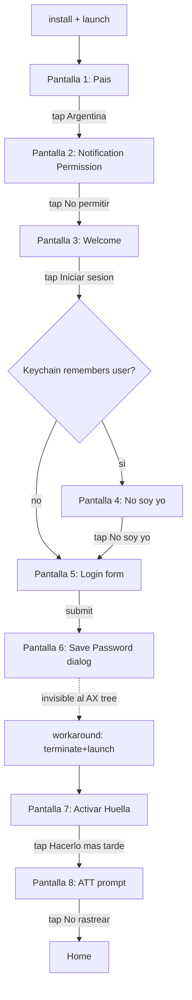
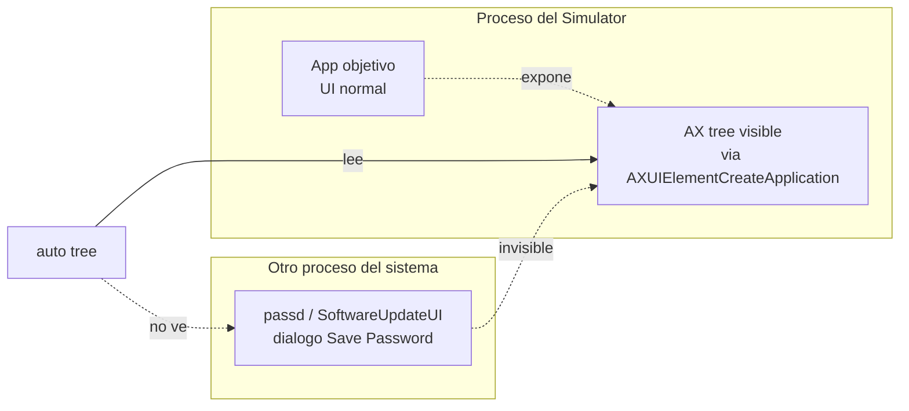

# Capitulo 14 — Validacion en una app real

## El problema

Despues de doce capitulos, AutoPilot funcionaba. El benchmark del [Capitulo 11](11-el-benchmark.md) mostraba 10.2 segundos contra 26.1 de Maestro. El recorder del [Capitulo 13](13-el-recorder-semantico.md) generaba scripts semanticos con replicabilidad real. Los tests E2E del repo verde, los WIPs de la sesion previa commiteados.

Pero todo eso se medio sobre `CameraTestApp` y un par de demos internas. Apps que escribimos nosotros, con `accessibilityIdentifier` puestos a mano, sin onboarding, sin permisos del sistema, sin keychain, sin formularios reales de produccion. Era trampa.

La pregunta honesta era distinta: si un developer instala el CLI hoy, sin conocer el codigo, sin tools auxiliares, sin recorder, sin computer-use, sin osascript de respaldo — ¿alcanza para automatizar el login completo de **una app comercial real** desde estado limpio? ¿En un solo `.auto` ejecutable?

Este capitulo es el experimento que respondio esa pregunta.

> **Nota:** El diario de laboratorio crudo, con cada comando, exit code y output literal, esta en [validacion/BITACORA.md](../validacion/BITACORA.md). Este capitulo es la version narrativa.

---

## El experimento

Elegimos una app comercial real de produccion (no la nombramos: el experimento mide la herramienta, no la app). En el resto del capitulo nos referimos a ella como "la app objetivo". Tiene todas las cosas que las demos no tienen: pais selector, permisos del sistema en el primer arranque, keychain compartido entre versiones, formularios con shifted chars, dialogos cross-proceso del sistema iOS, ATT prompt, biometria opcional, popups internos y un home screen real con datos reales.

### Reglas autoimpuestas

Para que el experimento midiera el alcance del CLI y no la habilidad del operador con tools externas, nos prohibimos todo lo que no fuera el CLI:

| Permitido | Prohibido |
|---|---|
| `auto`/`auto-android` (cualquier comando) | `mcp__computer-use__` (clicks de mouse) |
| `auto screenshot file.png` + `Read` del PNG | `osascript` (Hardware Keyboard, keystroke) |
| `auto tree`, `auto inspect` | `xcrun simctl` directo |
| Editor de archivos para escribir el `.auto` | `adb` directo (shell, install, forward, am, pm) |
| | `pkill`/`kill` para procesos |
| | `sips`/conversores externos |
| | El recorder semantico del Capitulo 13 |
| | Cualquier API no expuesta via `auto` |

La unica via de instalar la app fue `auto install <ruta al .app>` para iOS y `auto-android install <ruta al .apk>` para Android. La unica via de leer la pantalla fue `auto tree` y `auto screenshot`. La unica via de actuar fue `tap`, `type`, `pressKey`, `waitFor`, `terminate`, `launch`.

Sin red de seguridad.

### Metodologia

Imitamos el flujo de un dev novato: escribir un script ingenuo basado en lo que se sabe (o cree saber) del flujo, correrlo, ver donde rompe, abrir `auto tree` para entender que hay en pantalla, editar el script, repetir. Sin pre-grabacion, sin recorder, sin saber de antemano cuantas pantallas tiene el onboarding.

Como linea base usamos una receta documentada de la app objetivo que asumia que la app ya estaba pre-onboarded (logueada al menos una vez antes). Esa receta no servia para el experimento — necesitabamos hacerlo desde estado limpio. Pero servia para el primer paso del script: el ingenuo.

---

## Lo que descubrimos en iOS

El script ingenuo tenia tres lineas:

```auto
terminate "<bundle id>"
launch "<bundle id>"
waitFor "Iniciar Sesion" 15
```

Fallo en la linea 3. El `waitFor` agotaba 15 segundos sin encontrar el texto "Iniciar Sesion". Un `auto tree` revelo por que: la primera pantalla del onboarding no era el login, era un selector de pais.

Lo que siguio fue una expedicion. Cada pantalla nueva era una sorpresa que la receta documentada no mencionaba. En total descubrimos cuatro pantallas extras antes del login y una mas despues, ademas del barrido sobre el formulario en si.

### Las cuatro pantallas extras del onboarding



Ninguna de las cuatro pantallas extras estaba en la receta original. La receta asumia que la app ya estaba onboarded, asi que arrancaba directo en el formulario de login.

### La sorpresa del keychain

La pantalla 4 — `No soy yo` — fue la mas inesperada. La habiamos hecho `uninstall` antes de instalar. Asumiamos que `uninstall` borraba todo lo asociado al bundle. Pero no.

iOS mantiene varios keychains. El access group por default del bundle se borra al desinstalar. Pero los items con access group compartido (por ejemplo, `<TeamID>.<group>` con `kSecAttrAccessGroup`) sobreviven al uninstall del bundle individual mientras exista al menos otra app del mismo Team ID instalada en el dispositivo. El simulator no es excepcion.

La app objetivo guarda el ultimo email logueado en un access group compartido. Cuando volvio a arrancar tras nuestro `uninstall + install`, el welcome screen ya tenia el email pre-cargado y un boton que decia "No soy yo". El formulario de login no aparecia hasta que tocaramos ese boton.

Lo notable es que esto **no es un bug**. Es por diseno. Pero rompe la asuncion mental "uninstall = estado limpio" que toda receta de testing usa implicitamente. El estado verdaderamente limpio de iOS es `xcrun simctl erase`, no `uninstall`. Y `erase` no esta expuesto via `auto` (intencionalmente — borra todos los datos del simulador, no solo la app).

Este es el primer hallazgo del capitulo: las recetas de automatizacion necesitan distinguir entre "estado limpio del bundle" y "estado limpio del dispositivo".

### La barrera estructural: Save Password

La pantalla 6 fue el unico bloqueante real del experimento. Tras enviar el formulario, iOS muestra el dialogo del sistema "¿Guardar contraseña?". Es un dialogo modal que tapa la pantalla. Sin tocarlo, la app queda atrapada.

El problema es que ese dialogo **no aparece en `auto tree`**:



`AXUIElementCreateApplication(pid)` solo expone los elementos que viven en el espacio de direcciones del proceso del Simulator. El dialogo Save Password lo dibuja un proceso aparte (en macOS host: `passd`, `SoftwareUpdateUI` o equivalentes; en iOS guest: una extension del sistema). Vive en otro PID. El AX tree del Simulator no lo ve.

Probamos lo razonable:

| Intento | Resultado |
|---|---|
| `pressKey escape` | Sin efecto (ningun handler escucha) |
| `pressKey enter` | Sin efecto |
| `pressKey tab` + `enter` | Sin efecto |
| `tap "Now"` (label esperado del boton) | Element not found en el tree |
| Esperar y reintentar | El dialogo nunca desaparece solo |

Sin osascript no podiamos hacer click en coordenadas absolutas del display de macOS para tocar el boton del dialogo. Sin computer-use tampoco. El `tapAt` del CLI opera en coordenadas dentro del Simulator, no del host.

El workaround que encontramos fue inline en el script: `terminate` la app y volver a hacer `launch`. Cuando la app vuelve a arrancar, recuerda al usuario (porque ya lo intento loguear) y solo pide la contraseña otra vez. Esta segunda vez, iOS no muestra el dialogo de Save Password (probablemente porque la heuristica de passd considera que ya pregunto y no obtuvo confirmacion). Volvemos a tipear la contraseña y avanzamos.

Es feo. Es inelegante. Pero es lo que el CLI alcanza hoy y fue suficiente.

### El formulario en si

Los WIPs del worktree (commits previos a esta sesion) ya tenian aplicados los fixes para shifted chars en `type` y para `setValue` via AX en campos que bloquean paste. El formulario funcionaba: `tap[textField]` + `type "<email>"` + `tap[textField]` + `type "<password>"`.

El truco era el targeting. La app objetivo etiqueta sus inputs con dos elementos AX por campo: el primero es un `StaticText` con el placeholder, el segundo es el `TextField` real. `tap "Email o DNI"` toca el placeholder y no abre el teclado. `tap "Email o DNI[2]"` toca el segundo match y enfoca el campo. Esto lo aprendimos en sesiones previas y esta documentado en la nota cruda — pero es exactamente el tipo de cosa que un dev novato tropieza la primera vez.

---

## Lo que descubrimos en Android

Android repitio el patron. Script ingenuo, falla en la linea 2, expedicion para descubrir que hay realmente. Cuatro pantallas extras antes del login que la receta no documentaba. Y un bug propio del CLI al final.

### Las cuatro pantallas extras

```
launch
  -> Pantalla 1: Argentina (selector de pais)
  -> Pantalla 2: Notification permission (system dialog, pre-Tiramisu style)
  -> Pantalla 3: "Habilitar notificaciones" (segundo dialog, este es de la app)
  -> Pantalla 4: Welcome / Iniciar sesion
  -> Pantalla 5: Form (login_input_uname / pswd_input)
  -> Pantalla 6: Submit
  -> Pantalla 7: Popup interno "Tasa Plus" (con boton "Entendido")
  -> Pantalla 8: Home
```

Tres detalles relevantes:

**1. El apostrofe tipografico.** La pantalla 2 (notification permission del sistema) tiene un boton cuyo label empieza con `Don` seguido de un apostrofe. El apostrofe no es ASCII (`U+0027`), es la version tipografica (`U+2019`). Si escribimos `tap "Don't allow"` en el `.auto`, el matcher por label falla porque los strings no son iguales byte a byte.

La salida fue cambiar de match-por-label a match-por-id: el dialog del sistema usa `permission_deny_button` como resource id, y eso es estable. `tap "permission_deny_button"` funciono al primer intento. Lo que estamos usando aqui es la cascada del CLI: cuando el string no matchea como label, el resolver intenta como `accessibilityIdentifier`/`resource-id`. Si no se resuelve por ninguno, falla.

**2. Compose es lazy.** Esto lo descubrimos despues, cuando intentamos hacer `tap "login_button"` con el teclado abierto. El teclado virtual de Android tapa el boton de submit. Compose, a diferencia de View clasico, **no compone elementos que no estan visibles**. Si el boton esta tapado por el keyboard, no esta en el AX tree. `auto-android tree -s "login_button"` retorna vacio.

**3. El bug de hideKeyboard.** Aqui encontramos un bug del CLI mismo. `auto-android hideKeyboard` retorna exit 0 con el mensaje:

```
Keyboard dismissed (67ms)
```

Pero el teclado sigue visible en el simulator. La acepcion del CLI difiere de la realidad. Esto rompe el flujo entero: si el script confia en que el teclado se cerro y va directo a `tap "login_button"`, falla porque (a) el boton sigue tapado por el keyboard y (b) Compose no lo expone en el tree.

El workaround es trivial: `pressKey back` SI cierra el keyboard. Despues de la tecla back, hay que esperar ~2 segundos para que Compose re-rendere el formulario completo (sin esa espera, el `tree -s "login_button"` retorna vacio inmediatamente porque la composicion todavia no incluye el boton).

Quedaron dos issues abiertos para arreglar el CLI: el `hideKeyboard` mentiroso y un bug de parsing en `auto-android scrollTo "label" down` que veremos mas abajo.

### El bug del scrollTo

Mientras explorabamos, intentamos `auto-android scrollTo "Iniciar sesion" down` para asegurarnos de que el boton estuviera visible. El CLI respondio:

```
Error: ADB failed: Invalid direction: . Use up/down/left/right
```

El mensaje de error muestra el bug: el campo `direction` llega vacio al dispatcher. El parser del CLI Android no esta pasando el segundo argumento al comando. No bloquea el experimento porque `pressKey back` resolvio el caso, pero quedo registrado como un bug encontrado en un flujo real que los tests E2E del propio proyecto no habian tocado.

---

## Tabla de barreras y workarounds

| Barrera | Plataforma | Por que pasa | Que probamos | Como la sorteamos |
|---|---|---|---|---|
| Pantalla de pais | iOS + Android | El onboarding fresh tiene mas pasos que la receta | `auto tree` revelo el pais selector | `tap "Argentina"` |
| Notification permission | iOS + Android | Dialog del sistema, primera vez que arranca la app | Por label (Android no matchea por apostrofe tipografico) | iOS: por label `No permitir`. Android: por id `permission_deny_button` |
| Segundo dialog "Habilitar notificaciones" (interno) | Android | La app pide notificaciones por segunda vez con su propio AlertDialog | `tap "CANCELAR"` | Funciono al primer intento |
| Welcome con `No soy yo` | iOS | Keychain compartido sobrevive al uninstall del bundle | `auto tree` mostro el boton extra | `tap "No soy yo"` |
| Targeting de TextFields | iOS | Cada campo tiene 2 elementos AX (StaticText + TextField) | `tap "Email"` toca el StaticText, no enfoca | `tap "Email o DNI[2]"` (segundo match) |
| Save Password dialog | iOS | Vive en otro proceso, no en el AX tree del Simulator | escape, enter, tab, tap por label | `terminate` + `launch` + retipear contraseña |
| Activar Huella | iOS | Pantalla post-login estandar | `tap "Hacerlo mas tarde"` | Funciono al primer intento |
| ATT prompt | iOS | Dialog del sistema iOS, AX-accesible | `tap "Solicitar a la app no rastrear"` | Funciono al primer intento |
| Compose lazy + keyboard tapando submit | Android | Compose no compone lo que no es visible | `tree -s "login_button"` retorna vacio | `pressKey back` + `wait 2` |
| `hideKeyboard` mentiroso | Android | Bug del CLI: retorna exit 0 sin cerrar el teclado | Asumir que funciono | `pressKey back` |
| `scrollTo down` con direccion vacia | Android | Bug del parser del CLI Android | Reportar | No fue bloqueante: `pressKey back` resolvio el caso |
| Popup "Tasa Plus" interno | Android | Popup propio de la app post-login | `tap "Entendido"` | Funciono al primer intento |

Once barreras, una bloqueante real (Save Password) que requirio workaround inline, dos bugs del CLI que generaron issues, y ocho que se resuelven con un comando estandar del `.auto`.

---

## Lo que validamos al final

Despues de las iteraciones exploratorias, escribimos los dos scripts finales y los corrimos desde estado limpio (`uninstall` + `install` + `run`).

### Metricas

|  | iOS | Android |
|---|---|---|
| Pasos del script `.auto` | 30 | 22 |
| Tiempo end-to-end (uninstall + install + run) | 35.6s | 15.5s |
| Pantallas resueltas | 9/9 | 9/9 |
| Comandos `.auto` distintos usados | 9 | 7 |
| Iteraciones para llegar al script final | 1 explore + 1 valid | 1 explore + 1 valid |
| Bloqueantes resueltos con workaround inline | 1 (Save Password) | 1 (hideKeyboard) |
| Bugs del CLI encontrados | 0 | 2 (`hideKeyboard`, `scrollTo`) |
| Exit code de la corrida final | 0 | 0 |

Los nueve "comandos distintos" en iOS son: `uninstall`, `install`, `terminate`, `launch`, `waitFor`, `tap`, `type`, `pressKey`, `screenshot`. Android usa los mismos menos `pressKey` (no, espera — Android si lo usa para el back). Son siete porque el Android no necesito `terminate+launch` inline para el Save Password.

### Veredicto

El CLI hoy permite automatizar el login completo de una app comercial real desde estado limpio en ambas plataformas, en un unico `.auto` ejecutable, sin tools externas, sin recorder, sin computer-use. La barrera estructural unica (Save Password en iOS) tiene un workaround inline aceptable. Los dos bugs del CLI son de complejidad 1 y 2 respectivamente y no requieren cambios arquitectonicos.

Esto no significa que cualquier app sea automatizable sin sorpresas. Lo que significa es que el alcance del CLI es real: **el primer login de una app comercial de produccion, desde estado limpio, en menos de cuarenta segundos, con un solo script ejecutable**.

---

## Que aprendimos

1. **Las apps reales tienen mas pantallas que las recetas documentadas.** La receta original asumia tres pantallas. Encontramos nueve. Esto no es excepcion, es regla. Cualquier estimacion de "horas para automatizar el login" basada en una receta documentada va a estar 3-4x debajo del real.

2. **El "estado limpio" del uninstall es una mentira en iOS.** El keychain con access group compartido sobrevive al uninstall del bundle individual. La asuncion mental "uninstall = estado limpio" funciona en CameraTestApp pero rompe en cualquier app que use shared keychain (es decir, casi todas las apps de produccion). El estado realmente limpio es `simctl erase`, que el CLI no expone por seguridad — y es razonable que no lo haga.

3. **Compose en Android es lazy y eso afecta el AX tree.** Lo que no esta visible no esta compuesto, y lo que no esta compuesto no esta en el tree. Esto cambia como pensar el flow: en View clasico, los elementos estan ahi independientemente de la visibilidad y `scrollTo` los encuentra. En Compose, el `tree -s` puede retornar vacio aunque el elemento "exista" semanticamente — porque Compose no lo construyo todavia.

4. **Los dialogs del sistema iOS viven en otros procesos.** El AX tree del Simulator solo expone su propio proceso. Save Password, biometria del sistema, share sheet, todo lo que no es la app misma puede ser invisible al `auto tree`. La regla es: si el dialog lo dibuja la app (UIAlertController dentro del proceso), aparece. Si lo dibuja el sistema (passd, biometryd, etc), puede no aparecer.

5. **Los workarounds inline en `.auto` son posibles y suficientes para casi todo.** El truco del `terminate + launch` para sortear el Save Password es un mal patron — pero es expresable en el lenguaje y funciona. Esto valida una decision de diseno del Capitulo 2: el `.auto` es lo bastante imperativo para que el usuario inserte workarounds sin tener que extender el lenguaje.

6. **Los bugs del CLI solo aparecen en flujos reales.** `hideKeyboard` mentiroso y `scrollTo` con parser roto son dos bugs que los tests E2E del propio repo no habian tocado. CameraTestApp no usa Compose, no necesita cerrar el teclado en flujos criticos, y no necesita scroll para llegar al boton de submit. Las apps reales si. La leccion: la cobertura de E2E sobre demos internas no predice la robustez del CLI sobre apps reales.

7. **La metodologia de "script ingenuo + iteracion con `auto tree`" funciona.** Sin recorder, sin grabacion, sin tools externas, llegamos a scripts que ejecutan en una sola corrida desde estado limpio. La iteracion fue: escribir lo que se sabe, correr, ver donde rompe, abrir el tree, agregar la pantalla descubierta, repetir. Una expedicion con un solo bucle de exploracion y una validacion final basto en ambas plataformas.

---

## Limitaciones honestas

Lo que el experimento NO valida:

- **Escalabilidad a otras apps.** Validamos una app, en una version, con un par de cuentas. No probamos si los mismos comandos funcionan en una app de e-commerce, en una app con login federado (Google/Apple Sign-In), o en una app con captcha.
- **Robustez ante cambios de UI.** Nuestros scripts dependen de labels en español ("Iniciar sesion", "Hacerlo mas tarde"). Si la app cambia esos labels, los scripts rompen. Esto es una limitacion compartida con todo recorder de UI.
- **Estado limpio absoluto.** Como mencionamos, el `uninstall` no borra el keychain compartido. Si el experimento se repite con `simctl erase` previo, el flow puede cambiar (probablemente sin la pantalla `No soy yo`, pero quizas con otras sorpresas).
- **Apps con captcha o second-factor.** No las probamos. Asumimos que un captcha o un OTP por SMS rompen la cadena automatizable y requieren intervencion humana — esto es esperable para cualquier herramienta de automatizacion.

---

## Links

- [Diario de laboratorio crudo](../validacion/BITACORA.md) — comandos, exit codes, outputs literales, paso a paso.
- [Hallazgos del recorder](../recorder/HALLAZGOS.md) — limitaciones y metricas del recorder, contexto adicional.
- [Capitulo 12 — Permisos de accesibilidad](12-permisos-accesibilidad.md) — por que el AX tree de macOS solo ve el proceso del Simulator (relevante para entender el Save Password dialog).
- [Capitulo 13 — El recorder semantico](13-el-recorder-semantico.md) — el camino alternativo: grabar en vez de escribir a mano.

---

*Anterior: [Capitulo 13 — El recorder semantico](13-el-recorder-semantico.md)*
