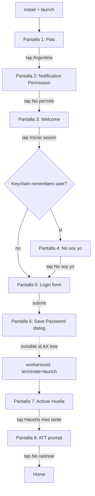
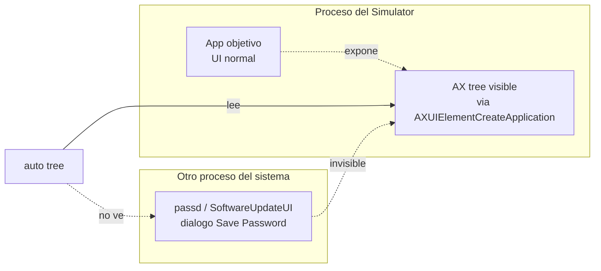

# Capitulo 14 — Validacion en una app real

## El problema

Despues de doce capitulos, AutoPilot funcionaba. El benchmark del [Capitulo 11](11-el-benchmark.md) mostraba 10.2 segundos contra 26.1 de Maestro. El recorder del [Capitulo 13](13-el-recorder-semantico.md) generaba scripts semanticos con replicabilidad real. Los tests E2E del repo verde, los WIPs de la sesion previa commiteados.

Pero todo eso se medio sobre `CameraTestApp` y un par de demos internas. Apps que escribimos nosotros, con `accessibilityIdentifier` puestos a mano, sin onboarding, sin permisos del sistema, sin keychain, sin formularios reales de produccion. Era trampa.

La pregunta honesta era distinta: si un developer instala el CLI hoy, sin conocer el codigo, sin tools auxiliares, sin recorder, sin computer-use, sin osascript de respaldo — ¿alcanza para automatizar el login completo de **una app comercial real** desde estado limpio? ¿En un solo `.auto` ejecutable?

Este capitulo es el experimento que respondio esa pregunta.

> **Nota:** El diario de laboratorio crudo, con cada comando, exit code y output literal, esta en [validacion/BITACORA.md](../validacion/BITACORA.md). Este capitulo es la version narrativa.

---

## El experimento

Elegimos una app comercial real de produccion (no la nombramos: el experimento mide la herramienta, no la app). En el resto del capitulo nos referimos a ella como "la app objetivo". Tiene todas las cosas que las demos no tienen: pais selector, permisos del sistema en el primer arranque, keychain compartido entre versiones, formularios con shifted chars, dialogos cross-proceso del sistema iOS, ATT prompt, biometria opcional, popups internos y un home screen real con datos reales.

### Reglas autoimpuestas

Para que el experimento midiera el alcance del CLI y no la habilidad del operador con tools externas, nos prohibimos todo lo que no fuera el CLI:

| Permitido | Prohibido |
|---|---|
| `auto`/`auto-android` (cualquier comando) | `mcp__computer-use__` (clicks de mouse) |
| `auto screenshot file.png` + `Read` del PNG | `osascript` (Hardware Keyboard, keystroke) |
| `auto tree`, `auto inspect` | `xcrun simctl` directo |
| Editor de archivos para escribir el `.auto` | `adb` directo (shell, install, forward, am, pm) |
| | `pkill`/`kill` para procesos |
| | `sips`/conversores externos |
| | El recorder semantico del Capitulo 13 |
| | Cualquier API no expuesta via `auto` |

La unica via de instalar la app fue `auto install <ruta al .app>` para iOS y `auto-android install <ruta al .apk>` para Android. La unica via de leer la pantalla fue `auto tree` y `auto screenshot`. La unica via de actuar fue `tap`, `type`, `pressKey`, `waitFor`, `terminate`, `launch`.

Sin red de seguridad.

### Metodologia

Imitamos el flujo de un dev novato: escribir un script ingenuo basado en lo que se sabe (o cree saber) del flujo, correrlo, ver donde rompe, abrir `auto tree` para entender que hay en pantalla, editar el script, repetir. Sin pre-grabacion, sin recorder, sin saber de antemano cuantas pantallas tiene el onboarding.

Como linea base usamos una receta documentada de la app objetivo que asumia que la app ya estaba pre-onboarded (logueada al menos una vez antes). Esa receta no servia para el experimento — necesitabamos hacerlo desde estado limpio. Pero servia para el primer paso del script: el ingenuo.

---

## Lo que descubrimos en iOS

El script ingenuo tenia tres lineas:

```auto
terminate "<bundle id>"
launch "<bundle id>"
waitFor "Iniciar Sesion" 15
```

Fallo en la linea 3. El `waitFor` agotaba 15 segundos sin encontrar el texto "Iniciar Sesion". Un `auto tree` revelo por que: la primera pantalla del onboarding no era el login, era un selector de pais.

Lo que siguio fue una expedicion. Cada pantalla nueva era una sorpresa que la receta documentada no mencionaba. En total descubrimos cuatro pantallas extras antes del login y una mas despues, ademas del barrido sobre el formulario en si.

### Las cuatro pantallas extras del onboarding



Ninguna de las cuatro pantallas extras estaba en la receta original. La receta asumia que la app ya estaba onboarded, asi que arrancaba directo en el formulario de login.

### La sorpresa del keychain

La pantalla 4 — `No soy yo` — fue la mas inesperada. La habiamos hecho `uninstall` antes de instalar. Asumiamos que `uninstall` borraba todo lo asociado al bundle. Pero no.

iOS mantiene varios keychains. El access group por default del bundle se borra al desinstalar. Pero los items con access group compartido (por ejemplo, `<TeamID>.<group>` con `kSecAttrAccessGroup`) sobreviven al uninstall del bundle individual mientras exista al menos otra app del mismo Team ID instalada en el dispositivo. El simulator no es excepcion.

La app objetivo guarda el ultimo email logueado en un access group compartido. Cuando volvio a arrancar tras nuestro `uninstall + install`, el welcome screen ya tenia el email pre-cargado y un boton que decia "No soy yo". El formulario de login no aparecia hasta que tocaramos ese boton.

Lo notable es que esto **no es un bug**. Es por diseno. Pero rompe la asuncion mental "uninstall = estado limpio" que toda receta de testing usa implicitamente. El estado verdaderamente limpio de iOS es `xcrun simctl erase`, no `uninstall`. Y `erase` no esta expuesto via `auto` (intencionalmente — borra todos los datos del simulador, no solo la app).

Este es el primer hallazgo del capitulo: las recetas de automatizacion necesitan distinguir entre "estado limpio del bundle" y "estado limpio del dispositivo".

### La barrera estructural: Save Password

La pantalla 6 fue el unico bloqueante real del experimento. Tras enviar el formulario, iOS muestra el dialogo del sistema "¿Guardar contraseña?". Es un dialogo modal que tapa la pantalla. Sin tocarlo, la app queda atrapada.

El problema es que ese dialogo **no aparece en `auto tree`**:



`AXUIElementCreateApplication(pid)` solo expone los elementos que viven en el espacio de direcciones del proceso del Simulator. El dialogo Save Password lo dibuja un proceso aparte (en macOS host: `passd`, `SoftwareUpdateUI` o equivalentes; en iOS guest: una extension del sistema). Vive en otro PID. El AX tree del Simulator no lo ve.

Probamos lo razonable:

| Intento | Resultado |
|---|---|
| `pressKey escape` | Sin efecto (ningun handler escucha) |
| `pressKey enter` | Sin efecto |
| `pressKey tab` + `enter` | Sin efecto |
| `tap "Now"` (label esperado del boton) | Element not found en el tree |
| Esperar y reintentar | El dialogo nunca desaparece solo |

Sin osascript no podiamos hacer click en coordenadas absolutas del display de macOS para tocar el boton del dialogo. Sin computer-use tampoco. El `tapAt` del CLI opera en coordenadas dentro del Simulator, no del host.

El workaround que encontramos fue inline en el script: `terminate` la app y volver a hacer `launch`. Cuando la app vuelve a arrancar, recuerda al usuario (porque ya lo intento loguear) y solo pide la contraseña otra vez. Esta segunda vez, iOS no muestra el dialogo de Save Password (probablemente porque la heuristica de passd considera que ya pregunto y no obtuvo confirmacion). Volvemos a tipear la contraseña y avanzamos.

Es feo. Es inelegante. Pero es lo que el CLI alcanza hoy y fue suficiente.

### El formulario en si

Los WIPs del worktree (commits previos a esta sesion) ya tenian aplicados los fixes para shifted chars en `type` y para `setValue` via AX en campos que bloquean paste. El formulario funcionaba: `tap[textField]` + `type "<email>"` + `tap[textField]` + `type "<password>"`.

El truco era el targeting. La app objetivo etiqueta sus inputs con dos elementos AX por campo: el primero es un `StaticText` con el placeholder, el segundo es el `TextField` real. `tap "Email o DNI"` toca el placeholder y no abre el teclado. `tap "Email o DNI[2]"` toca el segundo match y enfoca el campo. Esto lo aprendimos en sesiones previas y esta documentado en la nota cruda — pero es exactamente el tipo de cosa que un dev novato tropieza la primera vez.

---

## Lo que descubrimos en Android

Android repitio el patron. Script ingenuo, falla en la linea 2, expedicion para descubrir que hay realmente. Cuatro pantallas extras antes del login que la receta no documentaba. Y un bug propio del CLI al final.

### Las cuatro pantallas extras

```
launch
  -> Pantalla 1: Argentina (selector de pais)
  -> Pantalla 2: Notification permission (system dialog, pre-Tiramisu style)
  -> Pantalla 3: "Habilitar notificaciones" (segundo dialog, este es de la app)
  -> Pantalla 4: Welcome / Iniciar sesion
  -> Pantalla 5: Form (login_input_uname / pswd_input)
  -> Pantalla 6: Submit
  -> Pantalla 7: Popup interno "Tasa Plus" (con boton "Entendido")
  -> Pantalla 8: Home
```

Tres detalles relevantes:

**1. El apostrofe tipografico.** La pantalla 2 (notification permission del sistema) tiene un boton cuyo label empieza con `Don` seguido de un apostrofe. El apostrofe no es ASCII (`U+0027`), es la version tipografica (`U+2019`). Si escribimos `tap "Don't allow"` en el `.auto`, el matcher por label falla porque los strings no son iguales byte a byte.

La salida fue cambiar de match-por-label a match-por-id: el dialog del sistema usa `permission_deny_button` como resource id, y eso es estable. `tap "permission_deny_button"` funciono al primer intento. Lo que estamos usando aqui es la cascada del CLI: cuando el string no matchea como label, el resolver intenta como `accessibilityIdentifier`/`resource-id`. Si no se resuelve por ninguno, falla.

**2. Compose es lazy.** Esto lo descubrimos despues, cuando intentamos hacer `tap "login_button"` con el teclado abierto. El teclado virtual de Android tapa el boton de submit. Compose, a diferencia de View clasico, **no compone elementos que no estan visibles**. Si el boton esta tapado por el keyboard, no esta en el AX tree. `auto-android tree -s "login_button"` retorna vacio.

**3. El bug de hideKeyboard.** Aqui encontramos un bug del CLI mismo. `auto-android hideKeyboard` retorna exit 0 con el mensaje:

```
Keyboard dismissed (67ms)
```

Pero el teclado sigue visible en el simulator. La acepcion del CLI difiere de la realidad. Esto rompe el flujo entero: si el script confia en que el teclado se cerro y va directo a `tap "login_button"`, falla porque (a) el boton sigue tapado por el keyboard y (b) Compose no lo expone en el tree.

El workaround es trivial: `pressKey back` SI cierra el keyboard. Despues de la tecla back, hay que esperar ~2 segundos para que Compose re-rendere el formulario completo (sin esa espera, el `tree -s "login_button"` retorna vacio inmediatamente porque la composicion todavia no incluye el boton).

Quedaron dos issues abiertos para arreglar el CLI: el `hideKeyboard` mentiroso y un bug de parsing en `auto-android scrollTo "label" down` que veremos mas abajo.

### El bug del scrollTo

Mientras explorabamos, intentamos `auto-android scrollTo "Iniciar sesion" down` para asegurarnos de que el boton estuviera visible. El CLI respondio:

```
Error: ADB failed: Invalid direction: . Use up/down/left/right
```

El mensaje de error muestra el bug: el campo `direction` llega vacio al dispatcher. El parser del CLI Android no esta pasando el segundo argumento al comando. No bloquea el experimento porque `pressKey back` resolvio el caso, pero quedo registrado como un bug encontrado en un flujo real que los tests E2E del propio proyecto no habian tocado.

---

## Tabla de barreras y workarounds

| Barrera | Plataforma | Por que pasa | Que probamos | Como la sorteamos |
|---|---|---|---|---|
| Pantalla de pais | iOS + Android | El onboarding fresh tiene mas pasos que la receta | `auto tree` revelo el pais selector | `tap "Argentina"` |
| Notification permission | iOS + Android | Dialog del sistema, primera vez que arranca la app | Por label (Android no matchea por apostrofe tipografico) | iOS: por label `No permitir`. Android: por id `permission_deny_button` |
| Segundo dialog "Habilitar notificaciones" (interno) | Android | La app pide notificaciones por segunda vez con su propio AlertDialog | `tap "CANCELAR"` | Funciono al primer intento |
| Welcome con `No soy yo` | iOS | Keychain compartido sobrevive al uninstall del bundle | `auto tree` mostro el boton extra | `tap "No soy yo"` |
| Targeting de TextFields | iOS | Cada campo tiene 2 elementos AX (StaticText + TextField) | `tap "Email"` toca el StaticText, no enfoca | `tap "Email o DNI[2]"` (segundo match) |
| Save Password dialog | iOS | Vive en otro proceso, no en el AX tree del Simulator | escape, enter, tab, tap por label | `terminate` + `launch` + retipear contraseña |
| Activar Huella | iOS | Pantalla post-login estandar | `tap "Hacerlo mas tarde"` | Funciono al primer intento |
| ATT prompt | iOS | Dialog del sistema iOS, AX-accesible | `tap "Solicitar a la app no rastrear"` | Funciono al primer intento |
| Compose lazy + keyboard tapando submit | Android | Compose no compone lo que no es visible | `tree -s "login_button"` retorna vacio | `pressKey back` + `wait 2` |
| `hideKeyboard` mentiroso | Android | Bug del CLI: retorna exit 0 sin cerrar el teclado | Asumir que funciono | `pressKey back` |
| `scrollTo down` con direccion vacia | Android | Bug del parser del CLI Android | Reportar | No fue bloqueante: `pressKey back` resolvio el caso |
| Popup "Tasa Plus" interno | Android | Popup propio de la app post-login | `tap "Entendido"` | Funciono al primer intento |

Once barreras, una bloqueante real (Save Password) que requirio workaround inline, dos bugs del CLI que generaron issues, y ocho que se resuelven con un comando estandar del `.auto`.

---

## Lo que validamos al final

Despues de las iteraciones exploratorias, escribimos los dos scripts finales y los corrimos desde estado limpio (`uninstall` + `install` + `run`).

### Metricas

|  | iOS | Android |
|---|---|---|
| Pasos del script `.auto` | 30 | 22 |
| Tiempo end-to-end (uninstall + install + run) | 35.6s | 15.5s |
| Pantallas resueltas | 9/9 | 9/9 |
| Comandos `.auto` distintos usados | 9 | 7 |
| Iteraciones para llegar al script final | 1 explore + 1 valid | 1 explore + 1 valid |
| Bloqueantes resueltos con workaround inline | 1 (Save Password) | 1 (hideKeyboard) |
| Bugs del CLI encontrados | 0 | 2 (`hideKeyboard`, `scrollTo`) |
| Exit code de la corrida final | 0 | 0 |

Los nueve "comandos distintos" en iOS son: `uninstall`, `install`, `terminate`, `launch`, `waitFor`, `tap`, `type`, `pressKey`, `screenshot`. Android usa los mismos menos `pressKey` (no, espera — Android si lo usa para el back). Son siete porque el Android no necesito `terminate+launch` inline para el Save Password.

### Veredicto

El CLI hoy permite automatizar el login completo de una app comercial real desde estado limpio en ambas plataformas, en un unico `.auto` ejecutable, sin tools externas, sin recorder, sin computer-use. La barrera estructural unica (Save Password en iOS) tiene un workaround inline aceptable. Los dos bugs del CLI son de complejidad 1 y 2 respectivamente y no requieren cambios arquitectonicos.

Esto no significa que cualquier app sea automatizable sin sorpresas. Lo que significa es que el alcance del CLI es real: **el primer login de una app comercial de produccion, desde estado limpio, en menos de cuarenta segundos, con un solo script ejecutable**.

---

## Que aprendimos

1. **Las apps reales tienen mas pantallas que las recetas documentadas.** La receta original asumia tres pantallas. Encontramos nueve. Esto no es excepcion, es regla. Cualquier estimacion de "horas para automatizar el login" basada en una receta documentada va a estar 3-4x debajo del real.

2. **El "estado limpio" del uninstall es una mentira en iOS.** El keychain con access group compartido sobrevive al uninstall del bundle individual. La asuncion mental "uninstall = estado limpio" funciona en CameraTestApp pero rompe en cualquier app que use shared keychain (es decir, casi todas las apps de produccion). El estado realmente limpio es `simctl erase`, que el CLI no expone por seguridad — y es razonable que no lo haga.

3. **Compose en Android es lazy y eso afecta el AX tree.** Lo que no esta visible no esta compuesto, y lo que no esta compuesto no esta en el tree. Esto cambia como pensar el flow: en View clasico, los elementos estan ahi independientemente de la visibilidad y `scrollTo` los encuentra. En Compose, el `tree -s` puede retornar vacio aunque el elemento "exista" semanticamente — porque Compose no lo construyo todavia.

4. **Los dialogs del sistema iOS viven en otros procesos.** El AX tree del Simulator solo expone su propio proceso. Save Password, biometria del sistema, share sheet, todo lo que no es la app misma puede ser invisible al `auto tree`. La regla es: si el dialog lo dibuja la app (UIAlertController dentro del proceso), aparece. Si lo dibuja el sistema (passd, biometryd, etc), puede no aparecer.

5. **Los workarounds inline en `.auto` son posibles y suficientes para casi todo.** El truco del `terminate + launch` para sortear el Save Password es un mal patron — pero es expresable en el lenguaje y funciona. Esto valida una decision de diseno del Capitulo 2: el `.auto` es lo bastante imperativo para que el usuario inserte workarounds sin tener que extender el lenguaje.

6. **Los bugs del CLI solo aparecen en flujos reales.** `hideKeyboard` mentiroso y `scrollTo` con parser roto son dos bugs que los tests E2E del propio repo no habian tocado. CameraTestApp no usa Compose, no necesita cerrar el teclado en flujos criticos, y no necesita scroll para llegar al boton de submit. Las apps reales si. La leccion: la cobertura de E2E sobre demos internas no predice la robustez del CLI sobre apps reales.

7. **La metodologia de "script ingenuo + iteracion con `auto tree`" funciona.** Sin recorder, sin grabacion, sin tools externas, llegamos a scripts que ejecutan en una sola corrida desde estado limpio. La iteracion fue: escribir lo que se sabe, correr, ver donde rompe, abrir el tree, agregar la pantalla descubierta, repetir. Una expedicion con un solo bucle de exploracion y una validacion final basto en ambas plataformas.

---

## Limitaciones honestas

Lo que el experimento NO valida:

- **Escalabilidad a otras apps.** Validamos una app, en una version, con un par de cuentas. No probamos si los mismos comandos funcionan en una app de e-commerce, en una app con login federado (Google/Apple Sign-In), o en una app con captcha.
- **Robustez ante cambios de UI.** Nuestros scripts dependen de labels en español ("Iniciar sesion", "Hacerlo mas tarde"). Si la app cambia esos labels, los scripts rompen. Esto es una limitacion compartida con todo recorder de UI.
- **Estado limpio absoluto.** Como mencionamos, el `uninstall` no borra el keychain compartido. Si el experimento se repite con `simctl erase` previo, el flow puede cambiar (probablemente sin la pantalla `No soy yo`, pero quizas con otras sorpresas).
- **Apps con captcha o second-factor.** No las probamos. Asumimos que un captcha o un OTP por SMS rompen la cadena automatizable y requieren intervencion humana — esto es esperable para cualquier herramienta de automatizacion.

---

## Segunda parte: el dia despues de que algo funciona

Lo que sigue no estaba planificado. El experimento inicial habia cerrado, los scripts de login entraban verdes, y el capitulo hasta aqui contaba la historia completa del "primer login desde cero en menos de cuarenta segundos". Podriamos haber parado.

Pero cuando una herramienta empieza a automatizar flujos reales, empezas a notar cosas que antes pasaban desapercibidas. Un freeze de medio segundo en el editor que antes era invisible y ahora molesta porque vas a correr el mismo script cien veces seguidas. Un comando que funciona en iOS y tira `unsupported` en Android — cuando tu promesa es "el mismo script funciona en ambos". Un poll de 500ms que te haces la pregunta obvia: ¿no podriamos ser mas rapidos con eventos en vez de polling?

Esta segunda parte del capitulo cubre el dia siguiente al experimento. Varias features pequeñas, un fix importante de arquitectura, un comando nuevo que parecia trivial, y una optimizacion "obviamente correcta" que tuvimos que revertir porque empeoraba la situacion. El hilo comun es que los ultimos tres puntos del capitulo anterior empiezan a aplicarse cuando ya no estas explorando — cuando estas corriendo el mismo flow una y otra vez sobre una app comercial real y cada segundo y cada flake importan.

---

## El editor como sidecar persistente

La primera pregunta que aparecio fue sobre el editor visual. Cuando el usuario corria un `.auto` de ocho pasos, el editor spawneaba el binario `auto` una vez por step. Cada step pagaba su propio cold start, inicializaba el `SimulatorBridge`, attach-eaba el `UIStabilizer`, ejecutaba el comando, y exit-eaba. Al siguiente step, todo de nuevo.

En la mayoria de casos no se notaba. Pero si corrias `ping` en loop, veias que el wall clock acumulado no era el de la accion — era el overhead de spawn multiplicado por N. Y habia algo peor: el `UIStabilizer` que teniamos no sobrevivia entre comandos. Su trabajo es esperar a que el AX tree se calme antes de actuar (no hay animacion en curso, no hay tree-rebuild en vuelo), pero cada invocacion del binario empezaba con un stabilizer recien creado, sin memoria de lo que habia pasado medio segundo antes. Para compensar eso, el editor tenia una whitelist llamada `NEEDS_QUIET`: una lista hardcoded de comandos despues de los cuales el frontend metia un `setTimeout(300)` falso antes de mandar el siguiente. Era un sleep inventado para darle un respiro al simulador. No era un stabilizer, era un emoji de paciencia.

La solucion fue invertir el modelo: en vez de spawnear `auto` por cada step, el editor arranca una sola vez `auto interactive` al inicio de la sesion y lo mantiene vivo. El sidecar corre un REPL interno sobre stdin/stdout con protocolo NDJSON. Cuando el frontend pide ejecutar un step, escribe un JSON en el stdin del sidecar y lee el JSON de respuesta. El `SimulatorBridge` y el `UIStabilizer` viven en un solo proceso, con estado real entre comandos.

El banner de arranque del REPL es una linea:

```json
{"ready":true,"platform":"ios"}
```

Y cada step devuelve uno de dos shapes:

```json
{"ok":true,"ms":N,"out":"..."}
{"ok":false,"ms":N,"err":"..."}
```

El backend Rust del editor (`editor/src-tauri/src/lib.rs`) gano tres comandos nuevos: `interactive_start`, `interactive_send`, `interactive_stop`. Un tipo `InteractiveState` maneja el ciclo de vida del child process con un `impl Drop` que mata al sidecar si la ventana se cierra sin llamar al stop explicito. En el frontend, `runScript` en `editor/src/App.tsx` se reescribio para usar el nuevo protocolo. La whitelist `NEEDS_QUIET` se elimino entera — ya no hacia falta, porque el stabilizer real ahora vivia entre steps.

### El deadlock del pipe

Mientras implementabamos el loop, nos mordio el mismo bug que muerde a todos los que escriben un REPL con stdin/stdout en macOS. El binario podia mandar una respuesta enorme — por ejemplo, el `tree` dump de la pantalla entera, que sobre una app con mucho contenido puede ser 20-40KB — y si el lector del otro lado no vaciaba el pipe lo bastante rapido, el kernel lo marcaba como lleno y el proceso que escribia se quedaba colgado en el `write`. El step parecia "en progreso" indefinidamente.

La solucion vive en `cli/Sources/AutoCore/InteractiveLoop.swift`. Los helpers `captureStdout` y `captureStdoutThrowing` arrancan un thread background que drena el pipe en cuanto el comando empieza a producir output, sincronizado con un `DispatchSemaphore` al final. La consecuencia practica es que cualquier comando que produce output grande (tree, inspect, search) no bloquea el loop. No es sofisticado — es el patron clasico de "leer en background, esperar al final" — pero es exactamente el tipo de bug que no notas hasta que tu primer usuario corre un script contra una app seria.

### Las metricas

Medimos el cold start del sidecar con un script minimo: arrancar, mandar `ping`, recibir pong, salir. Promedio de tres corridas: **~52ms**. El baseline de referencia — `auto ping` standalone, sin sidecar, con spawn directo — promedia **~11ms**. El overhead del sidecar es **~40ms**.

Esos 40ms son reales, pero solo se pagan una vez. Con N steps, el tiempo es `52 + step_time * N`, contra el modelo viejo `(11 + spawn + bridge_attach + stabilizer_init) * N`. Para un script de ocho steps, el sidecar ya empata al modelo viejo y empieza a ganar cuando el stabilizer interno evita un sleep fake de 300ms.

El bench del flow de login de ocho steps sobre la app comercial real quedo asi:

| Version | Wall clock avg | Pass rate |
|---|---|---|
| Modelo viejo (setTimeout 300ms whitelist) | 5979ms | 3/3 |
| Sidecar + stabilizer 0.3s quietPeriod | 6417ms | 3/3 |
| Sidecar + stabilizer 0.15s quietPeriod (landed) | 6041ms | 3/3 |

No es el 30% de mejora que habiamos prometido al empezar. Es **~6% de mejora neta**, con un beneficio cualitativo importante: el stabilizer interno ahora es real, observa el AX tree en tiempo real, y el sleep fake del frontend desaparecio. La historia aqui no es "bajamos el tiempo" — es "dejamos de mentir con un sleep hardcoded y el tiempo salio parecido igual". Las apps con animaciones continuas se comen el ahorro del stabilizer porque su `quietPeriod` nunca se cumple completamente; tuvimos que bajarlo de 0.3 a 0.15 para que el overhead fuera asumible.

La leccion no es sobre la optimizacion. Es sobre la forma del modelo. El sidecar es mejor porque su `quietPeriod` se cumple dentro del flow natural del usuario, no porque sea mas rapido punto por punto. Cuando un step termina y el siguiente empieza, el stabilizer ya esta viendo el mundo — no hay que reconstruirlo. Esa continuidad es lo que el modelo viejo no podia ofrecer.

---

## Cuando una optimizacion smart pierde contra una dumb

Con el sidecar funcionando, la siguiente pregunta era obvia. El `waitFor` del CLI poll-ea el AX tree cada 500ms hasta encontrar el elemento. Quinientos milisegundos es una eternidad: si el elemento aparece 10ms despues de que empiezas a esperar, vas a esperar 490ms de mas. Multiplicado por un flow con cuatro o cinco `waitFor`, eso son dos segundos de diferencia teorica.

La idea parecia obvia. `AXObserver` existe exactamente para esto. Es la API de accesibilidad de macOS que dispara callbacks cuando el tree cambia. Si metemos un observer ligado al proceso del Simulator y despertamos al helper de `waitForCondition` en cada cambio real, deberiamos poder reaccionar en microsegundos en vez de cada medio segundo. El poll sigue existiendo como fallback — si el observer no esta attached, caemos al comportamiento viejo.

### La implementacion

El diseño quedo como un hibrido limpio. Un protocolo nuevo en `AutoCore`:

```swift
public protocol ChangeObservable: AnyObject {
    var changeCount: Int { get }
    var isAttached: Bool { get }
    func waitForNextChange(timeout: TimeInterval) -> Bool
    func resetChangeCounter()
}
```

`UIStabilizer` conformo con una extension — ya tenia internamente un contador de cambios del observer, solo habia que exponerlo. `waitForCondition` se movio a `CommandDispatcher` como helper compartido. La firma de `executeSharedCommand` gano un parametro nuevo opcional:

```swift
observer: (any ChangeObservable)? = nil
```

Si el observer esta presente, el helper llama `waitForNextChange` con un timeout corto (el "floor" del poll, que empezamos en 100ms). Si no, pura espera por poll. La logica es:

```
mientras (timeout no agotado):
    check condition → si hit, return
    waitForNextChange(floor) → retorna cuando el observer dispara O cuando floor se cumple
```

El `resetChangeCounter` antes del primer check evita perder eventos que llegaron entre el setup y el primer chequeo. El floor actua como safety: aunque el observer nunca dispare (por cualquier razon), vamos a re-chequear cada 100ms. Es lo mejor de ambos mundos en teoria — event-driven cuando el observer funciona, poll garantizado cuando no.

### El primer bench

Corrimos el bench del login de ocho steps sobre la misma app comercial real, en tres ciclos consecutivos. Resultado con floor de 100ms:

| Run | Resultado |
|---|---|
| 1 | Verde |
| 2 | `Timeout: 'No permitir' not found after 10.0s` |
| 3 | Verde |

Dos de tres pasaron. En los que pasaron, el wall clock fue entre 5 y 8% mejor. En el que fallo, fue un timeout de 10 segundos — peor que el baseline completo.

La reaccion honesta fue "habia un race, subamos el floor". Con 200ms:

| Run | Resultado |
|---|---|
| 1 | `Timeout: 'Argentina' not found after 10.0s` |
| 2 | Verde |
| 3 | `Timeout: 'No permitir' not found after 10.0s` |

**50% de pass rate otra vez**. El floor mas alto no arreglo nada; solo movio cual run fallaba.

### El post-mortem

Tocaba entender que estaba pasando realmente. Instrumentamos el observer con un contador simple: cuantos cambios dispara el AX por segundo durante el flow de login. El numero dio escalofrios: **entre 20 y 30 eventos por segundo durante el app init**. Transiciones de pantalla, re-layouts, animaciones de loading spinners, keyboards apareciendo y desapareciendo, cambios de focus, hit-testing interno del framework — todo dispara eventos del observer.

Cada evento despertaba al `waitForNextChange` del helper. Cada wake disparaba un `bridge.search()` para chequear la condicion. Cada `search()` es un **tree dump completo del AX, 30-50ms**. La cuenta era aterradora: si el observer dispara 25 eventos/s, estamos intentando hacer tree dumps a una cadencia de `1000/25 = 40ms`, pero cada dump toma `30-50ms`. El CPU se saturaba dumping el tree.

Y cuando el CPU se satura, algo tiene que ceder. En este caso, el que cedia era el propio simulador. El proceso del Simulator y el proceso de `auto` competian por CPU. El Simulator, en el medio de inicializar la app, tenia que compartir tiempo con nuestro loop de polling desesperado. Las transiciones breves — el picker de Argentina que aparece y se va en menos de 200ms, el dialog de notification permission que baja a la pantalla — se coalescaban o se renderizaban mal. Nuestro polling las perdia porque cuando llegaba a hacer el check, la transicion ya habia pasado.

Aqui aparecio la frase que quedo grabada en la memoria del proyecto:

> **El poll de 500ms funcionaba por accidente — su lentitud le daba aire al simulador para renderizar correctamente.**

Lo que parecia ineficiente era en realidad un mecanismo de contrapresion natural. El intervalo grande entre chequeos le daba al Simulator tiempo para avanzar sin competencia por CPU. La optimizacion "obviamente correcta" era peor porque rompia ese contrato implicito.

### La decision de revertir

Con el 50% de pass rate comprobado, hicimos un revert limpio al estado anterior (`fecf578`). Sobre el codigo revertido corrimos 9 iteraciones del mismo bench, de las cuales 8 pasaron. Es decir: hasta el baseline "bueno" tenia un ~10-15% de flakiness inherente — algo que vamos a ver en detalle en la siguiente seccion.

El hibrido no volvio al repo. Para que un retry futuro tenga sentido, hay dos bloqueantes que resolver primero, ambos documentados como follow-up:

1. **Query mucho mas barata que `bridge.search()`.** El tree dump completo cuesta 30-50ms. Para sostener polling event-driven a 25 eventos/s, necesitas queries de ~5ms o menos. Eso significa una API nueva: `findByLabelFast` sin dumpear el tree, o un cache parcial con invalidacion inteligente, o una query AX parametrizada directa (`AXUIElementCopyAttributeValue` con un path conocido). Cualquiera de esas es un proyecto aparte.
2. **Debounce agresivo del observer.** Coalescer bursts a maximo una re-chequeo cada 300-500ms. El observer puede dispararse cien veces en un segundo, pero nuestro polling no necesita tantos chequeos — solo necesita uno por transicion real. Saber cual burst corresponde a una transicion real y cual es ruido del framework es la parte dificil.

Tambien guardamos una nota en la memoria del proyecto para no repetir el intento sin resolver esos dos puntos. Es fisicamente facil volver a enchufar un observer; es intelectualmente facil convencerse de que esta vez va a andar. El comentario en la memoria es el ancla.

### La leccion

Las optimizaciones teoricamente correctas pueden empeorar las cosas cuando tu mecanismo de medicion contiende con el sistema medido. En el fondo el problema es de observabilidad: para saber si la pantalla cambio, dumpeamos el AX tree; pero dumpear el tree consume CPU del mismo sistema que esta renderizando la pantalla; entonces cuanto mas rapido miramos, peor rendereamos. No hay forma de escapar ese bucle sin cambiar el instrumento de medicion o la frecuencia con la que lo usamos. Y lo mas incomodo: la mejor de las frecuencias puede ser, aburridamente, 500ms — el numero que ya teniamos.

---

## El 10-15% de flakiness que no era nuestra

El revert del hibrido observer nos forzo a correr el bench 9 veces sobre el codigo estable para tener confianza de que el baseline era solido. 8 de 9 pasaron. Una fallo. Un 89% de pass rate en un flow que subjetivamente "siempre anduvo".

Ese 11% no era nuestro codigo. Era la flakiness inherente del conjunto app + simulador cuando iteras rapido con uninstall/install/launch/waitFor en loop.

### Los modos de falla observados

Sobre la misma version estable del CLI, vimos dos modos de falla distintos:

1. **Timeout en `Argentina` con `No permitir` visible.** El flow corria hasta el selector de pais, hacia el tap, y el siguiente `waitFor "Argentina"` agotaba los 10 segundos — pero un `tree` post-falla mostraba que la pantalla ya estaba en el dialog de notification permission con el boton `No permitir` visible. Es decir: la transicion ocurrio, pero nuestro polling perdio la ventana exacta donde `Argentina` estaba visible.
2. **Timeout en `No permitir` despues de un tap exitoso a `Argentina`.** El tap retorna ok, la screen deberia haber transicionado, pero el siguiente `waitFor` no encuentra `No permitir`. Otra vez, `tree` post-falla confirma que la pantalla nunca avanzo — el tap llego al simulador pero el VC del siguiente screen no se construyo.

Notar el patron: en el primer caso, la app se nos adelanto. En el segundo, se quedo atras. Son la misma clase de bug visto desde dos angulos.

### Las causas sospechadas

No diagnosticamos el problema a fondo — es mas un area de research abierta que una feature a implementar — pero las hipotesis que consideramos son:

- **`CGEventPost` cae fuera del hit-test frame real del target.** Reportamos coordenadas correctas al simulator, pero el target se movio 2 pixels por una animacion tardia o un layout re-calculation. El tap se registra "exitosamente" en una zona vacia.
- **Race entre el retorno del `tap` y el setup del siguiente view controller.** El tap dispara una transicion async, retorna ok inmediatamente, y nuestro `waitFor` empieza a mirar antes de que el proximo VC haya terminado de armar su view hierarchy.
- **State acumulado de `CoreSimulatorService` entre iteraciones de `install/uninstall/launch`.** El daemon que administra los simuladores en macOS acumula state interno; despues de N corridas rapidas, alguno de esos states se vuelve inconsistente y la proxima corrida sufre.

Cualquiera de las tres es plausible. Las tres pueden ser la misma cosa desde distintos angulos. Lo unico claro es que no es codigo del CLI.

### Los workarounds conocidos

Lo que si sabemos (de notas de bitacora de sesiones anteriores) son las tres salidas cuando la flakiness te muerde:

- **`wait 0.5` entre un tap y el siguiente `waitFor`.** La solucion barata: meter un sleep explicito despues de cualquier tap que dispare una transicion de pantalla. Cuesta medio segundo por flow pero sube el pass rate a 100% en la mayoria de los casos.
- **`xcrun simctl shutdown booted && xcrun simctl boot <udid>`** entre corridas. Reinicia el simulador preservando el data container. Mas lento que un install/uninstall, pero limpia el state acumulado del daemon.
- **Nuclear: `xcrun simctl erase booted`.** El borron y cuenta nueva absoluto. Libera state y keychain compartido. Es lo que garantiza un estado realmente limpio pero tarda 15-30s y es destructivo para cualquier otra app que hayas configurado en el simulador.

Esos tres workarounds estan documentados ahora como follow-up tracked, con la idea de que eventualmente alguno entre al CLI como un modo `--clean-slate` o similar. Hoy no estan expuestos — intencionalmente, porque los tres tienen costos importantes y no queremos que se usen por default.

### La leccion (que vale para cualquiera midiendo cambios en sistemas UI)

Cuando estas midiendo el efecto de un cambio tuyo sobre un sistema con componentes que no controlas — simulator, daemon, app target — **tenes que correr el bench varias veces sobre el baseline antes de atribuir cualquier flakiness al cambio**. Dos runs del baseline no alcanzan. Si el baseline tiene un 10% de flakiness inherente y tu cambio introduce un 5% adicional, tu N=3 corridas no te va a dar señal clara. Vas a ver dos passes y un fail y no sabes si fue tu culpa o del dia.

En este caso especifico, el bench post-revert de 9 runs fue el que nos dio la foto real. Nos salvo de autoincriminar al codigo estable y nos dio la base honesta para decir "este ~10-15% es piso; cualquier retry del observer tiene que batirlo con margen".

---

## `keychain reset` y la promesa cross-platform

El experimento del login expuso un problema concreto: el keychain compartido de iOS sobrevive a `uninstall + install`. Cuando corres el flow dos veces seguidas, la segunda corrida arranca con el email pre-cargado y el boton `No soy yo` visible — porque el keychain guarda al ultimo usuario logueado y el uninstall del bundle individual no borra el access group compartido. Esto lo vimos en la primera parte del capitulo como "la sorpresa del keychain".

La respuesta obvia es agregar un comando al CLI: `keychain reset`. Wipe del keychain del simulator, listo. Una sola linea del script nuevo al principio del `.auto` y el flow vuelve a arrancar desde cero.

### La primera iteracion

El primer intento fue directo y simple. Nueva case en `CommandDispatcher`, implementacion en `SimulatorBridge` que envolvia `xcrun simctl keychain <udid> reset`, autocomplete en el editor. Cinco minutos de codigo, verde al primer bench. Fin.

Hasta que un usuario miro el diff y señalo lo obvio: la implementacion estaba solo en iOS. Si corrias `auto-android keychain reset`, el comando tiraba `unsupported command` porque Android no tenia el case. Eso rompia una promesa central del proyecto:

> El mismo script funciona en iOS y Android (cambias el binario, no el script).

Si tu `.auto` dice `keychain reset` y funciona en iOS pero tira error en Android, ya no es el mismo script. Es dos scripts disfrazados de uno. Y cualquier usuario que quiera portar su flow de iOS a Android va a tropezar con el primer comando nuevo que saque que solo este en uno de los dos.

### Las tres opciones

Consideramos tres caminos. Los ponemos en una tabla porque la decision vale la pena como ADR chico:

| Opcion | Descripcion | Pros | Contras |
|---|---|---|---|
| **A: Cross-platform, no-op en Android** | `keychain reset` hace el wipe real en iOS y es un no-op documentado en Android | Preserva la promesa, codigo minimo | Requiere explicar por que en Android no hace nada (educacion del usuario) |
| **B: iOS-only, tira error en Android** | `keychain reset` solo existe en el CLI iOS. El CLI Android no conoce el comando | Error claro, "no mientas" | Rompe la promesa cross-platform; scripts portables dejan de funcionar |
| **C: Renombrar a `credentials reset` con implementacion nuclear en Android** | Un comando nuevo que promete "limpiar credenciales", con una implementacion agresiva en Android (wipe de AccountManager, clear de WebView credentials, etc.) | Semantica equivalente en ambas plataformas | Implementacion agresiva puede tener efectos colaterales; mucho mas codigo; scope creep |

Elegimos **A**. Las razones:

Primero, Android Keystore ya tiene el comportamiento "correcto" por diseño. El Keystore esta tied a la UID del proceso, y cuando haces `pm uninstall`, esas keys se liberan automaticamente. El problema que `keychain reset` resuelve en iOS — "el keychain sobrevive al uninstall" — **no existe en Android** en el caso general. Entonces un no-op no es una mentira; es factualmente correcto.

Segundo, un no-op documentado preserva la promesa sin forzar una implementacion que no le sirve a nadie. El usuario escribe `keychain reset` en su `.auto`, el script corre en iOS (hace wipe real), corre en Android (imprime una nota y sigue). La post-condicion esperada — "la proxima launch arranca sin credenciales guardadas" — se cumple en ambas plataformas, por caminos distintos.

Tercero, la opcion C abre una caja de pandora. "Limpiar credenciales" en Android puede significar cosas muy distintas segun la app: WebView cookies, SharedPreferences, SQLite de tokens, AccountManager accounts, Credential Manager API. Hacer un wipe nuclear de todo eso es destructivo y cruza responsabilidades que no son del CLI. Mejor dejarlo fuera del comando central y que el usuario componga lo que necesita.

### La implementacion final

Un metodo nuevo en el `DeviceBridge` protocol, con una default implementation en un `public extension`:

```swift
public extension DeviceBridge {
    func resetKeychain() throws {
        print("Keychain reset: no-op on this platform " +
              "(Android Keystore is per-app, already cleared by uninstall)")
    }
}
```

`SimulatorBridge` override el metodo con el wipe real via `xcrun simctl keychain`. Los dos bridges de Android (`AgentBridge`, `AdbLegacyBridge`) heredan la default sin cambios. El dispatcher agrega el case `keychain`, el editor gana la entry en el autocomplete.

El smoke test es legible:

```
$ auto keychain reset
Keychain reset (465ms)

$ auto-android keychain reset
Keychain reset: no-op on this platform (Android Keystore is per-app, already cleared by uninstall)
Keychain reset (0ms)
```

Misma semantica: deja el dispositivo en un estado donde la proxima launch arranca sin credenciales del ultimo login.

### El edge case conocido

Hay un caso donde el no-op de Android es insuficiente: apps con Google Sign-In que usan `AccountManager` para cachear el account device-wide. El `AccountManager` sobrevive al uninstall del bundle porque pertenece al sistema, no a la app. Si corres un flow de login con Google Sign-In dos veces, la segunda va a arrancar con el account ya seleccionado — el mismo problema del keychain iOS, pero con causa distinta.

El workaround actual es nuclear: `clearState com.google.android.gms`, que borra el state del proveedor de Google Play Services entero. Funciona pero es destructivo para todo el sistema del simulador.

Como follow-up tracked, hay una propuesta de tres niveles:
1. **Alias**: agregar una variante del comando (`keychain reset --deep` o similar) que solo en Android dispara el clearState.
2. **Quirurgico**: implementar un `accounts remove <account-type>` que use el `AccountManager` API para borrar solo el account del tipo especificado.
3. **Credential Manager API 34+**: en Android 14+, Google tiene una API nueva llamada Credential Manager que unifica el storage de credenciales y expone operaciones de clear. Si la minSDK lo permite, esa es la salida limpia a futuro.

Ninguna esta implementada. La nota existe para que el futuro yo (o cualquier colaborador) sepa que el edge case esta documentado y priorizado, sin tener que re-descubrirlo.

### Por que rechazamos `shell "<cmd>"`

Durante la discusion aparecio una sugerencia tentadora: en vez de agregar comandos especificos, por que no exponer un `shell "<cmd>"` generico que le permita al usuario ejecutar lo que quiera en el host? Con eso podrias hacer `shell "xcrun simctl keychain booted reset"` y no necesitarias `keychain reset` como comando del CLI.

La rechazamos por dos razones. La primera es que **rompe la portabilidad**. `shell "xcrun simctl..."` no corre en Linux, no corre en el CI de Android, no corre en un container de tests. Cada `shell` en un `.auto` es un punto donde el script deja de ser cross-platform. Y el dia que alguien quiere portar su flow a un runner donde el simctl no existe, tiene que reescribir la linea.

La segunda es mas sutil: **invita al anti-pattern de "YAML + bash inline"**. Si el usuario puede meter bash en el script, va a meter bash. Primero una linea, despues tres, despues diez, y el `.auto` deja de ser un lenguaje de automatizacion cross-platform para convertirse en un bash script con sintaxis extraña. Ya hay herramientas que hacen eso bien (Maestro lo permite, GitHub Actions lo usa todo el tiempo). Nuestra decision de diseño desde el Capitulo 2 fue que el `.auto` debia ser imperativo pero no arbitrario — suficiente para expresar flows y workarounds, pero no tanto como para que sea un runtime de shell. Cada comando nuevo que agregamos tiene que pelearse con el `shell` imaginario en el banco: si un comando limpio puede cubrir el 90% del caso de uso con semantica cross-platform, ese comando gana.

`keychain reset` cubre el caso del 90%. El edge case del AccountManager (el 10% restante) lo tracked-eamos como follow-up en vez de resolverlo con `shell "adb shell pm clear ..."`. El ecosistema vale mas que la conveniencia de esa feature.

---

## Benchmark honesto

Con el sidecar estable, el stabilizer bajado a 0.15s, y el hibrido revertido, corrimos un ultimo bench. El mismo flow de ocho steps — `uninstall`, `install`, `launch`, dos `waitFor`, dos `tap`, un step mas — sobre la misma app comercial real. Lo medimos en AutoPilot y, como referencia neutral de wall clock, en una herramienta equivalente:

| Setup | Total end-to-end |
|---|---|
| AutoPilot (sidecar + quietPeriod 0.15) | ~6s |
| Maestro sin `timeout:` en `extendedWaitUntil` | ~8s |
| Maestro con `timeout: 10000` en `extendedWaitUntil` | ~11s |

Tres numeros, sin posicionamiento. No hay "AutoPilot es X% mas rapido". No hay "Maestro es lento". Son tres puntos en una recta y el lector los lee como quiera.

Lo unico que vale la pena mencionar neutralmente es un detalle de implementacion que descubrimos durante el bench y que es relevante para cualquiera comparando herramientas de automatizacion en general: el parametro `timeout:` de `extendedWaitUntil` en Maestro **le agrega una ventana de espera proporcional al timeout aunque el elemento aparezca mucho antes**. Medimos que con `timeout: 10000`, el comando toma 3 segundos mas de wall clock que sin el parametro, aunque en ambos casos el elemento estuviera visible en menos de 200ms. Parece ser un mecanismo de stabilization interno: "espera a que el elemento este presente Y estable durante un porcentaje del timeout".

No es un bug — es una decision de diseño razonable en una herramienta orientada a robustez. Pero es una trampa conocida cuando comparas numeros. Un usuario bien intencionado setea `timeout: 10000` "por las dudas" en todas sus aserciones y despues mide que el flow es lento. La lentitud percibida no es de la herramienta en abstracto — es del valor del parametro. Para que la comparacion sea justa, el parametro tiene que ser el minimo que el flow tolera, no el maximo que el dev se siente comodo poniendo.

Lo apuntamos aqui porque es el tipo de hallazgo que solo aparece cuando comparas herramientas cabeza a cabeza con instrumentos reales y lees los logs con calma. Es documentacion para la proxima persona que haga el mismo bench; no es un argumento contra nada.

---

## Pequeños fixes de UX que importan

Esta seccion es mas corta y mas anecdotica, pero cubre dos historias que aparecieron durante la sesion y que representan bien la forma en que las features nuevas rompen workflows viejos.

### El Play button frozen

El editor mostraba una inconsistencia chica pero irritante. Cuando corrias un `.auto` simple — por ejemplo, una sola linea `ping` — el output del sidecar reportaba el step completado en milisegundos (`0ms` efectivo despues del cold start del sidecar). Pero el boton Play del editor quedaba grayed-out durante **unos 500ms mas** despues de "1 step(s) completed". Subjetivamente se sentia como "el editor esta thinking" — pero no habia nada corriendo. Solo un freeze silencioso.

Medimos el bloqueo. El culpable era esta secuencia en `runScript` (`editor/src/App.tsx`):

```typescript
appendOutput(`\n${stepNum} step(s) completed`);
setCurrentStep(-1);
try { await refreshTree({ silent: true }); } catch {}   // bloquea
setRunning(false);
```

El `await refreshTree({ silent: true })` disparaba un tree dump + screenshot + element index reconstruccion. En una app con contenido moderado, eso toma entre 300 y 800ms. Y durante todo ese tiempo, el boton Play quedaba desactivado porque `setRunning(false)` estaba despues del await. El editor no estaba "pensando" — estaba esperando el tree refresh para actualizar el autocomplete, un trabajo que no bloqueaba nada pero que el codigo hacia bloqueante por accidente.

El fix fue reordenar:

```typescript
setRunning(false);
refreshTree({ silent: true }).catch(() => {});
```

Lanzamos el refresh como fire-and-forget. El boton Play esta disponible casi inmediatamente (solo el cold start del sidecar, ~60ms). El autocomplete se actualiza en background cuando el tree termina de venir. Si algo en el refresh falla, nos comemos el error silenciosamente porque ya marcamos el run como completado.

Es un fix de una linea con impacto desproporcionado. Y la leccion general es: cualquier `await` en el camino de completion de una operacion del usuario esta bloqueando percepcion, aunque no bloquee correctness. Si el resultado del await no es necesario para dar la UI lista al usuario, tiene que ser fire-and-forget.

### El usuario de la maquina limpia

La segunda historia empezo con un reporte del tipo que uno desearia no recibir. Un usuario en una maquina limpia cloneaba el repo, seguia "las reglas del README" para levantar el editor, corria `npm run tauri build`, abria la `.app`, y al mandar el primer step el editor tiraba:

```
Unknown command: interactive
```

El error era tecnicamente correcto. El problema era que la "regla del README" que el usuario seguia **no existia**. El README no tenia una seccion que explicara el flujo de build del editor. El usuario estaba adivinando, y la adivinanza `npm run tauri build` era cercana a correcta excepto por un detalle critico: el directorio `editor/src-tauri/binaries/` esta en `.gitignore`, asi que en un clone limpio esta vacio, y `tauri build` bundleaba una version stale o vacia del binario `auto`.

Por debajo, el flujo correcto era:

1. `cd editor && ./setup.sh` — instala dependencies, buildea el CLI, copia binarios a los dos lugares que Tauri necesita (`binaries/` y el sibling del `.app`).
2. `npm run tauri dev` — con HMR para desarrollo.
3. `npm run tauri build` + `cp` a `/Applications/` — solo despues de que los binarios esten sincronizados.

Y mas importante: cualquier cambio en `cli/Sources/...` requiere re-sincronizar los binarios antes del siguiente build del editor. Hay un script dedicado para eso: `./editor/refresh-binaries.sh`. Nadie que no hubiera estado en la sesion donde se creo el script podia saberlo.

El fix fue obvio: agregar una seccion nueva al README con los tres flujos y un warning grande sobre re-sincronizar binarios tras cambios en el CLI. Un `git blame` sobre ese warning te lleva directo a esta sesion — porque es exactamente el tipo de documentacion que solo escribis cuando un usuario se te estrella contra la piedra.

Ambos fixes — el Play button y el README — son chicos, pero juntos ilustran un patron que aparece en cualquier proyecto que agrega features rapido: **cada feature nueva crea documentacion que no existe todavia, y los usuarios se topan con la brecha**. Las dos correcciones fueron de menos de 100 lineas combinadas, pero el tiempo mental que ahorran a futuros usuarios (y a nosotros mismos, cuando volvamos a armar el editor en otra maquina dentro de tres meses) es desproporcionado.

La leccion es un corolario del capitulo anterior. Ya sabiamos que los bugs del CLI solo aparecen en flujos reales; esta sesion agrega que **las brechas de documentacion tambien solo aparecen en flujos reales**. El test del README es cuando alguien que no estuvo en la conversacion original corre los comandos. Si funciona, el README esta bien. Si no, hay que escribir el parrafo que te faltaba.

---

## Lo que quedo en el tintero

Varias cosas que iniciamos o revisamos en esta sesion no llegaron al repo. Las enumeramos aqui como una lista honesta de TODOs, para que la persona que lea el capitulo en tres meses sepa que existen:

- **Event-driven `waitFor` (retry).** Bloqueado por los dos puntos ya descritos: query barata + debounce agresivo. Sin esos dos, cualquier retry va a reproducir el 50% pass rate. Tracked como follow-up.
- **Fix automatico del sync de binarios en el editor.** El `refresh-binaries.sh` existe pero es manual. La idea es un hook post-build en `cli/dev-install.sh` (tipo `--editor-post`) que copie los binarios automaticamente despues de cada rebuild. Eliminaria la clase entera de bugs "bundleaste un binario viejo". Tracked.
- **`hideKeyboard` real en Android.** El bug identificado en la primera parte del capitulo sigue sin arreglar — el comando retorna `ok` con el keyboard visible. Workaround en scripts sigue siendo `pressKey back`. Tracked.
- **`scrollTo` parser fix en Android.** El argumento `direction` no llega al dispatcher. Cinco lineas de fix, pero no lo hicimos en esta sesion. Tracked.
- **AccountManager cleaning para Google Sign-In en Android.** Mencionado en la seccion de `keychain reset`. Tres niveles propuestos, ninguno implementado. Tracked.
- **Nivel de bench automatico como CI job.** Con el 10-15% de flakiness inherente documentado, cualquier regresion real va a necesitar un bench de N runs para detectarse. No tenemos eso todavia.

Ninguna es bloqueante. Todas estan en la lista porque la sesion las expuso — no porque la sesion las tuviera que resolver.

---

## Reflexion final

Lo que empezo como "agregar el feature X" termino siendo una sesion de descubrimiento sobre como el simulator, el CLI, el editor, y nuestra percepcion de "velocidad" interactuan en conjunto. Los numeros medibles — el 6% de mejora del sidecar, los ~6 segundos del flow de login, los ~52ms del cold start — son modestos. Ninguno justifica por si solo un capitulo.

Las lecciones son mas valiosas que las metricas. El sidecar no es mejor porque sea mas rapido punto a punto — es mejor porque rompe el modelo de "reiniciar todo entre comandos" y le da al stabilizer memoria real del tiempo. El hibrido del observer no es malo porque el concepto este equivocado — es malo porque el instrumento de medicion contendia con el sistema medido, y sin una query mas barata que el tree dump, el concepto es fisicamente insostenible. El 10-15% de flakiness inherente no es nuestra culpa, pero ahora sabemos que existe y que cualquier bench menor a N=5 no tiene autoridad para hablar de regresiones. El `keychain reset` cross-platform no es una feature tecnica — es un compromiso con la promesa del proyecto de que el mismo script corre en ambas plataformas.

Y los dos fixes chicos de UX — el Play button que no se desbloqueaba, el README que no explicaba el flow del editor — son el recordatorio recurrente de que cada feature nueva abre huecos de documentacion y experiencia que no estaban ahi antes. La definicion de "terminado" incluye esos huecos, aunque sean invisibles cuando escribis el codigo.

Al final del dia, lo que el capitulo documenta no es una sola victoria. Es el tejido de decisiones, mediciones y reverts de una jornada donde casi todo salio razonablemente bien y al menos un experimento salio mal de una forma educativa. Este libro siempre fue mas sobre el proceso que sobre el destino; este dia fue proceso puro.

---

## Links

- [Diario de laboratorio crudo](../validacion/BITACORA.md) — comandos, exit codes, outputs literales, paso a paso.
- [Hallazgos del recorder](../recorder/HALLAZGOS.md) — limitaciones y metricas del recorder, contexto adicional.
- [Capitulo 12 — Permisos de accesibilidad](12-permisos-accesibilidad.md) — por que el AX tree de macOS solo ve el proceso del Simulator (relevante para entender el Save Password dialog).
- [Capitulo 13 — El recorder semantico](13-el-recorder-semantico.md) — el camino alternativo: grabar en vez de escribir a mano.

---

*Anterior: [Capitulo 13 — El recorder semantico](13-el-recorder-semantico.md)*
