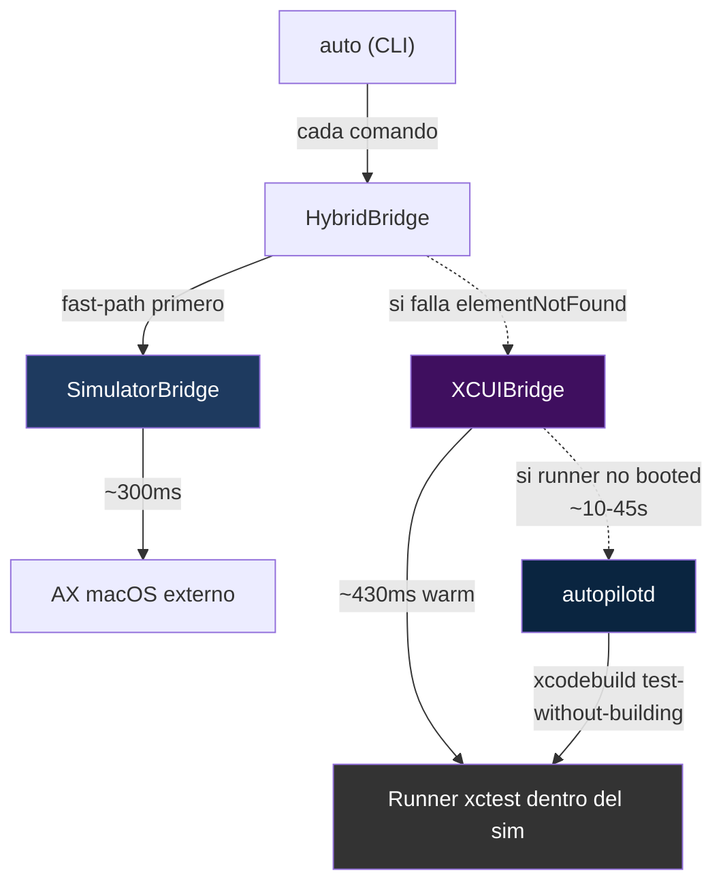

# Capítulo 15 — El segundo motor

## El problema: "Guardar" invisible

El [Capítulo 2](02-arquitectura.md) explica el backend iOS: `AXUIElement` + `CGEvent` + `simctl` + AppleScript. Es rápido (~300ms por tap), sin dependencias, sin XCUITest. Durante meses alcanzó.

Después empezamos a validar contra apps SwiftUI modernas. Un flujo tan simple como este falló:

```bash
auto tap "Crear primera entrada"    # ✓ funciona
auto tap "Titulo de tu experiencia" # ✓ funciona
auto type "Demo"                    # ✓ funciona
auto tap "Guardar"                  # ✗ Error: Element not found: 'Guardar'
```

"Guardar" era un `ToolbarItem(placement: .confirmationAction)` en un `NavigationBar` SwiftUI. Un botón azul arriba a la derecha, perfectamente visible en pantalla. Nuestro motor no lo veía.

Pedimos el árbol con `auto tree`:

```
AXGroup  id=Nueva Entrada  [380,199 402x54]   ← el NavBar está ahí
AXStaticText  label="Fotos"   [396,253 370x43]
AXButton  label="Camara"      [412,311 161x38]
AXButton  label="Galeria"     [589,311 161x38]
AXStaticText  label="Detalles"
AXTextField  value="Titulo de tu experiencia"
...
```

El NavBar aparece como `AXGroup` con identifier "Nueva Entrada" **pero sin children accesibles**. Los `ToolbarItem` están ahí, los podemos ver con los ojos, pero el AX de macOS los proyecta como un `AXGroup` opaco. El 80-90% de los taps funcionan — el 10-20% que fallaba eran todos botones en toolbars SwiftUI.

El bug apareció en Xcode 26 / iOS 26 con la nueva implementación de `NavigationStack`. En Xcode 15 y iOS 17 estos mismos `ToolbarItem` sí se exponían al AX externo. Apple cambió algo internamente y no lo documentó.

La pregunta era: ¿cómo vemos los botones que el AX de macOS no ve, sin romper el 80-90% que ya funciona?

---

## Investigación: cómo lo hacen los demás

Antes de escribir código, repetimos el patrón del [Capítulo 9](09-el-agente-android.md): investigar cómo Maestro, WebDriverAgent, idb y otros resuelven el problema de "AX externo no ve todo".

### Maestro

Maestro compila un fork minimalista de **WebDriverAgent** — un bundle `.xctest` que corre dentro del simulador vía `xcodebuild test-without-building`. El test se llama algo como `testRunner()` y nunca termina: bloquea en `XCTWaiter.wait()` indefinido y abre un servidor HTTP en loopback. El host habla con ese servidor via `usbmuxd` o `iproxy`.

Desde adentro del simulador, el runner tiene acceso a `XCUIApplication` — la API que Xcode usa para UI testing. A diferencia del AX macOS externo, `XCUIApplication` **sí ve** la `NavigationBar` de SwiftUI como un elemento de primera clase con children queryables.

Resultado: ~300-500ms por tap warm, ~5s cold boot la primera vez.

### WebDriverAgent (Appium)

El patrón original del que Maestro deriva. Mismo approach: un bundle xctest corriendo dentro del sim, servidor HTTP, pero más verboso (W3C WebDriver protocol completo) y con un ciclo de setup más manual (hay que firmar el runner con una cuenta de developer propia).

### idb (Facebook/Meta)

Esta es la más interesante. `idb_companion` no usa XCTest — usa **frameworks privados de Apple** (`SimulatorKit`, `CoreSimulator`) vía XPC. Es el mismo canal que usa Accessibility Inspector de Xcode.

Resultado: 50-200ms por query (5-10x más rápido que XCTest).

El precio: depende de headers privados que Apple puede romper en cualquier release de Xcode. En la práctica Facebook lo mantiene al día, pero el onboarding requiere Command Line Tools específicas y una cadena de dependencias (gRPC + XcodeGen + Swift Package Plugins).

### El patrón común

Todos comparten la misma arquitectura fundamental:

```
┌──────────────┐       ┌──────────────────────────────┐
│  Host (Mac)   │       │  Simulador iOS                │
│               │       │                               │
│  CLI ───────────────────► Runner persistente          │
│  (conexión    │socket │  (XCUIApplication directo,    │
│   reutilizada)│       │   sin fork por comando)       │
└──────────────┘       └──────────────────────────────┘
```

**Nadie rápido llama `xcrun simctl` ni AX macOS externo para operaciones de UI.** Todos mantienen un proceso dentro del sim con acceso a la API "de verdad".

---

## Decisión: xctest runner + sidecar daemon

Teníamos tres caminos para el "segundo motor":

| | XCTest runner | idb_companion | XPC a CoreSim |
|---|---|---|---|
| Setup usuario | 0 (runner precompilado) | `brew install idb-companion` | imposible sin firma |
| Latencia tap warm | ~430ms | ~100-200ms | ~50-100ms |
| Cold boot primera vez | 10-45s | ~2s | ~500ms |
| Firma requerida | no (en simulador) | no | sí (frameworks privados) |
| Frameworks privados | no | sí | sí |
| Riesgo por cambio de Xcode | bajo | medio | alto |

Probamos idb. `brew install facebook/fb/idb-companion` falló porque nuestras Command Line Tools estaban en 16.3 y Xcode en 26.3. Compilar desde source requería XcodeGen + gRPC + plugins de Swift Package Manager. La cadena de dependencias era demasiado frágil para una dependencia de usuario final.

Elegimos **XCTest runner** por tres razones:

1. **APIs públicas**. `XCUIApplication` es parte del framework público de Apple. No rompe entre versiones de Xcode con la frecuencia que rompen las privadas.
2. **Cero firma en simulador**. Apple no exige code signing para binarios en el simulator. El runner puede shippearse precompilado dentro del release del CLI.
3. **Patrón probado**. Maestro y WebDriverAgent llevan años usando esta arquitectura. Los bugs conocidos están documentados.

El precio es ~5x más lento que idb. Aceptable para el 10-20% de casos que el fast path no resuelve — no es el hot path.

---

## Arquitectura: dos motores en escalera

Mantener el motor rápido existente es no-negociable. El `SimulatorBridge` (AX macOS) resuelve el 80-90% de los taps en 300ms. No vamos a sacrificar esos casos para resolver el 10% que falla.

La solución es un **wrapper** que intenta fast-path primero y escala a deep-path solo si falla:

```swift
// HybridBridge.swift
try escalate("tap",
    fast: { try self.fast.tap(target: target) },   // SimulatorBridge
    deep: { try self.deep.tap(target: target) })   // XCUIBridge

// Implementación:
do {
    try fastFn()
    fastCount += 1
} catch BridgeError.elementNotFound {
    escalationCount += 1
    try deepFn()
}
```

`HybridBridge` implementa el mismo protocolo `DeviceBridge` que el CLI ya conoce. El usuario no cambia ni una línea de sus scripts `.auto` existentes. Lo que antes fallaba con "element not found" ahora escala al segundo motor y funciona.



Métodos que no son escalables (launch, simctl, biometric, permisos) van siempre por el fast-path. Solo escalan los que operan sobre elementos: `tap`, `longPress`, `doubleTap`, `clear`, `scroll`, `search`, `scrollTo`, `copyTextFrom`.

---

## Implementación: tres piezas nuevas

### 1. `AutoPilotRunner.xctest` — el servidor

Un bundle xctest mínimo, cuatro archivos:

```
runner/AutoPilotRunner/
├── AutoPilotRunnerTests.swift   ← @MainActor func testServe() que nunca termina
├── RunnerServer.swift           ← TCP server 127.0.0.1:22087 + dispatch JSON
├── RunnerHandlers.swift         ← 15 endpoints → XCUIApplication
└── RunnerSerialization.swift    ← XCUIElement → dict compatible con iOS/Android
```

El entry point es un método de test que bloquea indefinidamente:

```swift
@MainActor
func testServe() throws {
    let app = XCUIApplication(...)
    let server = RunnerServer(port: 22087, app: app)

    let done = XCTestExpectation(description: "server quit")

    DispatchQueue.global(qos: .userInitiated).async {
        try? server.start()       // accept loop en background
        done.fulfill()
    }

    // XCTWaiter.wait pumps el RunLoop del main thread,
    // permitiendo que los DispatchQueue.main.async del server se ejecuten.
    _ = XCTWaiter().wait(for: [done], timeout: 86400)
}
```

El protocolo es idéntico al del [agente Android](09-el-agente-android.md#implementación-4-archivos-200kb) — misma línea de JSON por request, misma línea de JSON por response, mismo formato de tree (`role`, `label`, `identifier`, `frame`, `children`). Esto permite reusar `TreePrinter`, `ElementIndexShared` y `TargetResolver` sin tocar nada.

### 2. `autopilotd` — el sidecar daemon

Un ejecutable Swift en `cli/Sources/Daemon/` que vive en macOS (no en el sim). Tres responsabilidades:

```
Sources/Daemon/
├── main.swift             ← start|stop|status + PID file + signal handlers
├── DaemonServer.swift     ← Unix socket server + JSON dispatch
└── RunnerLifecycle.swift  ← xcodebuild test-without-building + probe + shutdown
```

La única razón de existir del daemon es **mantener el runner xctest vivo entre comandos del CLI**. Sin daemon, cada `auto tap` tendría que bootear el runner desde cero (~10-45s) o confiar en que otra herramienta lo mantenga.

El daemon arranca `xcodebuild test-without-building` como proceso hijo, lo vigila, y expone un socket Unix local (`/tmp/autopilot-<udid>.sock`). Cuando el CLI quiere hacer algo XCUI, habla con el daemon (o directo con el runner, ver abajo).

### 3. `XCUIBridge.swift` — el cliente

Un cliente TCP que implementa `DeviceBridge`. Mismo formato JSON que `AgentBridge` en Android. La API pública relevante:

```swift
public final class XCUIBridge: DeviceBridge {
    public init(host: String = "127.0.0.1", port: UInt16 = 22087) { ... }

    public func tree() throws -> [[String: Any]]
    public func search(query: String) throws -> [[String: Any]]
    public func list(type: String) throws -> [[String: Any]]   // ← typed query rápida
    public func tap(target: String) throws
    public func launchApp(bundleId: String, envVars: [String: String]) throws
    // ...

    // Métodos no implementados (delegar al fast-path):
    public func biometricEnroll() throws { throw notImplemented("biometricEnroll") }
    public func installApp(path: String) throws { throw notImplemented("installApp") }
    // ...
}
```

Cada método no implementado tira `BridgeError.unknown("not implemented in XCUI")`. El `HybridBridge` lo captura y cae al fast-path. Así el `XCUIBridge` solo implementa lo que le suma valor — operaciones sobre elementos — y deja que el `SimulatorBridge` haga lo que ya hace bien.

---

## Tropiezo 1: Xcode 26 clona el simulador

Primer build del runner, primera llamada, primer crash. El simulador se **apagaba** después de que el test terminaba.

```
$ auto daemon start
✓ daemon arrancado, runner booted
$ auto tap "Guardar"
✓ Tapped "Guardar" (1550ms)
$ auto tap "General"
Error: No simulator window found. Is the Simulator open?
$ xcrun simctl list devices booted
-- iOS 26.3 --
(none)
```

Debug: el `xcodebuild test-without-building` en Xcode 26 por defecto **clona** el simulador para aislar el test. Cuando nuestro test-que-nunca-termina eventualmente termina (porque el daemon lo mata o porque crashea), el clone se destruye. El problema es que la destrucción del clone se propagaba al sim original — el que el usuario tenía abierto — y lo apagaba.

No encontramos documentación oficial sobre el comportamiento. El fix apareció después de mirar flags de xcodebuild línea por línea:

```swift
proc.arguments = [
    "xcodebuild", "test-without-building",
    "-xctestrun", xctestRunPath,
    "-destination", "platform=iOS Simulator,id=\(udid)",
    "-only-testing:\(testID)",
    // Xcode 26 default: clone sim per test. El clone se destruye al final
    // y en el proceso apaga el simulator original. Sin estos flags, el sim
    // muere después de cada ciclo del runner:
    "-parallel-testing-enabled", "NO",
    "-disable-concurrent-destination-testing",
    "-maximum-concurrent-test-simulator-destinations", "1"
]
```

Con los tres flags, xcodebuild corre el test directamente en el sim del usuario sin clonar. El sim sobrevive.

Nadie documenta esto en las release notes de Xcode 26. Lo encontramos probando combinaciones.

---

## Tropiezo 2: `XCUIApplication` requiere main thread

El accept loop del servidor corre en `DispatchQueue.global(qos: .userInitiated)` — background thread. Natural para un server TCP. Pero cuando un handler llama `XCUIApplication.launch()` desde ese thread, crash inmediato:

```
*** Assertion failure in -[XCUIApplication _launchUsingXcode:...]
XCUIApplication must be called on the main thread
NSInternalInconsistencyException
```

Las APIs de XCUI están diseñadas asumiendo que corren desde un test XCTest, que siempre está en main thread. Nuestro servidor las llamaba desde background.

El fix es despachar cada operación XCUI al main thread con un semáforo:

```swift
private func dispatchOnMain(_ block: @escaping () -> String) -> String {
    if Thread.isMainThread { return block() }

    var result = ""
    let semaphore = DispatchSemaphore(value: 0)
    DispatchQueue.main.async {
        result = block()
        semaphore.signal()
    }
    semaphore.wait()
    return result
}
```

El truco que hace que esto funcione es que `XCTWaiter.wait()` **pumps el RunLoop del main thread**. Sin eso, un background thread haciendo `DispatchQueue.main.async` quedaría encolado eternamente porque nadie procesa la cola. Con `XCTWaiter` corriendo en el main, los bloques se ejecutan, el semáforo se libera, y el background thread sigue.

Una invariante escondida en el framework de XCTest que nadie documenta pero de la que depende toda la arquitectura.

---

## Arquitectura v2: TCP directo (skip daemon)

Versión inicial: `XCUIBridge` hablaba con el daemon via Unix socket, el daemon reenviaba al runner via TCP. Funcionaba, pero cada llamada era:

```
auto → Unix socket → autopilotd (parse JSON) → TCP → runner
     ← Unix socket ← autopilotd (re-serialize) ← TCP ← runner
```

Cuatro saltos de serialización por cada comando. Medido: ~1500ms warm por tap.

Segunda iteración: **`XCUIBridge` habla directo al runner por TCP**, saltando el daemon en el hot path. El daemon queda solo como lifecycle manager.

```swift
private func sendCommand(_ method: String, params: [String: Any]? = nil) throws -> [String: Any] {
    // Fast path: TCP directo al runner (connect timeout 100ms)
    if let fd = connectTCP(host: "127.0.0.1", port: 22087) {
        defer { close(fd) }
        return try exchange(fd: fd, method: method, params: params)
    }

    // Cold fallback: Unix socket al daemon, que auto-bootea el runner.
    // Primera llamada de una sesión paga el cold boot (~10-45s), las siguientes
    // van directo TCP.
    guard let daemonFD = connectDaemonUnixSocket() else {
        throw BridgeError.unknown("runner not responding + daemon not running")
    }
    defer { close(daemonFD) }
    return try exchange(fd: daemonFD, method: method, params: params)
}
```

Esto bajó tap warm de ~1500ms a ~430ms. 3.5x con el mismo runner y el mismo código de handler. La diferencia era toda en el proxy de serialización.

---

## Tropiezo 3: `tree deep` tardaba 60 segundos

Con el runner funcionando pedimos el árbol completo para explorar:

```
$ auto tree deep
Application
 Window
  Other
   ... (501 nodos anidados)

(59339ms — deep)
```

Un minuto. Inaceptable incluso como debug command. Imposible para un loop de escaneo.

Debug: `RunnerSerialization.swift` recorría el árbol recursivamente y por cada nodo llamaba:

```swift
dict["role"] = element.elementType        // 1 XPC call al sim
dict["label"] = element.label             // 1 XPC call
dict["identifier"] = element.identifier   // 1 XPC call
dict["value"] = element.value             // 1 XPC call
dict["title"] = element.title             // 1 XPC call
dict["frame"] = element.frame             // 1 XPC call
dict["enabled"] = element.isEnabled       // 1 XPC call
```

Cada acceso a una property de `XCUIElement` es un XPC call separado al proceso que posee el snapshot de accesibilidad. ~500 nodos × 7 atributos = **3500 XPC calls**. Cada uno ~15ms. Total: ~52s. Tomando el overhead de recursión y serialización JSON: 60s.

La fix es `XCUIElement.snapshot()` — una API que hace **un solo XPC** y devuelve un `XCUIElementSnapshot` con todos los atributos cacheados en memoria:

```swift
let snap = try element.snapshot()         // 1 XPC para todo
dict["label"] = snap.label                // acceso a campo en memoria, 0 XPC
dict["value"] = snap.value                // 0 XPC
dict["identifier"] = snap.identifier      // 0 XPC
// ... etc
```

Pero mejor que hacer snapshot completo es **no recorrer todo el árbol**. La mayoría de los nodos en un `tree deep` son `Other` containers de SwiftUI vacíos. Agregamos un comando alternativo `auto list`:

```bash
$ auto list buttons        # solo botones, con labels y frames
$ auto list textfields     # solo inputs
$ auto list cells          # solo celdas
$ auto list                # todos los interactivos (all + cells + switches)
```

Internamente, `list buttons` usa **queries tipadas** de XCTest:

```swift
// Lento (lo que hacía tree deep):
app.descendants(matching: .any).matching(predicate)
// → serializa 500 nodos para filtrar 20

// Rápido (lo que hace list):
let query = app.buttons    // XCUIElementQuery tipada, lazy
for i in 0..<query.count {
    let snap = try query.element(boundBy: i).snapshot()
    items.append([...])
}
// → solo materializa los 20 botones + 1 XPC por snapshot
```

Resultado: **`auto list buttons` en 1 segundo**, contra 13s de `auto tree deep`. 10-13x.

El error de diseño inicial fue usar `tree deep` como herramienta de exploración. `tree deep` es útil para debug profundo — ver el árbol completo en un problema específico — pero no es la herramienta correcta para "¿qué elementos puedo tapear en esta pantalla?". Para eso, `list <type>`.

---

## Resultados

Medido contra la app Settings del simulador (`com.apple.Preferences`), tap "General":

| Bridge | Latencia | Overhead | Cuándo se usa |
|---|---|---|---|
| `SimulatorBridge` (fast, AX macOS) | **300ms** | baseline | 80-90% de los taps |
| `HybridBridge` sin escalar | **355ms** | +18% | wrapper overhead |
| `XCUIBridge` directo TCP (warm) | **430ms** | +43% | cuando el fast-path falla |
| `XCUIBridge` cold boot | **10-45s** | una vez por sesión | primera escalación del día |

Y exploración de UI:

| Comando | Tiempo | Qué devuelve |
|---|---|---|
| `auto tree` (fast) | **300ms** | árbol AX macOS (no ve NavBar SwiftUI) |
| `auto list` | **1000ms** | elementos interactivos (buttons + fields + cells + switches + links) |
| `auto list buttons` | **500-1000ms** | solo botones |
| `auto tree deep` | **10-13s** | árbol XCUI completo (debug) |

Con el daemon arrancado una sola vez al inicio de la sesión (`./scripts/demo/start-daemon.sh start`), todas las llamadas posteriores son warm. El cold boot se paga una vez.

---

## Tropiezo residual: Command Line Tools desactualizadas

El primer instinto fue usar idb en lugar de XCTest. Es ~5x más rápido y Facebook lo mantiene. Intentamos instalar:

```bash
$ brew install facebook/fb/idb-companion
Error: Your Command Line Tools are too outdated.
Update them from Software Update in System Settings.

If that doesn't show you any updates, run:
  sudo rm -rf /Library/Developer/CommandLineTools
  sudo xcode-select --install

You should download the Command Line Tools for Xcode 26.3.
```

Nuestras CLT estaban en 16.3 mientras Xcode estaba en 26.3. brew rechazaba instalar idb. Compilar desde source (clonar el repo, `./build.sh`) requería XcodeGen + gRPC + Swift Package Manager plugins — cadena de dependencias demasiado frágil.

No es un problema de idb. Es un problema de que el setup del usuario tiene que ser trivial y Apple hace que "tener CLT y Xcode sincronizados" sea complicado cuando el usuario no actualiza a mano.

Si eventualmente las CLT se destraban y idb instala limpio, el `XCUIBridge` actual se puede reemplazar por un `IdbBridge` con el mismo protocolo. El `HybridBridge` no cambia. Los scripts `.auto` no cambian. Solo cambia el cliente.

---

## Cómo usar

El daemon vive en background una vez arrancado. Tres comandos principales:

```bash
# Una vez al inicio de la sesión (paga el cold boot ~10-45s)
./scripts/demo/start-daemon.sh start

# Después, scripts existentes funcionan sin cambios:
auto tap "Guardar"                # hybrid: fast primero, XCUI si falla
auto list buttons                 # exploración rápida (~1s)
auto tree                         # árbol fast
auto tree deep                    # árbol XCUI (lento, debug)

# Diagnóstico
auto daemon status                # runner booted? pid?
auto stats                        # cuántas veces escaló el hybrid

# Forzar un motor específico (debug)
AUTO_BRIDGE=simulator auto tap "Guardar"  # falla en NavBar SwiftUI
AUTO_BRIDGE=xcui auto tap "Guardar"       # siempre usa deep
AUTO_BRIDGE=hybrid auto tap "Guardar"     # default
```

Para CI y release, el runner xctest se buildea una vez (`xcodebuild build-for-testing`) y el `.xctestrun` + `Runner.app` se publican como asset en el release. El CLI lo instala al primer uso — el usuario final no necesita Xcode.

---

## Qué aprendimos

1. **Dos motores en escalera > un motor universal.** El `SimulatorBridge` resuelve el 80-90% a 300ms. El `XCUIBridge` resuelve el 10-20% restante a 430ms. Intentar reemplazar todo por XCUI habría penalizado el caso común para ganar el caso raro. El `HybridBridge` da el mejor de los dos mundos con un wrapper de ~300 líneas.

2. **El proxy silencioso mata la latencia.** La primera versión pasaba todo por el daemon. Saltar el daemon para llamadas de datos bajó tap warm de 1500ms a 430ms — 3.5x con el mismo código de handler. Siempre que un componente intermedio re-serializa datos, medir su costo.

3. **`XCUIElement.snapshot()` o nada.** Cada acceso a `element.label`, `element.value`, `element.frame` es un XPC call al sim. 500 nodos × 7 atributos = 3500 XPC = 60s. Un `snapshot()` al inicio baja a 500 XPC = 5s. Es la diferencia entre usable e inusable.

4. **Queries tipadas > descendants matching any.** `app.buttons[label]` es O(1) porque XCTest usa una estructura indexada. `descendants(matching: .any).matching(predicate)` es O(N) con N full snapshots. Para exploración, las queries tipadas son 10x-50x más rápidas.

5. **Xcode 26 cambió el default de `test-without-building` a cloned sims.** Nadie lo documenta. Sin los tres flags (`-parallel-testing-enabled NO`, `-disable-concurrent-destination-testing`, `-maximum-concurrent-test-simulator-destinations 1`), el sim del usuario muere cada vez que el runner termina. Lo descubrimos probando.

6. **XCUIApplication solo funciona en main thread.** El servidor TCP corre en background; el dispatcher hace `DispatchQueue.main.async` + semáforo; `XCTWaiter.wait()` en el main thread pumpea el RunLoop para que los blocks se ejecuten. Si el main thread está bloqueado en algo que no pumpea el RunLoop, deadlock.

7. **idb sería mejor técnicamente, pero el setup no es viable hoy.** `idb_companion` es 5x más rápido que XCTest. Pero requiere Command Line Tools sincronizadas con Xcode, y Apple no facilita eso. XCTest runner es peor perf pero trivial de distribuir (cero dependencias del usuario, cero firma).

8. **Pagar el cold boot una vez > pagarlo por llamada.** `--timeout 0` (runner inmortal mientras el daemon vive) + pre-warm al arrancar el daemon convierte "45s cold boot eventual" en "45s cold boot una vez al arrancar, nunca más". Los 45s amortizan en la primera llamada — las 1000 siguientes son warm.

---

## Integración con el CLI

Con los tres componentes funcionando, la factory en `main.swift` respeta un env var `AUTO_BRIDGE`:

```swift
let simulatorBridge = SimulatorBridge()
let xcuiBridge = XCUIBridge()
let bridge: DeviceBridge = makeBridge(simulatorBridge)

func makeBridge(_ simBridge: SimulatorBridge) -> DeviceBridge {
    switch ProcessInfo.processInfo.environment["AUTO_BRIDGE"] ?? "hybrid" {
    case "simulator": return simBridge
    case "xcui":      return xcuiBridge
    case "hybrid":    return HybridBridge(fast: simBridge, deep: xcuiBridge)
    default:          return HybridBridge(fast: simBridge, deep: xcuiBridge)
    }
}
```

El default es `hybrid`. Los scripts existentes ganan la escalación automática sin cambiar una línea. Los usuarios que quieran debugging puro pueden forzar `AUTO_BRIDGE=simulator` (comportamiento histórico) o `AUTO_BRIDGE=xcui` (ver qué ve el runner).

Comandos nuevos agregados al CLI:

```
auto list <type>          # typed query via XCUI runner (~1s)
auto tree deep            # árbol XCUI completo
auto tree full            # fast + deep side-by-side (debug)
auto daemon start|stop|status   # lifecycle del sidecar
auto runner install|status      # gestión del bundle xctest
auto stats                # contadores fast/deep/escalations del hybrid
```

El detalle técnico del protocolo, los endpoints del runner, y los parámetros de cada método están en [`docs/ios/XCUI-BRIDGE.md`](../ios/XCUI-BRIDGE.md).

---

## Siguiente paso

El motor deep cubre el caso de NavBar SwiftUI — el 10-20% que el AX externo no ve. Faltan dos cosas para paridad completa con Maestro:

1. **Reemplazar XCTest por idb** cuando las CLT se actualicen o cuando el proyecto idb publique binarios pre-built. Eso bajaría tap warm de 430ms a ~150ms — 3x más. La arquitectura `HybridBridge + deep client` queda igual; solo cambia el cliente.

2. **Soporte para device físico.** El runner actual funciona solo en simulador (sin firma). Para device real habría que distribuir el `.xctest` firmado o exigir al usuario que lo firme con su cuenta de developer. Maestro tiene este flow pero es la parte fea de su onboarding. Preferimos mantener "solo simulador" hasta que haya demanda real.

3. **Heurísticas de escalación pre-fallo.** Hoy el `HybridBridge` paga un `elementNotFound` del fast-path antes de escalar. Eso son ~200-300ms de fast-path fallado + 430ms de XCUI = 700ms total. Si tuviéramos una heurística tipo "este script dice `tap[navbar] X`, va directo a XCUI", bajaríamos a 430ms limpio. Pendiente hasta tener datos reales de qué patrones escalan.

---

*Anterior: [Capítulo 14 — Validación en una app real](14-validacion-en-una-app-real.md) | Siguiente: por escribir*

*[Índice del libro](README.md)*
